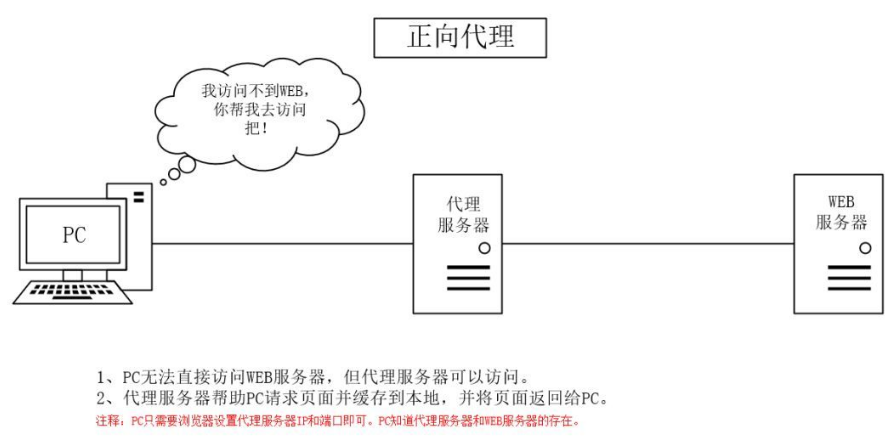
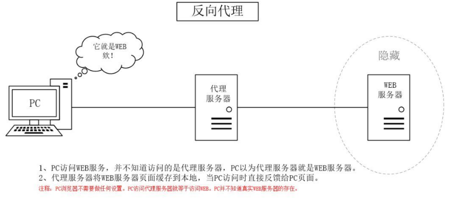

`Nginx`（`engine x`）是一款高性能的开源`web`服务器，兼具反向代理服务器、负载均衡器和`HTTP`缓存功能。

### 1. 正向代理

正向代理是一种代理服务器位于客户端和目标服务器之间的模式，代理服务器代表客户端向目标服务器发起请求。

这种代理方式常见于以下情况：

- 客户端无法直接访问目标服务器（例如访问外部互联网）。
- 绕过防火墙或访问限制。
- 隐藏客户端的真实`IP`地址。

例如，科学上网时，用户希望访问无法直接访问的外网网站。这时可以使用一个能访问外网的代理服务器，将用户的请求转发到目标网站，并返回响应给用户。此时，代理服务器对真实的`Web`服务器不可见，目标服务器无法识别实际的客户端。

### 2. 反向代理

反向代理是一种代理服务器位于目标服务器和客户端之间的模式。代理服务器代表目标服务器向客户端提供服务。常见用途包括：

- 负载均衡：将请求分发到不同的服务器。
- 提升安全性：隐藏真实服务器的`IP`地址。

当访问一个网站时，反向代理服务器接收请求，将其转发到实际的服务器，并将响应返回给客户端。客户端不直接与真实服务器通信。

在反向代理中，通常存在多个真实的`Web`服务器。代理服务器使用负载均衡策略将请求分发到不同的服务器，以防止单个服务器过载。