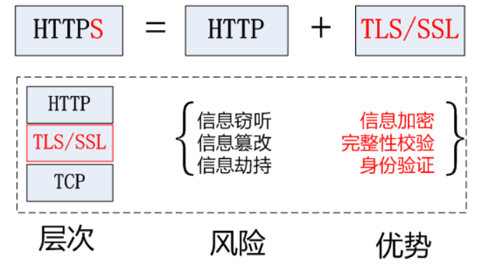

`HTTP`被认为是不安全的协议，主要原因有两个：

1. 明文传输：`HTTP`以明文形式传递数据，意味着信息在传输过程中可以被任意拦截，导致敏感数据暴露。
2. 无法验证身份：`HTTP`无法验证通信双方的身份，使得中间人攻击（`MITM`）更容易发生。

为了解决这些问题，我们使用了`HTTPS`。`HTTPS`是在`HTTP`基础上添加了`TLS/SSL`加密层，从而确保通信的机密性、完整性和身份验证。

使用`HTTPS`协议，浏览器和客户端需要进行`SSL/TLS`握手来建立加密通信：

1. 客户端发送`ClientHello`：浏览器发送支持的加密算法、随机数等信息。
2. 服务器返回`ServerHello`：服务器选择加密算法，并返回证书（`SSL`证书）。
3. 客户端验证证书：浏览器验证`SSL`证书的有效性（是否可信、是否过期等）。
4. 密钥交换：双方协商对称加密密钥。
5. 加密通信：之后的`HTTP`数据传输将使用加密通信。

`SSL`（`Secure Sockets Layer`，安全套接层）协议已被`TLS`（`Transport Layer Security`，传输层安全）协议取代，但人们通常仍会使用`SSL`或`SSL/TLS`来泛指这一类协议。`SSL/TLS`协议跨越了传输层和应用层。

`HTTP`与`HTTPS`的特征比较如下：

| 特征     | HTTP                     | HTTPS                                 |
| -------- | ------------------------ | ------------------------------------- |
| 安全性   | 数据以明文传输，不安全。 | 数据经过加密，提供安全连接。          |
| 协议     | 超文本传输协议。         | 安全超文本传输协议。                  |
| 默认端口 | `80`端口。               | `443`端口。                           |
| 连接方式 | 非安全，无加密。         | 安全，使用`SSL/TLS`进行加密。         |
| 证书     | 不需要证书。             | 需要`SSL`证书进行服务器身份验证。     |
| 性能     | 通常更快。               | 可能引入额外的计算和通信开销。        |
| 成本     | 协议本身无费用。         | 需要获取和维护`SSL`证书，可能有费用。 |
| 配置     | 配置相对简单。           | 配置更为复杂，涉及证书管理。          |
| 缓存     | 通常更易实现缓存。       | `HTTPS`缓存可能更为复杂。             |

`HTTPS`的缺点如下：

| 缺点         | 描述                                                         |
| ------------ | ------------------------------------------------------------ |
| 性能开销     | `HTTPS`可能引入额外的计算和通信开销。                        |
| 成本         | 获取和维护`SSL`证书可能产生费用。                            |
| 配置复杂性   | 配置和维护`HTTPS`需要更多工作，包括证书管理等。              |
| 缓存问题     | `HTTPS`对一些`Web`优化技术如`CDN`和缓存的支持不如`HTTP`友好。 |
| 不是绝对安全 | 虽然提供高安全性，但不能绝对防范所有攻击。                   |