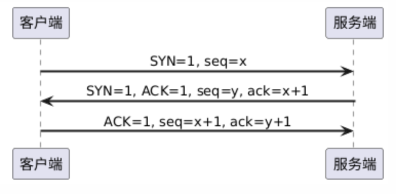
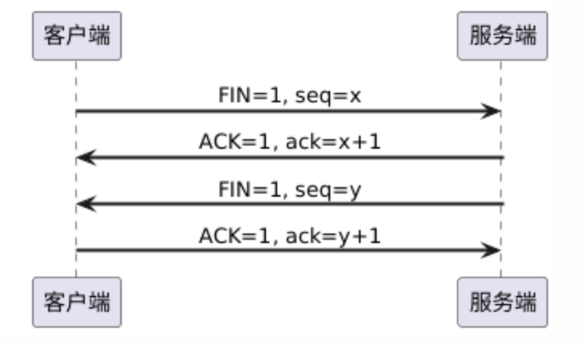

`TCP`（`Transmission Control Protocol`，传输控制协议）`TCP`是`TCP/IP`协议族中传输层的协议，它提供可靠的、有连接的、面向字节流的通信服务。`TCP`协议的特点如下：

1. 面向连接：通信双方在传输数据前，必须先建立连接（通过三次握手完成），数据传输完成后释放连接（通过四次挥手实现）。
2. 可靠传输：`TCP`使用确认应答、超时重传、校验和、序列号、流量控制、拥塞控制等机制保证数据可靠。
3. 面向字节流：数据被视为无边界的字节流，发送方将数据分割成合适大小的段（`Segment`），接收方重组字节流还原数据。

`TCP`的连接通过三次握手进行建立：

- 第一次握手：客户端请求建立连接，发送一个`SYN`报文。

- 第二次握手：服务端响应连接，发送一个`SYN+ACK`报文，确认收到客户端的`SYN`。

- 第三次握手：客户端确认服务端的`SYN`，并发送`ACK`报文确认。

三次握手过程图示如下：

`TCP`连接的断开通过四次挥手完成：

- 第一次挥手：客户端发送`FIN`报文，表示客户端没有数据要发送了，想关闭连接。
- 第二次挥手：服务端收到`FIN`后，发送`ACK`报文段进行确认。
- 第三次挥手：服务端再发送自己的`FIN`，表示服务端也准备关闭连接。
- 第四次挥手：客户端收到`FIN`后，发送`ACK`进行确认，然后进入`TIME_WAIT`状态。

四次挥手过程图示如下：

`seq`表示序列号，是每个`TCP`报文段中都会携带的字段，用于标识该报文段中第一个字节的序号。它的作用是帮助接收方按顺序重组收到的数据，从而确保数据传输的完整性和有序性。`ack`表示确认号，用于确认接收方已经成功接收到的数据。它的含义是：期望对方从该序号开始继续发送后续数据。换句话说，`ack=n`表示“我已经成功接收了以`seq=n-1`为结束的数据，请从`seq=n`开始继续发送。

在`TCP`四次挥手的最后一步，客户端发送`ACK`后进入`TIME_WAIT`状态，是为了确保若服务器未成功接收到该`ACK`，并重发`FIN`报文时，客户端仍能回应。若客户端立即关闭连接，服务器的`FIN`重发将得不到响应。同时，`TIME_WAIT`还能避免旧连接的延迟数据影响新连接。`TIME_WAIT`状态持续时间为`2 * MSL`，一般为`60`秒或`120`秒，视操作系统设置而定。

`MSL`是`Maximum Segment Lifetime`的缩写，意思是一个`TCP`报文段在网络中最多可以存活的时间。`TIME_WAIT`状态持续`2 * MSL`，是为了确保客户端发送的最后一个`ACK`能被服务器成功接收，并防止网络中延迟的旧报文影响后续的新连接。

三次握手中，为什么不能省略第三次？这是因为客户端和服务端都需要确认对方具备发送与接收数据的能力：

- 在第一次握手中，服务端收到客户端发送的`SYN`报文，能够确认客户端具备发送能力。
- 在第二次握手中，客户端收到服务端的`SYN+ACK`报文，确认服务端具备发送能力和接收能力。
- 在第三次握手中，服务端收到客户端发送的`ACK`报文，最终确认客户端也具备接收能力。

如果省略第三次握手，会带来严重的问题。若服务端发送的`SYN+ACK`报文由于网络异常未能到达客户端，会导致服务端误以为连接已经建立。此时，服务端会等待客户端发送数据，而客户端因为没有收到`SYN+ACK`，根本不知道连接已经建立，自然也不会发送任何数据。结果就是服务端进入一种“半连接”状态，占用资源却无法进行有效通信。

这种状态不仅浪费系统资源，还可能引发安全隐患，且无法通过正常方式进行恢复。

四次挥手中，为什么不能合并第二次和第三次？这是因为`TCP`连接是全双工的，客户端和服务端都需要确认对方的数据发送已经完成：

- 在第一次挥手中，服务端收到客户端发送的`FIN`报文，能够确认客户端不再发送数据，但客户端仍然可以接收数据。
- 在第二次挥手中，客户端收到服务端的`ACK`报文，确认服务端已知晓客户端不再发送数据，但此时服务端仍可能继续发送数据。
- 在第三次挥手中，服务端发送自己的`FIN`报文，表示服务端也没有数据要发了，准备关闭发送通道。
- 在第四次挥手中，客户端收到服务端的`FIN`报文后，发送`ACK`进行确认，最终完成整个连接的关闭。

如果合并第二次和第三次挥手，会带来严重的问题。例如，当客户端发送`FIN`报文后，服务端若立刻以一个`FIN+ACK`的合并报文进行响应，而不是等数据发送完再单独发送`FIN`，就会出现问题。此时服务端可能仍有数据尚未发送完毕，但客户端一旦收到`FIN`，就会立即释放资源，停止接收数据。结果就是连接被提前关闭，导致服务端剩余的数据无法成功传输，出现数据丢失。

这不仅违背了`TCP`协议中对可靠数据传输的设计初衷，还可能导致连接状态异常、数据传输不完整等严重后果。

那么，服务端是否可以在完成所有数据发送之后，再以一个`FIN+ACK`的合并报文来响应客户端的`FIN`请求呢？答案同样是不可以。

在`TCP`中，无论客户端还是服务端，都会设置超时重传定时器。如果客户端在预定时间内没有收到对方的`ACK`，就会认为可能发生了网络丢包，或是对方已经宕机，于是会重发`FIN`报文，重新发起连接终止请求。如果服务端延迟发送`ACK`，等几秒钟后数据发完再连同`FIN`一并回复，客户端在等待过程中可能会误以为连接状态出现异常，甚至提前释放资源，导致连接提前关闭。

这违背了`TCP`协议的核心原则之一：每一步操作都必须被确认。将严重破坏`TCP`协议的状态一致性和可靠性保障。

每个`TCP`报文段都有一个头部，最小长度是`20`字节，最大可以达到`60`字节。其格式如下：

| 字段名                  | 长度（位） | 描述                                                    |
| ----------------------- | ---------- | ------------------------------------------------------- |
| `Source Port`           | `16`       | 源端口号，标识发送端应用程序                            |
| `Destination Port`      | `16`       | 目标端口号，标识接收端应用程序                          |
| `Sequence Number`       | `32`       | 序列号，表示本报文段第一个字节的序号                    |
| `Acknowledgment Number` | `32`       | 确认号，期望接收对方下一个字节的序号（`ACK`置位时有效） |
| `Data Offset`           | `4`        | `TCP`头部长度，以`4`字节为单位                          |
| `Reserved`              | `6`        | 保留字段，固定为`0`                                     |
| `Flags`                 | `6`        | 控制位，包括：`URG`、`ACK`、`PSH`、`RST`、`SYN`、`FIN`  |
| `Window Size`           | `16`       | 接收窗口大小，用于流量控制                              |
| `Checksum`              | `16`       | 校验和，用于完整性校验（包含伪头部）                    |
| `Urgent Pointer`        | `16`       | 紧急指针，仅当`URG`位为`1`时有效                        |
| `Options`（可选）       | 可变       | `TCP`扩展功能，如`MSS`、窗口缩放、时间戳等              |
| `Padding`               | 可变       | 填充字段，使`TCP`头部长度是`4`字节对齐                  |

这部分内容这里不做展开讲解。