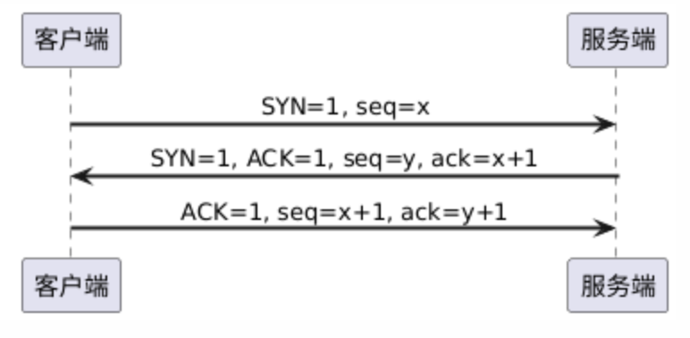
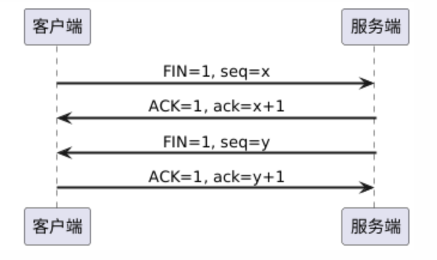

`TCP`（`Transmission Control Protocol`，传输控制协议）`TCP`是`TCP/IP`协议族中传输层的协议，它提供可靠的、有连接的、面向字节流的通信服务。`TCP`协议的特点如下：

1. 面向连接：通信双方在传输数据前，必须先建立连接（三次握手），数据传输完成后释放连接（四次挥手）。
2. 可靠传输：`TCP`使用确认应答、超时重传、校验和、序列号、流量控制、拥塞控制等机制保证数据可靠。
3. 面向字节流：数据被视为无边界的字节流，发送方将数据分割成合适大小的段（`Segment`），接收方重组字节流还原数据。

`TCP`的连接通过三次握手进行建立：

- 第一次握手：客户端请求建立连接，发送一个`SYN`报文。

- 第二次握手：服务端响应连接，发送一个`SYN+ACK`报文，确认收到客户端的`SYN`。

- 第三次握手：客户端确认服务端的`SYN`，并发送`ACK`报文确认。

三次握手过程图示如下：

`TCP`连接的断开通过四次挥手完成：

- 第一次挥手：客户端发送`FIN`报文，表示客户端没有数据要发送了，想关闭连接。
- 第二次挥手：服务端收到`FIN`后，发送`ACK`报文段进行确认。
- 第三次挥手：服务端再发送自己的`FIN`，表示服务端也准备关闭连接。
- 第四次挥手：客户端收到`FIN`后，发送`ACK`进行确认，然后进入`TIME_WAIT`状态。

四次挥手过程图示如下：

`seq`表示序列号，是每个`TCP`报文段中都会携带的字段，用于标识该报文段中第一个字节的序号。它的作用是帮助接收方按顺序重组收到的数据，从而确保数据传输的完整性和有序性。`ack`表示确认号，用于确认接收方已经成功接收到的数据。它的含义是：期望对方从该序号开始继续发送后续数据。换句话说，`ack=n`表示「我已经成功接收了以`seq=n-1`为结束的数据，请从`seq=n`开始继续发送」。

在`TCP`四次挥手的最后一步，客户端发送`ACK`后进入`TIME_WAIT`状态，是为了确保若服务器未成功接收到该`ACK`，并重发`FIN`报文时，客户端仍能回应。若客户端立即关闭连接，服务器的`FIN`重发将得不到响应。同时，`TIME_WAIT`还能避免旧连接的延迟数据影响新连接。`TIME_WAIT`状态持续时间为`2 * MSL`，一般为`60`秒或`120`秒，视操作系统设置而定。

`MSL`是`Maximum Segment Lifetime`的缩写，意思是一个`TCP`报文段在网络中最多可以存活的时间。`TIME_WAIT`状态持续`2 * MSL`，是为了确保客户端发送的最后一个`ACK`能被服务器成功接收，并防止网络中延迟的旧报文影响后续的新连接。

三次握手中，第三次不可省略，因为通信双方都需要确认对方具备发送与接收数据的能力：

- 第一次握手：服务端收到客户端的`SYN`报文，确认客户端具备发送能力。
- 第二次握手：客户端收到服务端的`SYN+ACK`报文，确认服务端具备发送与接收能力。
- 第三次握手：服务端收到客户端的`ACK`报文，最终确认客户端具备接收能力。

若省略第三次，一旦第二次中服务端发出的`SYN+ACK`因网络异常未能到达客户端，通信双方便会陷入认知不一致的状态。

此时服务端走完了两次握手流程，认为连接已建立，进入等待数据的阶段，但是客户端从未收到`SYN+ACK`，因此会触发超时重传机制。客户端每次重传`SYN`，服务端便再次回复`SYN+ACK`，并再次认为连接已建立，从而不断累积新的半连接状态。若因网络问题导致服务端的`SYN+ACK`持续无法到达客户端，客户端会在耗尽重传次数后最终放弃。

服务端由此陷入「半连接」状态，持续占用连接资源却无法产生任何有效通信。这一状态无法通过正常流程自行恢复，也为`SYN Flood`攻击提供了可乘之机，攻击方可以伪造大量源`IP`发送`SYN`报文，令服务端建立海量此类僵死连接，耗尽其资源。

第三次握手的另一个作用是阻止历史的、已经失效的连接请求被服务端误认为新连接而错误建立。

例如客户端发出的`SYN`可能因为网络拥塞在链路中滞留很久，期间客户端早已超时重发并完成了新的连接。当这个旧`SYN`终于到达服务端时，服务端单凭报文本身无法判断它是否过期，只能照常回复`SYN+ACK`。客户端判断出收到的`SYN+ACK`对应的是一个自己已经放弃的旧请求，会回复`RST`而不是`ACK`，这一步是两次握手机制完全缺失的环节。

如果没有第三次握手，服务端在回复`SYN+ACK`后就直接进入连接已建立的状态，等待数据到来。一旦这个连接对应的是历史报文，客户端根本不会发送任何数据，服务端便会持续占用该连接的资源却永远等不到通信。

四次挥手中，第二次和第三次不能合并，因为`TCP`连接是全双工的，客户端和服务端都需要独立确认对方的数据发送已经完成：

- 第一次挥手：服务端收到客户端的`FIN`报文，确认客户端不再发送数据，但客户端仍可接收数据。
- 第二次挥手：客户端收到服务端的`ACK`报文，确认服务端已知晓客户端不再发送数据，但服务端此时可能仍有数据待发。
- 第三次挥手：服务端发送自己的`FIN`报文，表示服务端也已无数据可发，准备关闭发送通道。
- 第四次挥手：客户端收到服务端的`FIN`报文后，发送`ACK`确认，整个连接至此关闭。

若将第二次与第三次合并，服务端在收到客户端`FIN`后立即以`FIN+ACK`的合并报文进行响应，就意味着服务端必须在此刻同时完成确认与关闭两个动作，而不能等到数据真正发完再关闭发送通道。

客户端收到`FIN`后便会立即释放资源、停止接收数据，结果就是连接被提前关闭，导致服务端剩余的数据无法成功传输，出现数据丢失问题。这不仅违背了`TCP`协议中对可靠数据传输的设计初衷，还可能导致连接状态异常、数据传输不完整等严重后果。

那么，服务端是否可以在完成所有数据发送之后，再以一个`FIN+ACK`的合并报文来响应客户端的`FIN`请求呢？同样行不通。

因为`TCP`的超时重传机制要求每一步操作都必须被及时确认，若服务端迟迟不发`ACK`，客户端会在超时后误判为网络丢包或对端宕机，进而重发`FIN`，甚至提前释放资源，导致连接状态错乱。延迟确认的做法从根本上破坏了`TCP`的状态一致性与可靠性保障。

每个`TCP`报文段都有一个头部，最小长度是`20`字节，最大可以达到`60`字节。其格式如下：

| 字段名                  | 长度（位） | 描述                                                    |
| ----------------------- | ---------- | ------------------------------------------------------- |
| `Source Port`           | `16`       | 源端口号，标识发送端应用程序                            |
| `Destination Port`      | `16`       | 目标端口号，标识接收端应用程序                          |
| `Sequence Number`       | `32`       | 序列号，表示本报文段第一个字节的序号                    |
| `Acknowledgment Number` | `32`       | 确认号，期望接收对方下一个字节的序号（`ACK`置位时有效） |
| `Data Offset`           | `4`        | `TCP`头部长度，以`4`字节为单位                          |
| `Reserved`              | `6`        | 保留字段，固定为`0`                                     |
| `Flags`                 | `6`        | 控制位，包括：`URG`、`ACK`、`PSH`、`RST`、`SYN`、`FIN`  |
| `Window Size`           | `16`       | 接收窗口大小，用于流量控制                              |
| `Checksum`              | `16`       | 校验和，用于完整性校验（包含伪头部）                    |
| `Urgent Pointer`        | `16`       | 紧急指针，仅当`URG`位为`1`时有效                        |
| `Options`（可选）       | 可变       | `TCP`扩展功能，如`MSS`、窗口缩放、时间戳等              |
| `Padding`               | 可变       | 填充字段，使`TCP`头部长度是`4`字节对齐                  |

这部分内容这里不做展开讲解。