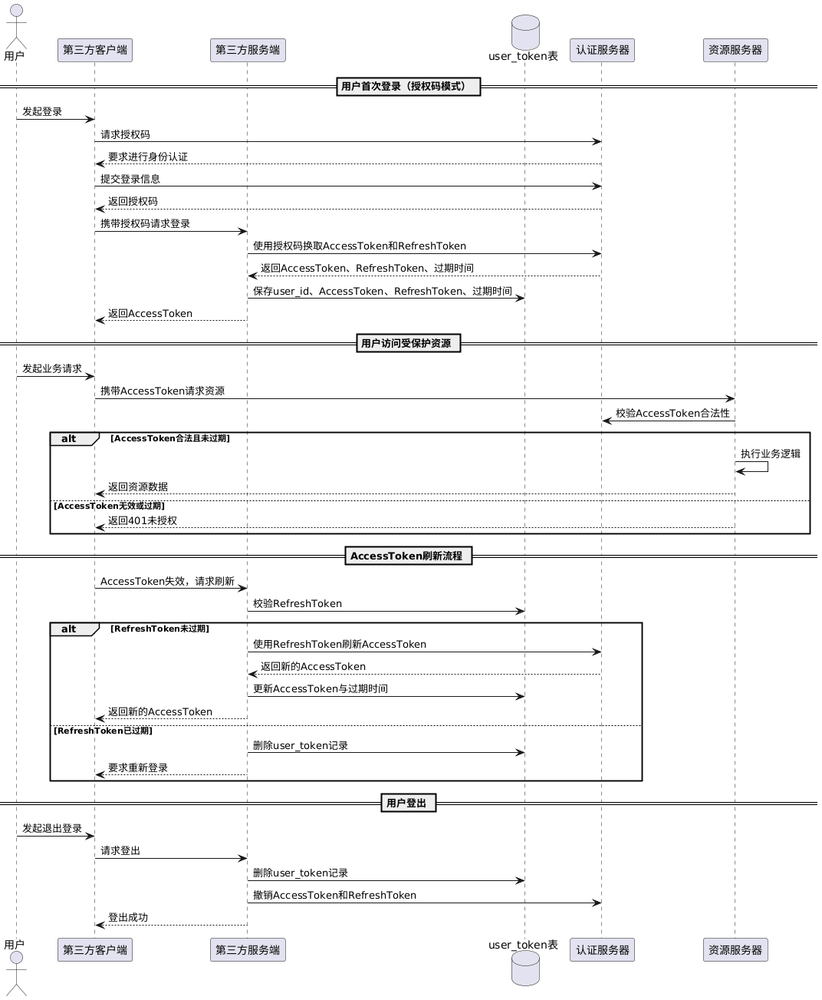

`Token`是一个用于表示用户身份或访问权限的字符串。它通常被用于进行身份验证、授权或传递信息的过程中。`Token`存储在浏览器中，在发送请求时，一般放在请求的请求头中，传输到服务器，例如这样：

```sh
curl -H "Authorization: 36c60f-63013b" https://example.com/api/resource
```

`Token`的生成、存储与验证的流程如下：

1. 客户端通过用户名和密码，或者其他信息（如验证码），向服务端发送请求。
2. 服务端验证用户信息的合法性，若验证失败，返回拒绝信息。
3. 验证通过后，服务端生成一个包含用户身份信息的`Token`，并放在响应体，返回给客户端。
4. 客户端对该`Token`进行存储，通常保存在本地存储（如`LocalStorage`）中。
5. 客户端在后续的请求中，将该`Token`放入请求头，请求头名字通常为`Authorization`。
6. 服务端收到请求后，首先验证`Token`是否过期，然后对其解码，并进行签名认证，验证其有效性。
7. 验证通过后，服务端允许用户访问请求的资源或执行相应的操作，并返回对应的数据。

`Token`与`Session`的主要区别在于，`Token`不需要在服务器端存储用户的会话信息，而是通过自身的解析和验证来确认用户身份和权限，从而具备更高的可扩展性和更轻量级的特性。可以简单地理解为“时间换空间”。

在`HTTP`请求头中，`Authorization`字段通常采用如下格式：`Bearer <token>`。其中，`Bearer`意为“持有者”，用于指明`<token>`是一个无需额外身份验证的持有者令牌。只要该令牌仍然有效，客户端即可访问受保护的资源。服务端在解析`Authorization`字段时，应按照空格（`" "`）将其拆分为两部分，从中提取出实际的`token`，并据此进行后续处理。

`Token`可以分为`JWT Token`以及`OAuth 2.0 Token`两种类型，它们的具体内容如下：

### 1. `JWT`（`JSON Web Token`）相关

> `JWT`的在线生成网站：https://www.bejson.com/jwt/

`JWT`由三个部分组成，这三个部分通过点号`.`连接而成。

`Header`（头部）为 `JSON`格式，包含两部分信息，声明类型（`typ`）和使用的签名算法（`alg`）。

```json
{
  "alg": "HS256",
  "typ": "JWT"
}
```

`Payload`（载荷）为 `JSON`格式，包含要传输的声明，这里一般放置用户及其他相关数据的数据信息。

```json
{
  "userName": "zhangsan",
  "dept": "safeAI",
  "userId": "330293534w"
}
```

在`Payload`中还可以设置发行者`iss`、过期时间`exp`、主题`sub`等等，其中过期时间我们一般都要设置。

`Signature`（签名）是使用`Header`中指定的签名算法，结合服务器保存的密钥`secret`，对`Header`和`Payload`进行计算得到的签名结果。相关伪代码如下所示：

```go
Signature = HMACSHA256(Base64UrlEncode(Header) + "." + Base64UrlEncode(Payload), secret)
```

`JWT`形成最终的字符串的算法，其伪代码如下所示：

```go
JwtString = Base64UrlEncode(Header) + "." + Base64UrlEncode(Payload) + "." + Base64UrlEncode(Signature)
```

`Base64UrlEncode`和`Base64`的区别是：`Base64UrlEncode`将`+`替换为`-`，`/`替换为`_`，并去掉填充字符`=`，适合在`URL`中使用。

一个`JWT`字符串的示例如下：

```sh
eyJ0eXAiOiJKV1QiLCJhbGciOiJIUzI1NiJ9
.eyJkZXB0IjoiaWt1buWQjuaPtOS8miIsInVzZXJOYW1lIjoi5byg5LiJIiwiZXhwIjoxNjY1NjMwMjc1LCJ1c2VySWQiOiIzIn0
.Oy82soyC8JGNFUzlZsZEC17Srxb6nokeBQHlonlxxkE
```

`JWT`字符串的主要长度集中在第二部分，即`Payload`经过`Base64UrlEncode`编码后的内容。因此，`JWT`的整体长度不可能是固定的，并且会随着`Payload`内容的增加而线性增长。

服务端解析`JWT`通常需要执行以下步骤：

1. 分割`JWT`：将`JWT`字符串按照`.`进行分割，分成`Header`、`Payload`和`Signature`三个部分。
2. `Base64`解码：对`Header`和`Payload`部分进行`Base64`解码，获取原始的`JSON`格式数据。
3. 验证签名：使用相同的编码算法和密钥，对解码后的`Header`和`Payload`重新生成签名，并与`JWT`中的`Signature`进行比较。若重新生成的签名与`JWT`中的`Signature`相同，则说明`JWT`未被篡改，服务端可信任其中的用户数据。

`JWT`是一种无状态令牌。一旦签发，服务端通常不会主动使其失效，而是依赖`exp`过期时间来控制有效期。

由于这一设计特性，`JWT`天然不支持用户主动下线或服务端强制下线。也就是说，在`JWT`签发完成后，即使用户已退出登录、账号被封禁或密码被修改，之前签发的`JWT`在`exp`到期之前仍然有效。虽然客户端可以删除本地存储的`JWT`，但如果该令牌已被第三方截获，在过期之前仍可用于访问受保护的资源。

从服务端视角看，无法单方面使某个已签发的`JWT`立即失效，除非额外引入黑名单、`jti`校验、频繁轮换密钥或缩短令牌有效期等机制。但这些方案都要求服务端维护额外状态，实质上破坏了`JWT`完全无状态的设计初衷。

### 2. `OAuth 2.0 Token`相关

在`OAuth 2.0`认证框架中，主要涉及两种令牌：`AccessToken`（访问令牌）和`RefreshToken`（刷新令牌），它们的作用如下：

- `AccessToken`：用于访问资源服务器的凭证，有效期通常较短，一般在`5`分钟到`1`小时之间。

- `RefreshToken`：用于在访问令牌过期后获取新的访问令牌，其生命周期通常更长，一般在`7`天到`30`天之间。

`OAuth 2.0`的认证过程包括以下几个步骤：

1. 同步用户信息：资源服务器将平台侧的用户信息同步至认证服务器，用于后续的用户身份校验与令牌颁发。
2. 申请授权码：客户端向认证服务器发起授权请求，用户完成身份验证后，认证服务器返回授权码。
3. 获取令牌：客户端传递授权码到服务端，服务端向认证服务器申请访问令牌和刷新令牌，并返回访问令牌给客户端。
4. 访问资源：客户端携带访问令牌，向资源服务器请求访问受保护的数据与服务。
5. 刷新访问令牌：如果服务端发现访问令牌过期，使用刷新令牌向认证服务器申请新的访问令牌。

`OAuth 2.0`的`AccessToken`通常具有较短的有效期。令牌过期后，服务端需要通过`RefreshToken`向认证服务器申请新的`AccessToken`。当用户主动下线或服务端执行强制下线时，认证服务器会删除对应的`AccessToken`与`RefreshToken`，客户端同时清除本地存储的`AccessToken`。即使访问令牌被第三方截获，由于它已在认证服务器失效，因此无法被继续使用。

如果认证服务器发现传入的`RefreshToken`已过期，则会拒绝刷新`AccessToken`，并返回相应的错误信息。此时，用户需要重新走登录认证流程，以获取新的`AccessToken`和`RefreshToken`。

`AccessToken`通常由客户端进行存储，用于在调用受保护接口时携带身份凭证。而`RefreshToken`由于具有更长的有效期，一旦泄露可能带来更大风险，因此由服务端负责存储和管理，通常持久化在数据库中。我们可以设计如下的`Token`管理表：

```sql
CREATE TABLE `user_token` (
    `id` BIGINT NOT NULL AUTO_INCREMENT COMMENT '主键ID',
    `user_id` BIGINT NOT NULL COMMENT '用户ID',
    `access_token` VARCHAR(512) NOT NULL COMMENT '访问Token',
    `refresh_token` VARCHAR(512) NOT NULL COMMENT '刷新Token',
    `at_expired_at` DATETIME NOT NULL COMMENT '访问Token过期时间',
    `rt_expired_at` DATETIME NOT NULL COMMENT '刷新Token过期时间',
    `device_id` VARCHAR(255) NOT NULL DEFAULT '' COMMENT '设备ID，支持多设备登录',
    `created_at` DATETIME NOT NULL DEFAULT CURRENT_TIMESTAMP,
    `updated_at` DATETIME NOT NULL DEFAULT CURRENT_TIMESTAMP ON UPDATE CURRENT_TIMESTAMP,
    PRIMARY KEY (`id`)
) COMMENT='用户Token表';
```

当用户首次通过客户端发起请求并完成`OAuth 2.0`授权流程后，服务端将获取`AccessToken`、`RefreshToken`及对应的过期时间。并将上述信息与用户标识一并写入`user_token`表，用于后续的会话管理。在后续请求中，客户端访问资源服务器时需携带`AccessToken`，资源服务器再基于该`AccessToken`向认证服务器发起校验请求，以确认其有效性。

如果查询到`AccessToken`有效，资源服务器会根据`user_id`确定用户角色，并授予相应权限。

如果`AccessToken`已过期，服务端将检查对应的`RefreshToken`是否过期：

- 若`RefreshToken`未过期，服务端会凭刷新令牌向认证服务器申请新的`AccessToken`，更新`user_token`表中的访问令牌及其过期时间，并将刷新后的`AccessToken`返回给客户端，供后续请求携带使用。
- 若`RefreshToken`也已过期，说明用户会话已失效，服务端将删除`user_token`表中对应的记录，并跳转至认证服务器的登录页面，引导用户重新完成认证流程。认证服务器颁发新的令牌后，向`user_token`表写入新的令牌信息。

用户手动登出系统时，服务端应根据传入的`AccessToken`删除`user_token`表中对应的记录，并同步调用认证服务器接口，移除该`AccessToken`及对应的`RefreshToken`，确保认证状态被清除。用户后续需重新登录获取新的`AccessToken`和`RefreshToken`。

`OAuth 2.0`认证流程的时序图如下所示：



当前描述的`OAuth 2.0`流程尚不完全准确，待后续在实际使用过程中进一步验证后，将对该流程进行持续更新与优化。

`OAuth 2.0`认证流程的时序图，其`PlantUML`代码如下所示：

```scss
@startuml
actor 用户
participant 第三方客户端
participant 第三方服务端 as ClientBE
database "user_token表" as DB
participant 认证服务器 as AS
participant 资源服务器 as RS

== 用户首次登录（授权码模式） ==
用户 -> 第三方客户端: 发起登录
第三方客户端 -> AS: 请求授权码
AS --> 第三方客户端: 要求进行身份认证
第三方客户端 -> AS: 提交登录信息
AS --> 第三方客户端: 返回授权码
第三方客户端 -> ClientBE: 携带授权码请求登录
ClientBE -> AS: 使用授权码换取AccessToken和RefreshToken
AS --> ClientBE: 返回AccessToken、RefreshToken、过期时间
ClientBE -> DB: 保存user_id、AccessToken、RefreshToken、过期时间
ClientBE --> 第三方客户端: 返回AccessToken

== 用户访问受保护资源 ==
用户 -> 第三方客户端: 发起业务请求
第三方客户端 -> RS: 携带AccessToken请求资源
RS -> AS: 校验AccessToken合法性
alt AccessToken合法且未过期
    RS -> RS: 执行业务逻辑
    RS --> 第三方客户端: 返回资源数据
else AccessToken无效或过期
    RS --> 第三方客户端: 返回401未授权
end

== AccessToken刷新流程 ==
第三方客户端 -> ClientBE: AccessToken失效，请求刷新
ClientBE -> DB: 校验RefreshToken
alt RefreshToken未过期
    ClientBE -> AS: 使用RefreshToken刷新AccessToken
    AS --> ClientBE: 返回新的AccessToken
    ClientBE -> DB: 更新AccessToken与过期时间
    ClientBE --> 第三方客户端: 返回新的AccessToken
else RefreshToken已过期
    ClientBE -> DB: 删除user_token记录
    ClientBE --> 第三方客户端: 要求重新登录
end

== 用户登出 ==
用户 -> 第三方客户端: 发起退出登录
第三方客户端 -> ClientBE: 请求登出
ClientBE -> DB: 删除user_token记录
ClientBE -> AS: 撤销AccessToken和RefreshToken
ClientBE --> 第三方客户端: 登出成功
@enduml
```

`OAuth 2.0`中的授权并不涉及单一平台内部的角色、页面或接口权限分配，而是面向跨平台场景的访问授权，即用户是否允许某个第三方客户端在特定授权范围内访问资源服务器上的资源。例如，用户允许知乎读取其微信头像和昵称。

而平台内部的角色归属、菜单可见性、接口可调用性等，仍然属于业务层面的权限控制，通常由资源服务器基于`RBAC`或其他权限模型自行完成。认证服务器的职责仅限于确认“你是谁”以及“令牌是否合法可信”，并不参与具体业务权限的判定。
