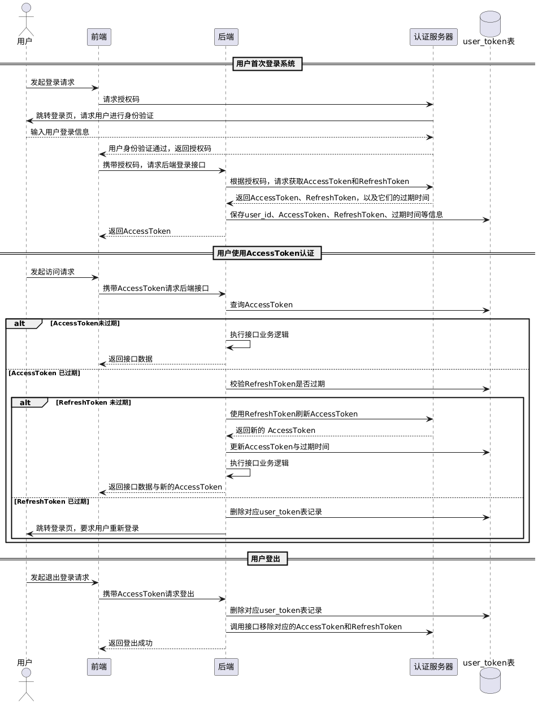

`Token`是一个用于表示用户身份或访问权限的字符串。它通常被用于进行身份验证、授权或传递信息的过程中。`Token`存储在浏览器中，在发送请求时，一般放在请求的请求头中，传输到服务器，例如这样：

```sh
curl -H "Authorization: 36c60f-63013b" https://example.com/api/resource
```

`Token`的生成、存储与验证的流程如下：

1. 客户端通过用户名和密码，或者其他信息（如验证码），向服务端发送请求。
2. 服务端验证用户信息的合法性，若验证失败，返回拒绝信息。
3. 验证通过后，服务端生成一个包含用户身份信息的`Token`，并放在响应体，返回给客户端。
4. 客户端对该`Token`进行存储，通常保存在本地存储（如`LocalStorage`）中。
5. 客户端在后续的请求中，将该`Token`放入请求头，请求头名字通常为`Authorization`。
6. 服务端收到请求后，首先验证`Token`是否过期，然后对其解码，并进行签名认证，验证其有效性。
7. 验证通过后，服务端允许用户访问请求的资源或执行相应的操作，并返回对应的数据。

`Token`与`Session`的主要区别在于，`Token`不需要在服务器端存储用户的会话信息，而是通过自身的解析和验证来确认用户身份和权限，从而具备更高的可扩展性和更轻量级的特性。可以简单地理解为“时间换空间”。

在`HTTP`请求头中，`Authorization`字段通常采用如下格式：`Bearer <token>`。其中，`Bearer`意为“持有者”，用于指明`<token>`是一个无需额外身份验证的持有者令牌。只要该令牌仍然有效，客户端即可访问受保护的资源。服务端在解析`Authorization`字段时，应按照空格（`" "`）将其拆分为两部分，从中提取出实际的`token`，并据此进行后续处理。

`Token`可以分为`JWT Token`以及`OAuth 2.0 Token`两种类型，它们的具体内容如下：

### 1. `JWT`（`JSON Web Token`）相关

> `JWT`的在线生成网站：https://www.bejson.com/jwt/

`JWT`由三个部分组成，这三个部分通过点号`.`连接而成。

`Header`（头部）： `JSON`格式，包含两部分信息，声明类型（`typ`）和使用的签名算法（`alg`）。

```json
{
  "alg": "HS256",
  "typ": "JWT"
}
```

`Payload`（载荷）： `JSON`格式，包含要传输的声明，这里一般放置用户及其他相关数据的数据信息。

```json
{
  "userName": "zhangsan",
  "dept": "safeAI",
  "userId": "330293534w"
}
```

在`Payload`中还可以设置发行者`iss`、过期时间`exp`、主题`sub`等等，其中过期时间我们一般都要设置。

`Signature`（签名）： 使用`Header`指定的签名算法和服务器保存的密钥`secret`，对`Header`和`Payload`进行签名。

```go
Signature = HMACSHA256(Base64UrlEncode(Header) + "." + Base64UrlEncode(Payload), secret)
```

`JWT`形成最终的字符串的算法是这样的：

```go
JWTString := Base64UrlEncode(Header) + "." + Base64UrlEncode(Payload) + "." + Base64UrlEncode(Signature)
```

`Base64UrlEncode`和`Base64`的区别是：`Base64UrlEncode`将`+`替换为`-`，`/`替换为`_`，并去掉填充字符`=`，适合在`URL`中使用。

一个`JWT`的示例如下：

```
eyJ0eXAiOiJKV1QiLCJhbGciOiJIUzI1NiJ9
.eyJkZXB0IjoiaWt1buWQjuaPtOS8miIsInVzZXJOYW1lIjoi5byg5LiJIiwiZXhwIjoxNjY1NjMwMjc1LCJ1c2VySWQiOiIzIn0
.Oy82soyC8JGNFUzlZsZEC17Srxb6nokeBQHlonlxxkE
```

服务端解析`JWT`通常需要执行以下步骤：

1. 分割`JWT`：将`JWT`字符串按照`.`进行分割，分成`Header`、`Payload`和`Signature`三个部分。
2. `Base64`解码：对`Header`和`Payload`部分进行`Base64`解码，获取原始的`JSON`格式数据。
3. 验证签名：使用相同的编码算法和密钥，对解码后的`Header`和`Payload`重新生成签名，并与`JWT`中的`Signature`进行比较。若重新生成的签名与`JWT`中的`Signature`相同，则说明`JWT`未被篡改，服务端可信任其中的用户数据。

### 2. `OAuth 2.0 Token`相关

在`OAuth 2.0`认证框架中，主要涉及两种令牌：`AccessToken`（访问令牌）和`RefreshToken`（刷新令牌），它们的作用如下：

- `AccessToken`：用于访问受保护资源的凭证，包含用户授权的信息。访问令牌的有效期通常较短，一般在`5`分钟到`1`小时。

- `RefreshToken`：用于在访问令牌过期后，获取新的访问令牌。刷新令牌的生命周期更长，一般在`7`天到`30`天。

`OAuth 2.0`的认证过程包括以下几个步骤：

1. 同步用户信息：资源服务器（后端）将平台用户信息同步至认证服务器，以便后续用户身份验证和授权操作。
2. 申请授权码：前端向认证服务器发起授权请求，用户完成身份验证后，认证服务器返回授权码。
3. 获取令牌：前端传递授权码到后端，后端向认证服务器申请访问令牌和刷新令牌，并返回访问令牌给前端。
4. 访问受保护资源：前端携带访问令牌，向资源服务器请求访问受保护的数据与服务。
5. 刷新访问令牌：如果资源服务器发现访问令牌过期，使用刷新令牌向认证服务器申请新的访问令牌。

`JWT`是一种无状态令牌，一旦签发，服务器不会主动使其失效，而是依赖`exp`（过期时间）来控制其有效性。在实际设计中，如果系统为了减少数据库查询，把用户的角色或权限信息直接写入`JWT`，那么在`JWT`过期之前，系统对该用户的权限变更无法立即生效，会带来安全隐患。特别是在`JWT`有效期较长时，旧令牌仍然携带过时的权限数据，风险会进一步放大。

相比之下，`OAuth 2.0`的`AccessToken`虽然同样无状态，但其有效期通常较短。一旦过期，客户端会使用`RefreshToken`向认证服务器申请新的`AccessToken`。认证服务器在验证`RefreshToken`后，会生成并返回包含最新权限信息的`AccessToken`，这样客户端就可以使用新的令牌。由于`AccessToken`的有效期较短，权限变更的延迟时间大幅缩短，从而提高了安全性。

如果认证服务器发现传入的`RefreshToken`已过期，则会拒绝刷新`AccessToken`，并返回相应的错误信息。此时，用户需要重新走登录认证流程，以获取新的`AccessToken`和`RefreshToken`。

对于`AccessToken`，通常由前端进行存储，用于在调用受保护接口时携带身份凭证。而`RefreshToken`由于具有更长的有效期，一旦泄露可能带来更大风险，因此由后端负责存储和管理，通常持久化在数据库中。我们可以设计如下的`Token`管理表：

```sql
CREATE TABLE `user_token` (
    `id` BIGINT NOT NULL AUTO_INCREMENT COMMENT '主键ID',
    `user_id` BIGINT NOT NULL COMMENT '用户ID',
    `access_token` VARCHAR(512) NOT NULL COMMENT '访问Token',
    `refresh_token` VARCHAR(512) NOT NULL COMMENT '刷新Token',
    `at_expired_at` DATETIME NOT NULL COMMENT '访问Token过期时间',
    `rt_expired_at` DATETIME NOT NULL COMMENT '刷新Token过期时间',
    `device_id` VARCHAR(255) NOT NULL DEFAULT '' COMMENT '设备ID，支持多设备登录',
    `created_at` DATETIME NOT NULL DEFAULT CURRENT_TIMESTAMP,
    `updated_at` DATETIME NOT NULL DEFAULT CURRENT_TIMESTAMP ON UPDATE CURRENT_TIMESTAMP,
    PRIMARY KEY (`id`)
) COMMENT='用户Token表';
```

当用户首次通过前端发起请求并完成`OAuth 2.0`授权流程后，系统会获取`AccessToken`、`RefreshToken`及其过期时间。后端将这些信息与用户标识一并写入`user_token`表，用于后续身份验证和会话管理。

之后，前端在每次请求中都会携带`AccessToken`访问业务系统。后端接收到请求后，会根据该`AccessToken`查询`user_token`表：

- 如果查询到记录，且`AccessToken`未过期，说明用户登录状态有效，系统允许访问受保护资源。

- 如果`AccessToken`已过期，后端会检查对应的`RefreshToken`是否过期。

- 如果`RefreshToken`未过期，后端会向认证服务器申请新的`AccessToken`，更新`user_token`表的访问令牌及其过期时间，并将刷新后的`AccessToken`反馈给前端，供后续调用传入。

- 如果`RefreshToken`也已过期，说明用户会话已失效，系统会删除对应的`user_token`表数据记录，并跳转至认证服务器登录页面，引导用户重新完成认证流程，并写入新的令牌信息。

用户手动登出系统时，后端应根据传入的`AccessToken`删除`user_token`表中对应记录，并调用认证服务器接口，移除该`AccessToken`及对应的`RefreshToken`，确保认证状态被清除。用户后续需重新登录获取新的`AccessToken`和`RefreshToken`。

`OAuth 2.0`认证流程的时序图如下所示：



`OAuth 2.0`认证流程的时序图，其`PlantUML`代码如下所示：

```scss
@startuml
actor 用户
participant 前端
participant 后端 as BE
participant 认证服务器 as AS
database "user_token表" as DB

== 用户首次登录系统 ==
用户 -> 前端: 发起登录请求
前端 -> AS: 请求授权码
AS -> 用户: 跳转登录页，请求用户进行身份验证
用户 --> AS : 输入用户登录信息
AS --> 前端: 用户身份验证通过，返回授权码
前端 -> BE: 携带授权码，请求后端登录接口
BE -> AS: 根据授权码，请求获取AccessToken和RefreshToken
AS --> BE: 返回AccessToken、RefreshToken，以及它们的过期时间
BE -> DB: 保存user_id、AccessToken、RefreshToken、过期时间等信息
BE --> 前端: 返回AccessToken

== 用户使用AccessToken认证 ==
用户 -> 前端: 发起访问请求
前端 -> BE: 携带AccessToken请求后端接口
BE -> DB: 查询AccessToken
alt AccessToken未过期
    BE -> BE : 执行接口业务逻辑
    BE --> 前端: 返回接口数据
else AccessToken 已过期
    BE -> DB: 校验RefreshToken是否过期
    alt RefreshToken 未过期
        BE -> AS: 使用RefreshToken刷新AccessToken
        AS --> BE: 返回新的 AccessToken
        BE -> DB: 更新AccessToken与过期时间
        BE -> BE : 执行接口业务逻辑
        BE --> 前端: 返回接口数据与新的AccessToken
    else RefreshToken 已过期
        BE -> DB: 删除对应user_token表记录
        BE -> 用户: 跳转登录页，要求用户重新登录
    end
end

== 用户登出 ==
用户 -> 前端: 发起退出登录请求
前端 -> BE: 携带AccessToken请求登出
BE -> DB: 删除对应user_token表记录
BE -> AS: 调用接口移除对应的AccessToken和RefreshToken
BE --> 前端: 返回登出成功
@enduml
```

