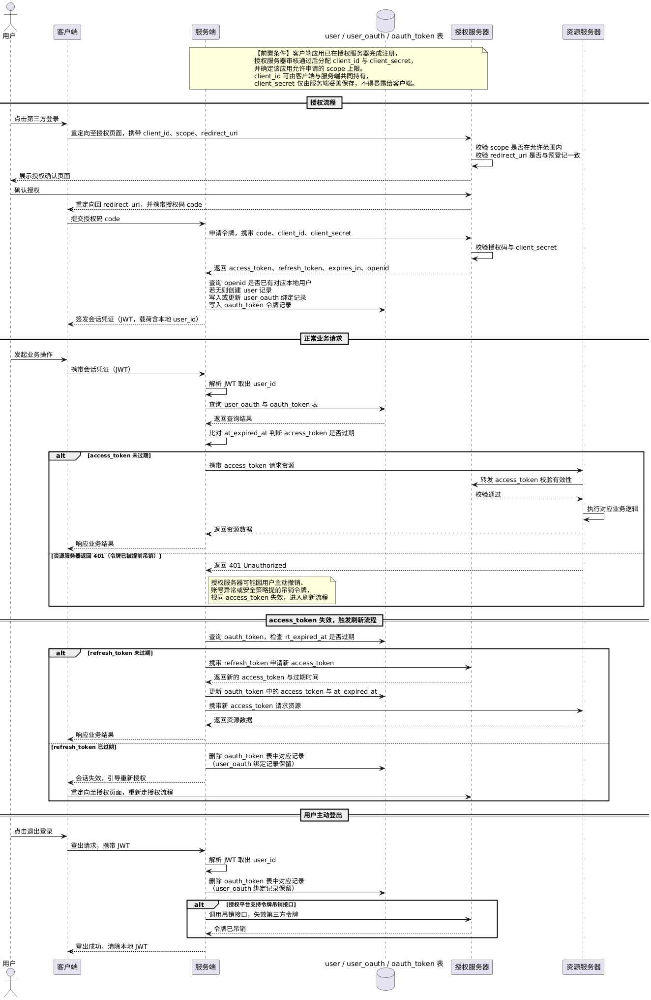

> 参考文章：https://blog.csdn.net/qq_45408390/article/details/127730870、https://blog.csdn.net/weixin_44763552/article/details/123741791

`OAuth`这个名字来源于`Open Authorization`，其中`Auth`表示授权，`2.0`表示该授权协议的第二个主要版本。

`OAuth 2.0`解决的问题是如何授权第三方代表自己访问资源服务器的受保护资源，而无须将对应的账号和密码交给第三方。例如，用户通过微信登录小红书，授权后，小红书可以读取用户微信头像、昵称等信息，无需获取或存储用户的微信密码。

需要注意的是，平台内部的角色归属、菜单可见性、接口可调用性、数据访问范围等，并不属于`OAuth 2.0`的职责范畴，而是资源服务器自身的业务权限控制问题。这类权限通常由资源服务器基于`RBAC`、`ABAC`或其他权限模型进行判定与管理，授权服务器仅负责用户身份认证、授权许可的签发以及访问令牌的管理，并不参与具体业务权限的计算与决策。

> 在以下内容中，「客户端」指第三方客户端应用，「服务端」指该第三方客户端应用对应的服务端。

第三方登录的核心机制通常基于`OAuth 2.0`授权码模式。客户端首先向授权服务器发起授权请求，请求中通常包含`client_id`、`scope`与`redirect_uri`等参数，其中`client_id`用于标识客户端应用身份，`scope`用于声明本次申请访问的权限范围，`redirect_uri`用于指定授权完成后回调地址。用户完成身份认证并确认授权后，授权服务器将授权码重定向返回至`redirect_uri`对应的客户端入口。随后，客户端将授权码发送至服务端，由服务端携带授权码、`client_id`与`client_secret`向授权服务器申请令牌。

其中`client_id`与`client_secret`是在开发者向授权服务器注册应用时分配的一对凭证。`client_id`用于标识客户端身份，可公开使用；`client_secret`则是与`client_id`配套的私密凭证，仅应保存在服务端，不得泄露给客户端。

授权服务器通过校验上述内容，确认当前令牌申请确实来自已注册的合法客户端，而非攻击者在截获授权码后伪造的请求，从而有效防止授权码被盗用后的冒充行为。校验通过后，返回`AccessToken`、`RefreshToken`与用户的唯一标识（如微信的`openid`）。服务端将令牌持久化存储，以便后续代表用户调用第三方平台接口（如拉取用户头像、昵称等基础资料）时使用。

需要注意的是，授权服务器仅维护用户在自身平台内的身份信息，这些信息用于标识「用户在该平台是谁」，并不参与第三方业务系统的用户建模，也不负责维护业务数据之间的关联关系。因此，业务系统仍需建立独立的用户体系，并为每位用户生成本地`user_id`作为统一身份标识，以承载后续所有业务数据关系，例如内容发布、点赞、评论、关注等操作。

第三方登录的本质在于通过`openid`等第三方唯一标识，在「第三方身份」与「本地用户」之间建立绑定映射。服务端在获取`openid`等外部唯一标识后，以其作为关联依据查询是否已存在对应的本地用户；若不存在，则创建新的本地用户，随后，服务端建立并持久化「本地`user_id` ↔ 第三方`openid`」的绑定关系，同时将本次授权获得的`AccessToken`、`RefreshToken`、过期时间等相关凭证持久化，以支撑后续令牌刷新、接口调用及账号管理等功能。该过程需要以下三张表：

```sql
CREATE TABLE `user` (
    `id` BIGINT NOT NULL AUTO_INCREMENT COMMENT '主键ID',
    `nickname` VARCHAR(64) NOT NULL DEFAULT '' COMMENT '用户昵称',
    `avatar` VARCHAR(512) NOT NULL DEFAULT '' COMMENT '用户头像URL',
    `status` TINYINT NOT NULL DEFAULT 1 COMMENT '用户状态，1正常，0禁用',
    `created_at` DATETIME NOT NULL DEFAULT CURRENT_TIMESTAMP,
    `updated_at` DATETIME NOT NULL DEFAULT CURRENT_TIMESTAMP ON UPDATE CURRENT_TIMESTAMP,
    PRIMARY KEY (`id`)
) COMMENT='系统用户表';

CREATE TABLE `user_oauth` (
    `id` BIGINT NOT NULL AUTO_INCREMENT COMMENT '主键ID',
    `user_id` BIGINT NOT NULL COMMENT '本地用户ID，关联user.id',
    `provider` VARCHAR(32) NOT NULL DEFAULT '' COMMENT '第三方平台，如wechat、apple、google',
    `provider_uid` VARCHAR(128) NOT NULL DEFAULT '' COMMENT '第三方唯一标识，如openid、sub',
    `status` TINYINT NOT NULL DEFAULT 1 COMMENT '绑定状态，1正常，0解绑',
    `created_at` DATETIME NOT NULL DEFAULT CURRENT_TIMESTAMP,
    `updated_at` DATETIME NOT NULL DEFAULT CURRENT_TIMESTAMP ON UPDATE CURRENT_TIMESTAMP,
    PRIMARY KEY (`id`)
) COMMENT='第三方账号绑定关系表';

CREATE TABLE `oauth_token` (
    `id` BIGINT NOT NULL AUTO_INCREMENT COMMENT '主键ID',
    `user_oauth_id` BIGINT NOT NULL COMMENT '绑定关系ID，关联user_oauth.id',
    `access_token` VARCHAR(512) NOT NULL DEFAULT '' COMMENT '访问令牌',
    `refresh_token` VARCHAR(512) NOT NULL DEFAULT '' COMMENT '刷新令牌',
    `at_expired_at` DATETIME NOT NULL COMMENT 'access_token过期时间',
    `rt_expired_at` DATETIME NOT NULL COMMENT 'refresh_token过期时间，计算获得',
    `created_at` DATETIME NOT NULL DEFAULT CURRENT_TIMESTAMP,
    `updated_at` DATETIME NOT NULL DEFAULT CURRENT_TIMESTAMP ON UPDATE CURRENT_TIMESTAMP,
    PRIMARY KEY (`id`)
) COMMENT='第三方授权令牌表';
```

完成绑定后，服务端基于当前用户在平台的用户身份签发自身体系的会话凭证（通常为`JWT`）并返回给客户端。此后客户端与服务端的所有通信均携带该凭证，与授权服务器侧的`AccessToken`完全隔离。

客户端携带会话凭证向服务端发起请求后，服务端解析`JWT`后得到本地`user_id`，并从`user_oauth`表中查询对应的第三方账号绑定记录。随后，关联查询`oauth_token`表，并将当前时间与`at_expired_at`字段进行比对：若`AccessToken`已过期，则直接进入令牌刷新流程，无需再向资源服务器发起请求；若尚未过期，则携带`AccessToken`访问资源服务器。

需要注意的是，即使本地记录显示`AccessToken`尚未过期，服务端仍需对资源服务器返回的`401 Unauthorized`进行兜底处理。这是因为授权服务器可能因用户主动撤销授权、账号异常或安全策略调整等原因，提前吊销尚未到达过期时间的令牌。此时，服务端应根据业务场景执行令牌刷新或重新授权流程，而不能仅依赖本地保存的过期时间判断令牌是否有效。

资源服务器收到携带`AccessToken`的请求后，会将令牌提交至授权服务器进行有效性校验；校验通过后，资源服务器返回受保护的资源数据，服务端再将处理结果响应给客户端。

> 若`AccessToken`为不透明令牌，资源服务器通常需转发至授权服务器校验；若为`JWT`，则可在资源服务器本地验签。

若`AccessToken`已过期，服务端查询`oauth_token`表，检查对应的`RefreshToken`是否过期：

- 若`RefreshToken`未过期，服务端会凭此向授权服务器申请新的`AccessToken`，更新表中的访问令牌及其过期时间。
- 若`RefreshToken`已过期，说明用户会话已失效，服务端将删除`oauth_token`表中对应的记录，并跳转至授权服务器的登录页面，引导用户重新完成授权流程。授权服务器颁发新的令牌后，向`oauth_token`表写入新的令牌信息。

用户手动登出系统时，服务端解析会话凭证取出`user_id`，据此删除`oauth_token`表中对应的记录，若授权平台支持令牌吊销接口，则调用以失效第三方令牌；否则仅删除本地绑定关系与会话信息。

无论是`RefreshToken`过期，还是用户主动登出，都不需要删除`user_oauth`表的记录，因为`user_oauth`记录的是本地用户与第三方平台之间的长期身份映射关系，该关系一旦建立即表示账号已完成绑定，其生命周期独立于登录态与授权凭证状态。

`OAuth 2.0`授权流程的时序图如下所示：



以「用户通过微信登录小红书」场景为例，在授权流程开始之前，小红书需要先在微信开放平台完成开发者注册，并申请接入「微信登录」能力。审核通过后，微信开放平台会为小红书分配`client_id`与`client_secret`，由小红书服务端妥善保存。

审核过程中，微信还会确定该应用可申请的权限范围上限，例如仅允许申请基础信息读取权限。这份配置作为应用级数据保存在微信服务端，在后续每次授权请求中用于合法性校验。

后续的授权流程如下所示：

1. 我在小红书上点击「微信登录」，小红书客户端将我跳转到微信的授权页面，跳转地址的查询参数里携带了`client_id`、本次申请的权限范围`scope`（只读取头像和昵称）以及授权完成后的回跳地址`redirect_uri`。微信授权服务器收到请求后，校验`scope`是否在小红书被允许申请的权限上限范围内，超出则拒绝；同时校验`redirect_uri`是否与开放平台预先登记的一致，不一致则拒绝，防止授权码被重定向到恶意地址。校验全部通过后继续往下走。
2. 我在微信的授权页面登录微信账号，然后看到「小红书申请获取我的头像和昵称」选项，点击同意。微信授权服务器生成一个一次性的授权码，将我重定向回小红书客户端，授权码附在跳转地址里。
3. 小红书客户端拿到授权码后传给小红书服务端，服务端携带授权码、`client_id`、`client_secret`向微信授权服务器请求换取`AccessToken`、`RefreshToken`及`openid`，其中`openid`是微信为同一应用下每个用户分配的唯一标识。
4. 微信授权服务器校验通过后返回上述内容，服务端以`provider`（第三方平台标识）与`openid`为联合条件查询`user_oauth`表，判断该第三方账号是否已绑定本地用户：若不存在，则在`user`表创建新用户，并在`user_oauth`表写入绑定关系；若已存在，则直接复用已有的本地用户。随后将本次授权获得的令牌信息写入或更新`oauth_token`表。
5. 随后小红书服务端以当前用户身份为基础签发一个自己体系内的会话凭证（通常为`JWT`），将其返回给小红书客户端，客户端后续与小红书服务端的所有通信均携带此凭证，与微信侧的`AccessToken`完全隔离。
6. 小红书客户端携带会话凭证向小红书服务端发起请求，服务端解析会话凭证取出本地`user_id`，以此查询`user_oauth`表取出绑定记录，再关联`oauth_token`表取出`AccessToken`，凭此调用微信资源服务器的接口。微信资源服务器将`AccessToken`转发至微信授权服务器完成有效性校验，校验通过后返回头像和昵称，小红书服务端再将结果响应给客户端。
7. `AccessToken`有效期通常较短，过期后微信资源服务器会返回`401`。此时服务端检查`oauth_token`表中对应的`RefreshToken`是否仍在有效期内：若未过期，则用它向微信换取新的`AccessToken`并更新表中记录，整个过程对我无感知；若`RefreshToken`也已过期，则引导我重新完成上述完整授权流程。

微信的授权服务器负责颁发令牌，资源服务器负责提供头像和昵称数据。小红书只是凭我授权后拿到的令牌去访问数据，始终没有接触到我的微信密码，这就是`OAuth 2.0`设计的核心价值，第三方应用在不获取用户凭证的前提下，访问用户在另一个平台上的资源。

`OAuth 2.0`授权流程的时序图，其`PlantUML`代码如下所示：

```scss
@startuml
actor 用户
participant 客户端 as Client
participant 服务端 as ClientBE
database "user / user_oauth / oauth_token 表" as DB
participant 授权服务器 as AS
participant 资源服务器 as RS

note over ClientBE, AS: 【前置条件】客户端应用已在授权服务器完成注册，\n授权服务器审核通过后分配 client_id 与 client_secret，\n并确定该应用允许申请的 scope 上限。\nclient_id 可由客户端与服务端共同持有，\nclient_secret 仅由服务端妥善保存，不得暴露给客户端。

== 授权流程 ==

用户 -> Client: 点击第三方登录
Client -> AS: 重定向至授权页面，携带 client_id、scope、redirect_uri
AS -> AS: 校验 scope 是否在允许范围内\n校验 redirect_uri 是否与预登记一致
AS --> 用户: 展示授权确认页面
用户 -> AS: 确认授权
AS --> Client: 重定向回 redirect_uri，并携带授权码 code
Client -> ClientBE: 提交授权码 code
ClientBE -> AS: 申请令牌，携带 code、client_id、client_secret
AS -> AS: 校验授权码与 client_secret
AS --> ClientBE: 返回 access_token、refresh_token、expires_in、openid
ClientBE -> DB: 查询 openid 是否已有对应本地用户\n若无则创建 user 记录\n写入或更新 user_oauth 绑定记录\n写入 oauth_token 令牌记录
ClientBE --> Client: 签发会话凭证（JWT，载荷含本地 user_id）

== 正常业务请求 ==

用户 -> Client: 发起业务操作
Client -> ClientBE: 携带会话凭证（JWT）
ClientBE -> ClientBE: 解析 JWT 取出 user_id
ClientBE -> DB: 查询 user_oauth 与 oauth_token 表
DB --> ClientBE: 返回查询结果
ClientBE -> ClientBE: 比对 at_expired_at 判断 access_token 是否过期

alt access_token 未过期
    ClientBE -> RS: 携带 access_token 请求资源
    RS -> AS: 转发 access_token 校验有效性
    AS --> RS: 校验通过
    RS -> RS: 执行对应业务逻辑
    RS --> ClientBE: 返回资源数据
    ClientBE --> Client: 响应业务结果
else 资源服务器返回 401（令牌已被提前吊销）
    RS --> ClientBE: 返回 401 Unauthorized
    note right of ClientBE: 授权服务器可能因用户主动撤销、\n账号异常或安全策略提前吊销令牌，\n视同 access_token 失效，进入刷新流程
end

== access_token 失效，触发刷新流程 ==

ClientBE -> DB: 查询 oauth_token，检查 rt_expired_at 是否过期

alt refresh_token 未过期
    ClientBE -> AS: 携带 refresh_token 申请新 access_token
    AS --> ClientBE: 返回新的 access_token 与过期时间
    ClientBE -> DB: 更新 oauth_token 中的 access_token 与 at_expired_at
    ClientBE -> RS: 携带新 access_token 请求资源
    RS --> ClientBE: 返回资源数据
    ClientBE --> Client: 响应业务结果
else refresh_token 已过期
    ClientBE -> DB: 删除 oauth_token 表中对应记录\n（user_oauth 绑定记录保留）
    ClientBE --> Client: 会话失效，引导重新授权
    Client -> AS: 重定向至授权页面，重新走授权流程
end

== 用户主动登出 ==

用户 -> Client: 点击退出登录
Client -> ClientBE: 登出请求，携带 JWT
ClientBE -> ClientBE: 解析 JWT 取出 user_id
ClientBE -> DB: 删除 oauth_token 表中对应记录\n（user_oauth 绑定记录保留）

alt 授权平台支持令牌吊销接口
    ClientBE -> AS: 调用吊销接口，失效第三方令牌
    AS --> ClientBE: 令牌已吊销
end

ClientBE --> Client: 登出成功，清除本地 JWT
@enduml
```

