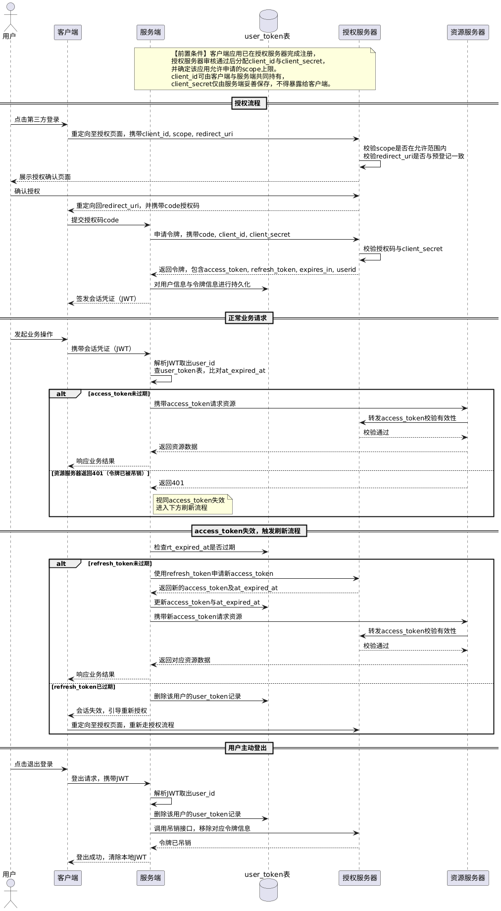

> 参考文章：https://blog.csdn.net/qq_45408390/article/details/127730870、https://blog.csdn.net/weixin_44763552/article/details/123741791

`OAuth`这个名字来源于`Open Authorization`，其中`Auth`表示授权，`2.0`表示该授权协议的第二个主要版本。

`OAuth 2.0`解决的核心问题是资源拥有者如何在不暴露自身凭证的前提下，授权第三方客户端访问其在资源服务器上的特定资源，例如小红书允许通过微信登录，并读取微信的头像与昵称。平台内部的角色归属、菜单可见性、接口可调用性等属于业务层面的权限控制，由资源服务器基于`RBAC`或其他权限模型自行完成，授权服务器并不参与具体业务权限的判定。

> 在以下内容中，「客户端」指第三方客户端应用，「服务端」指该第三方客户端应用对应的服务端。

在`OAuth 2.0`授权框架中，主要涉及两种令牌：`AccessToken`（访问令牌）和`RefreshToken`（刷新令牌），它们的作用如下：

- `AccessToken`：用于访问资源服务器的凭证，有效期通常较短，一般在`5`分钟到`1`小时之间。

- `RefreshToken`：用于在访问令牌过期后获取新的访问令牌，其生命周期通常更长，一般在`7`天到`30`天之间。

`AccessToken`与`RefreshToken`均由服务端负责存储和管理，通常一并持久化在数据库中。例如下表：

```sql
CREATE TABLE `user_token` (
    `id` BIGINT NOT NULL AUTO_INCREMENT COMMENT '主键ID',
    `user_id` BIGINT NOT NULL COMMENT '用户ID',
    `access_token` VARCHAR(512) NOT NULL COMMENT '访问令牌',
    `refresh_token` VARCHAR(512) NOT NULL COMMENT '刷新令牌',
    `at_expired_at` DATETIME NOT NULL COMMENT '访问令牌过期时间',
    `rt_expired_at` DATETIME NOT NULL COMMENT '刷新令牌过期时间',
    `device_id` VARCHAR(255) NOT NULL DEFAULT '' COMMENT '设备ID，支持多设备登录',
    `created_at` DATETIME NOT NULL DEFAULT CURRENT_TIMESTAMP,
    `updated_at` DATETIME NOT NULL DEFAULT CURRENT_TIMESTAMP ON UPDATE CURRENT_TIMESTAMP,
    PRIMARY KEY (`id`)
) COMMENT='用户Token表';
```

客户端首先向授权服务器发起授权请求，用户完成身份验证并同意授权后，授权服务器将授权码返回给客户端。客户端随即将授权码提交至服务端，服务端携带授权码、`client_id`与`client_secret`向授权服务器申请令牌；授权服务器校验通过后，返回`AccessToken`、`RefreshToken`与用户的唯一标识（如微信的`openid`），服务端持久化至`user_token`表，再基于当前用户身份签发自身体系的会话凭证（通常为`JWT`）并返回给客户端。此后客户端与服务端的所有通信均携带该凭证，与授权服务器侧的`AccessToken`完全隔离。

在第三方授权登录场景中，用户的身份信息由授权服务器负责维护，服务端本身不创建用户身份。因此授权服务器在颁发访问令牌与刷新令牌的同时，必须一并返回用户的唯一标识，服务端拿到后将其持久化，作为后续关联用户数据的依据。这也是第三方授权登录与传统账号密码登录的本质区别，传统登录的用户身份由服务端自身创建和管理，而第三方授权登录的用户身份归属于授权平台。

> 这里的`client_id`与`client_secret`是开发者在授权服务器注册应用时一次性分配的一对凭证：`client_id`用于标识客户端身份，可公开使用；`client_secret`是与之配对的私密凭证，仅保存于服务端，作用是向授权服务器证明该令牌申请确实来自合法的客户端本身，而非他人盗用授权码后伪造的请求。

客户端携带会话凭证向服务端发起请求后，服务端解析其中的`user_id`，并从`user_token`表中取出对应记录，将当前时间与`at_expired_at`字段进行比对：若已过期，则直接进入刷新流程，无需再向资源服务器发起请求；若未过期，则携带`AccessToken`向资源服务器发起请求，同时仍需对资源服务器返回的`401`做兜底处理，因为令牌可能已在授权服务器侧被主动吊销。资源服务器收到请求后，将`AccessToken`转发至授权服务器进行有效性校验，校验通过后将资源数据返回给服务端，服务端再将结果响应给客户端。

> 若`AccessToken`为不透明令牌，资源服务器通常需转发至授权服务器校验；若为`JWT`，则可本地验签。

若`AccessToken`已过期，服务端查询`user_token`表，检查对应的`RefreshToken`是否过期：

- 若`RefreshToken`未过期，服务端会凭此向授权服务器申请新的`AccessToken`，更新`user_token`表中的访问令牌及其过期时间。
- 若`RefreshToken`已过期，说明用户会话已失效，服务端将删除`user_token`表中对应的记录，并跳转至授权服务器的登录页面，引导用户重新完成授权流程。授权服务器颁发新的令牌后，向`user_token`表写入新的令牌信息。

用户手动登出系统时，服务端解析会话凭证取出`user_id`，据此删除`user_token`表中对应的记录，并同步调用授权服务器接口移除对应的令牌信息，确保授权状态被清除。用户后续需重新完成授权流程以获取新的令牌。

`OAuth 2.0`授权流程的时序图如下所示：



以「小红书允许通过微信登录」场景为例，在授权流程开始之前，小红书需要先在微信开放平台完成开发者注册，并申请接入「微信登录」能力。审核通过后，微信开放平台会为小红书分配`client_id`与`client_secret`，由小红书服务端妥善保存。

审核过程中，微信还会确定该应用可申请的权限范围上限，例如仅允许申请基础信息读取权限。这份配置作为应用级数据保存在微信服务端，在后续每次授权请求中用于合法性校验。

后续的授权流程如下所示：

1. 我在小红书上点击「微信登录」，小红书客户端将我跳转到微信的授权页面，跳转地址的查询参数里携带了`client_id`、本次申请的权限范围`scope`（只读取头像和昵称）以及授权完成后的回跳地址`redirect_uri`。微信授权服务器收到请求后，校验`scope`是否在小红书被允许申请的权限上限范围内，超出则拒绝；同时校验`redirect_uri`是否与开放平台预先登记的一致，不一致则拒绝，防止授权码被重定向到恶意地址。校验全部通过后继续往下走。
2. 我在微信的授权页面登录微信账号，然后看到「小红书申请获取我的头像和昵称」选项，点击同意。微信授权服务器生成一个一次性的授权码，将我重定向回小红书客户端，授权码附在跳转地址里。
3. 小红书客户端拿到授权码后传给小红书服务端，服务端携带授权码、`client_id`、`client_secret`向微信授权服务器请求换取`AccessToken`、`RefreshToken`及`openid`，其中`openid`是微信为同一应用下每个用户分配的唯一标识。微信授权服务器校验通过后返回上述内容，服务端以此完成本地用户的创建或匹配，并将令牌信息持久化至`user_token`表。
4. 随后小红书服务端以当前用户身份为基础签发一个自己体系内的会话凭证（通常为`JWT`），将其返回给小红书客户端，客户端后续与小红书服务端的所有通信均携带此凭证，与微信侧的`AccessToken`完全隔离。
5. 小红书客户端携带会话凭证向小红书服务端发起请求，服务端解析会话凭证取出`user_id`（即持久化时存入的微信`openid`），据此从`user_token`表取出对应的`AccessToken`，凭此去调用微信资源服务器的接口，微信资源服务器将`AccessToken`转发至微信授权服务器完成有效性校验，校验通过后返回头像和昵称，再由小红书服务端将结果响应给客户端。
6. `AccessToken`有效期通常较短，过期后微信资源服务器会返回`401`。此时服务端检查`user_token`表中对应的`RefreshToken`是否仍在有效期内：若未过期，则用它向微信换取新的`AccessToken`并更新表中记录，整个过程对我无感知；若`RefreshToken`也已过期，则引导我重新完成上述完整授权流程。

微信的授权服务器负责颁发令牌，资源服务器负责提供头像和昵称数据。小红书只是凭我授权后拿到的令牌去访问数据，始终没有接触到我的微信密码，这就是`OAuth 2.0`设计的核心价值，第三方应用在不获取用户凭证的前提下，访问用户在另一个平台上的资源。

`OAuth 2.0`授权流程的时序图，其`PlantUML`代码如下所示：

```scss
@startuml
actor 用户
participant 客户端 as Client
participant 服务端 as ClientBE
database "user_token表" as DB
participant 授权服务器 as AS
participant 资源服务器 as RS

note over ClientBE, AS: 【前置条件】客户端应用已在授权服务器完成注册，\n授权服务器审核通过后分配client_id与client_secret，\n并确定该应用允许申请的scope上限。\nclient_id可由客户端与服务端共同持有，\nclient_secret仅由服务端妥善保存，不得暴露给客户端。

== 授权流程 ==

用户 -> Client: 点击第三方登录
Client -> AS: 重定向至授权页面，携带client_id, scope, redirect_uri
AS -> AS: 校验scope是否在允许范围内\n校验redirect_uri是否与预登记一致
AS --> 用户: 展示授权确认页面
用户 -> AS: 确认授权
AS --> Client: 重定向回redirect_uri，并携带code授权码
Client -> ClientBE: 提交授权码code
ClientBE -> AS: 申请令牌，携带code, client_id, client_secret
AS -> AS: 校验授权码与client_secret
AS --> ClientBE: 返回令牌，包含access_token, refresh_token, expires_in, userid
ClientBE -> DB: 对用户信息与令牌信息进行持久化
ClientBE --> Client: 签发会话凭证（JWT）

== 正常业务请求 ==

用户 -> Client: 发起业务操作
Client -> ClientBE: 携带会话凭证（JWT）
ClientBE -> ClientBE: 解析JWT取出user_id\n查user_token表，比对at_expired_at
alt access_token未过期
    ClientBE -> RS: 携带access_token请求资源
    RS -> AS: 转发access_token校验有效性
    AS --> RS: 校验通过
    RS --> ClientBE: 返回资源数据
    ClientBE --> Client: 响应业务结果
else 资源服务器返回401（令牌已被吊销）
    RS --> ClientBE: 返回401
    note right of ClientBE: 视同access_token失效\n进入下方刷新流程
end

== access_token失效，触发刷新流程 ==

ClientBE -> DB: 检查rt_expired_at是否过期
alt refresh_token未过期
    ClientBE -> AS: 使用refresh_token申请新access_token
    AS --> ClientBE: 返回新的access_token及at_expired_at
    ClientBE -> DB: 更新access_token与at_expired_at
    ClientBE -> RS: 携带新access_token请求资源
    RS -> AS: 转发access_token校验有效性
    AS --> RS: 校验通过
    RS --> ClientBE: 返回对应资源数据
    ClientBE --> Client: 响应业务结果
else refresh_token已过期
    ClientBE -> DB: 删除该用户的user_token记录
    ClientBE --> Client: 会话失效，引导重新授权
    Client -> AS: 重定向至授权页面，重新走授权流程
end

== 用户主动登出 ==

用户 -> Client: 点击退出登录
Client -> ClientBE: 登出请求，携带JWT
ClientBE -> ClientBE: 解析JWT取出user_id
ClientBE -> DB: 删除该用户的user_token记录
ClientBE -> AS: 调用吊销接口，移除对应令牌信息
AS --> ClientBE: 令牌已吊销
ClientBE --> Client: 登出成功，清除本地JWT
@enduml
```

