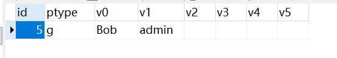

授权的核心就是回答三个问题：谁（主体），对什么资源（对象），能做什么操作（动作）。

- 主体：通常是用户、用户组、角色、服务账号等，例如用户`Alice`。
- 对象：某个接口、某张表、某个字段、某个文件，甚至是一个微服务。
- 动作：描述主体可以对资源做什么，常见的操作有读、写、删除、更新、执行等。

我们使用下方的命令引入`Casbin`授权相关第三方库：

```sh
go get github.com/casbin/casbin/v2
go get github.com/casbin/gorm-adapter/v3
```

在`Casbin`里，这个三元关系为`sub`（`subject`）、`obj`（`object`）和`act`（`action`），它们合称为策略（`policy`）。

使用`Casbin`进行权限控制，可以使用模型文件`model.conf`来定义访问控制模型。该模型文件示例如下：

```ini
[request_definition]
r = sub, obj, act

[policy_definition]
p = sub, obj, act

[role_definition]
g = _, _

[policy_effect]
e = some(where (p.eft == allow))

[matchers]
m = g(r.sub, p.sub) && r.obj == p.obj && r.act == p.act
```

上面是一个基于角色的访问控制（`RBAC`）配置，我们可通过修改`model.conf`将其调整为基于属性的访问控制（`ABAC`）等形式。

我们把`model.conf`文件放到`cmd/casbin`目录下，并在`utils`目录下的`enforcer.go`文件中编写下方代码：

```go
var (
	enforcer *casbin.Enforcer
)

func NewEnforcer() (*casbin.Enforcer, error) {
	if enforcer != nil {
		return enforcer, nil
	}
	adapter, err := gormadapter.NewAdapterByDB(db.GetDB())
	if err != nil {
		wlog.Error("call gormadapter.NewAdapterByDB failed").Err(err).Log()
		return nil, err
	}
	enforcer, err = casbin.NewEnforcer("cmd/casbin/model.conf", adapter)
	if err != nil {
		wlog.Error("call casbin.NewEnforcer failed").Err(err).Log()
		return nil, err
	}
	err = enforcer.LoadPolicy()
	if err != nil {
		wlog.Error("call enforcer.LoadPolicy failed").Err(err).Log()
		return nil, err
	}
	return enforcer, nil
}
```

普通的`NewEnforcer`适用于策略变动频繁、策略变化幅度较大但鉴权请求量不高的场景。而当策略修改较少且鉴权请求调用频繁时，可以考虑使用`NewCachedEnforcer`，它会返回一个`*casbin.CachedEnforcer`类型的对象。

在后续的其它接口中，可以调用`NewEnforcer`方法以获取`enforcer`对象：

```go
enforcer, err := utils.NewEnforcer()
if err != nil {
	wlog.Error("call NewEnforcer failed").Err(err).Log()
	return nil, err
}
```

`gormadapter.NewAdapterByDB`函数会检查指定数据库中是否存在`casbin_rule`表，如果不存在，则会自动创建：

```sql
CREATE TABLE `casbin_rule` (
  `id` BIGINT UNSIGNED NOT NULL AUTO_INCREMENT,
  `ptype` VARCHAR(100) DEFAULT NULL,
  `v0` VARCHAR(100) DEFAULT NULL,
  `v1` VARCHAR(100) DEFAULT NULL,
  `v2` VARCHAR(100) DEFAULT NULL,
  `v3` VARCHAR(100) DEFAULT NULL,
  `v4` VARCHAR(100) DEFAULT NULL,
  `v5` VARCHAR(100) DEFAULT NULL,
  PRIMARY KEY (`id`),
  UNIQUE KEY `idx_casbin_rule` (`ptype`,`v0`,`v1`,`v2`,`v3`,`v4`,`v5`)
) ENGINE=InnoDB DEFAULT CHARSET=utf8mb4 COLLATE=utf8mb4_0900_ai_ci;
```

表中的`ptype`字段表示策略类型，常见取值有两种：

- `g`表示分组策略，用于定义继承关系，例如`g, Alice, admin`，表示用户`Alice`属于用户组`admin`，也就是拥有角色`admin`。
- `p`表示策略规则，例如`p, admin, /api/user, GET`，表示角色`admin`可以对接口`/api/user`发起`GET`请求。

`v0`到`v5`是策略参数的占位字段，在`model.conf`中定义的策略字段会映射到这些字段上。例如定义`p = sub, obj, act`时，对应到表中为`v0 = sub`、`v1 = obj`、`v2 = act`；定义`g = _, _`时，第一个`_`对应`v0`，第二个`_`对应`v1`。如果策略包含更多维度，则可以依次使用`v3`、`v4`、`v5`进行存放。`casbin_rule`表既可以存储用户-角色关系，也可以存储角色-资源权限。

接下来，我将使用上文中获取到的`enforcer`对象，来完成分组策略与策略规则的新增、删除、修改和查询操作。

首先是新增分组策略，使用到`AddGroupingPolicy`方法，其方法签名如下所示：

```go
func (e *Enforcer) AddGroupingPolicy(params ...interface{}) (bool, error)
```

我们可以看到，该方法接收可变参数，实际上传入的参数数量由配置文件中的内容决定。在上文的配置文件中，我们配置了`g = _, _`，因此该方法需要传入两个参数，第一个参数表示用户，第二个参数表示角色。

例如下方代码，表示将用户`Bob`赋予角色`admin`：

```go
_, _ = enforcer.AddGroupingPolicy("Bob", "admin")
```

需要注意，`AddGroupingPolicy`方法会自动判断该用户是否已经拥有该角色，若是，则不会重复执行插入操作。例如，即使我们执行上面的代码两次，它也只会在数据库中插入一条记录。数据库的记录如下所示：



执行如下代码可以完成分组策略的删除操作：

```go
_, _ = enforcer.RemoveGroupingPolicy("Bob", "admin")
```

分组策略的修改使用到`UpdateGroupingPolicy`方法，其方法签名如下所示：

```go
func (e *Enforcer) UpdateGroupingPolicy(oldRule []string, newRule []string) (bool, error)
```

例如要把用户`Bob`的角色`admin`替换为`superadmin`，代码如下所示：

```go
_, _ = enforcer.UpdateGroupingPolicy(
	[]string{"Bob", "admin"},       // old rule
	[]string{"Bob", "superadmin"}, // new rule
)
```

如果`Casbin`未能查询到与`g, Bob, admin`匹配的旧策略，该方法会返回`false`，并且不会进行任何修改。
