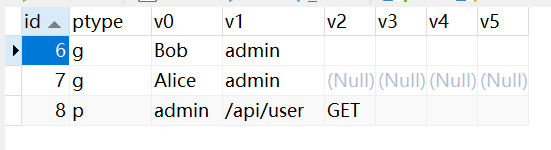

授权的核心就是回答三个问题：谁（主体），对什么资源（对象），能做什么操作（动作）。

- 主体：通常是用户、用户组、角色、服务账号等，例如用户`Alice`。
- 对象：某个接口、某张表、某个字段、某个文件，甚至是一个微服务。
- 动作：描述主体可以对资源做什么，常见的操作有读、写、删除、更新、执行等。

我们使用下方的命令引入`Casbin`授权相关第三方库：

```sh
go get github.com/casbin/casbin/v2
go get github.com/casbin/gorm-adapter/v3
```

在`Casbin`里，这个三元关系为`sub`（`subject`）、`obj`（`object`）和`act`（`action`），它们合称为策略（`policy`）。

使用`Casbin`进行权限控制，可以使用模型文件`model.conf`来定义访问控制模型。该模型文件示例如下：

```ini
[request_definition]
r = sub, obj, act

[policy_definition]
p = sub, obj, act

[role_definition]
g = _, _

[policy_effect]
e = some(where (p.eft == allow))

[matchers]
m = g(r.sub, p.sub) && r.obj == p.obj && r.act == p.act
```

上面是一个基于角色的访问控制（`RBAC`）配置，我们可通过修改`model.conf`将其调整为基于属性的访问控制（`ABAC`）等形式。

我们把`model.conf`文件放到`cmd/casbin`目录下，并在`utils`目录下的`enforcer.go`文件中编写下方代码：

```go
var (
	enforcer *casbin.Enforcer
)

func NewEnforcer() (*casbin.Enforcer, error) {
	if enforcer != nil {
		return enforcer, nil
	}
	adapter, err := gormadapter.NewAdapterByDB(db.GetDB())
	if err != nil {
		wlog.Error("call gormadapter.NewAdapterByDB failed").Err(err).Log()
		return nil, err
	}
	enforcer, err = casbin.NewEnforcer("cmd/casbin/model.conf", adapter)
	if err != nil {
		wlog.Error("call casbin.NewEnforcer failed").Err(err).Log()
		return nil, err
	}
	err = enforcer.LoadPolicy()
	if err != nil {
		wlog.Error("call enforcer.LoadPolicy failed").Err(err).Log()
		return nil, err
	}
	return enforcer, nil
}
```

普通的`NewEnforcer`适用于策略变动频繁、策略变化幅度较大但鉴权请求量不高的场景。而当策略修改较少且鉴权请求调用频繁时，可以考虑使用`NewCachedEnforcer`，它会返回一个`*casbin.CachedEnforcer`类型的对象。

在后续的其它接口中，可以调用`NewEnforcer`方法以获取`enforcer`对象：

```go
enforcer, err := utils.NewEnforcer()
if err != nil {
	wlog.Error("call NewEnforcer failed").Err(err).Log()
	return nil, err
}
```

`gormadapter.NewAdapterByDB`函数会检查指定数据库中是否存在`casbin_rule`表，如果不存在，则会自动创建：

```sql
CREATE TABLE `casbin_rule` (
  `id` BIGINT UNSIGNED NOT NULL AUTO_INCREMENT,
  `ptype` VARCHAR(100) DEFAULT NULL,
  `v0` VARCHAR(100) DEFAULT NULL,
  `v1` VARCHAR(100) DEFAULT NULL,
  `v2` VARCHAR(100) DEFAULT NULL,
  `v3` VARCHAR(100) DEFAULT NULL,
  `v4` VARCHAR(100) DEFAULT NULL,
  `v5` VARCHAR(100) DEFAULT NULL,
  PRIMARY KEY (`id`),
  UNIQUE KEY `idx_casbin_rule` (`ptype`,`v0`,`v1`,`v2`,`v3`,`v4`,`v5`)
) ENGINE=InnoDB DEFAULT CHARSET=utf8mb4 COLLATE=utf8mb4_0900_ai_ci;
```

表中的`ptype`字段表示策略类型，常见取值有两种：

- `g`表示分组策略，用于定义继承关系，例如`g, Alice, admin`，表示用户`Alice`属于用户组`admin`，也就是拥有角色`admin`。
- `p`表示策略规则，例如`p, admin, /api/user, GET`，表示角色`admin`可以对接口`/api/user`发起`GET`请求。

`v0`到`v5`是策略参数的占位字段，在`model.conf`中定义的策略字段会映射到这些字段上。例如定义`p = sub, obj, act`时，对应到表中为`v0 = sub`、`v1 = obj`、`v2 = act`；定义`g = _, _`时，第一个`_`对应`v0`，第二个`_`对应`v1`。如果策略包含更多维度，则可以依次使用`v3`、`v4`、`v5`进行存放。`casbin_rule`表既可以存储用户-角色关系，也可以存储角色-资源权限。

接下来，我将使用上文中获取到的`enforcer`对象，来完成分组策略与策略规则的新增、删除、修改和查询操作。

首先是新增分组策略，使用到`AddGroupingPolicy`方法，其方法签名如下所示：

```go
func (e *Enforcer) AddGroupingPolicy(params ...interface{}) (bool, error)
```

我们可以看到，该方法接收可变参数，实际上传入的参数数量由配置文件中的内容决定。在上文的配置文件中，我们配置了`g = _, _`，因此该方法需要传入两个参数，第一个参数表示用户，第二个参数表示角色。

例如下方代码，表示将用户`Bob`赋予角色`admin`：

```go
_, _ = enforcer.AddGroupingPolicy("Bob", "admin")
```

一般情况下，这里应存储用户的`ID`而非名称，以确保唯一性。为了便于理解，这里暂时采用保存名称的方式。

需要注意，`AddGroupingPolicy`方法会自动判断该用户是否已经拥有该角色，若是，则不会重复执行插入操作。例如，即使我们执行上面的代码两次，它也只会在数据库中插入一条记录。数据库的记录如下所示：


执行如下代码可以完成分组策略的删除操作：

```go
_, _ = enforcer.RemoveGroupingPolicy("Bob", "admin")
```

分组策略的修改使用到`UpdateGroupingPolicy`方法，其方法签名如下所示：

```go
func (e *Enforcer) UpdateGroupingPolicy(oldRule []string, newRule []string) (bool, error)
```

例如要把用户`Bob`的角色`admin`替换为`super_admin`，代码如下所示：

```go
_, _ = enforcer.UpdateGroupingPolicy(
	[]string{"Bob", "admin"},       // old rule
	[]string{"Bob", "super_admin"}, // new rule
)
```

如果`Casbin`未能查询到与`g, Bob, admin`匹配的旧策略，该方法会返回`false`，并且不会进行任何修改。

除此之外，如果想修改多条分组策略，可以使用`UpdateGroupingPolicies`方法，其方法签名如下所示：

```go
func (e *Enforcer) UpdateGroupingPolicies(oldRules [][]string, newRules [][]string) (bool, error)
```

它要求`oldRules`和`newRules`的长度必须一致，否则会返回`error`。该方法的使用示例如下所示：

```go
oldRules := [][]string{
    {"Alice", "admin"},
    {"Bob", "super_admin"},
}
newRules := [][]string{
    {"Alice", "super_admin"},
    {"Bob", "admin"},
}
_, _ = enforcer.UpdateGroupingPolicies(oldRules, newRules)
```

获取所有分组策略，使用到`GetGroupingPolicy`方法，其方法签名如下所示：

```go
func (e *Enforcer) GetGroupingPolicy() ([][]string, error)
```

该方法的使用方式如下所示：

```go
groupingPolicies, _ := enforcer.GetGroupingPolicy()
```

它返回一个二维数组，例如：`[["Bob", "admin"], ["Alice", "admin"]]`，用于展示所有用户与角色的对应关系。

获取指定用户的所有角色，使用到`GetRolesForUser`方法，其方法签名如下所示：

```go
func (e *Enforcer) GetRolesForUser(name string, domain ...string) ([]string, error)
```

这里的`domain`表示域，仅在多租户`RBAC`场景中使用，也就是需要配置为`g = _, _, _`。在当前情况下，无需传递该参数。

该方法的使用方式如下所示：

```go
roles, _ := enforcer.GetRolesForUser("Bob")
```

获取指定角色下的所有用户，使用到`GetUsersForRole`方法，其方法签名如下所示：

```go
func (e *Enforcer) GetUsersForRole(name string, domain ...string) ([]string, error)
```

该方法的参数`domain`也是仅在多租户`RBAC`场景下使用。该方法的使用方式如下所示：

```go
users, _ := enforcer.GetUsersForRole("admin")
```

策略规则主要用于控制访问权限，应用场景包括接口、前端菜单以及按钮级权限，其格式与含义如下：

1. 接口访问权限
   - 示例：`p, admin, /api/user, GET`
   - 含义：`admin`角色可以访问`/api/user`接口并执行`GET`操作。
2. 前端菜单或路由访问控制
   - 示例：`p, admin, menu:user_manage, view`
   - 含义：`admin`角色可以查看唯一标识为`menu:user_manage`的前端菜单或路由。
3. 按钮或操作级权限
   - 示例：`p, admin, button:user:add, click`
   - 含义：`admin`角色可以对唯一标识为`button:user:add`的按钮执行点击操作。

需要注意，策略规则的最后两个字段通常是自定义的，可根据具体业务需求定义操作类型或资源类型。

这里我们以接口访问权限为例，新增策略规则使用到`AddPolicy`方法，其方法签名如下所示：

```go
func (e *Enforcer) AddPolicy(params ...interface{}) (bool, error)
```

由于在`model.conf`文件中定义了`p = sub, obj, act`，因此在该方法中需要传入三个参数，分别对应这三个元素。

该方法的使用示例如下所示：

```go
_, _ = enforcer.AddPolicy("admin", "/api/user", "GET")
```

执行后，数据库表会多出这样一条数据信息：



执行如下代码可以完成策略规则的删除操作：

```go
_, _ = enforcer.RemovePolicy("admin", "/api/user", "GET")
```

修改策略规则使用到`UpdatePolicy`方法，其方法签名如下所示：

```go
func (e *Enforcer) UpdatePolicy(oldPolicy []string, newPolicy []string) (bool, error)
```

该方法的使用示例如下所示：

```go
_, _ = enforcer.UpdatePolicy(
	[]string{"admin", "/api/user", "GET"},  // old rule
	[]string{"admin", "/api/user", "POST"}, // new rule
)
```

如果要修改多个策略规则，可以使用`UpdatePolicies`方法，其方法签名如下所示：

```go
func (e *Enforcer) UpdatePolicies(oldPolices [][]string, newPolicies [][]string) (bool, error)
```

该方法的使用示例如下所示：

```go
_, _ = enforcer.UpdatePolicies(
	[][]string{
		{"admin", "/api/user", "GET"},
		{"admin", "/api/order", "DELETE"},
	},
	[][]string{
		{"admin", "/api/user", "POST"},
		{"admin", "/api/order", "PUT"},
	},
)
```

同样地，该方法要求`oldPolices`与`newPolicies`的长度必须一致，否则会返回`error`。

获取所有策略，使用到`GetPolicy`方法，其方法签名如下所示：

```go
func (e *Enforcer) GetPolicy() ([][]string, error)
```

该方法的使用示例如下所示：

```go
policies, _ := enforcer.GetPolicy()
```

获取指定角色的所有策略，使用到`GetPermissionsForUser`方法，其方法签名如下所示：

```go
func (e *Enforcer) GetPermissionsForUser(user string, domain ...string) ([][]string, error)
```

该方法的使用示例如下所示：

```go
permissions, _ := enforcer.GetPermissionsForUser("admin")
```

使用`GetFilteredPolicy`方法可以按条件过滤策略规则，其方法签名如下所示：

```go
func (e *Enforcer) GetFilteredPolicy(fieldIndex int, fieldValues ...string) ([][]string, error)
```

参数`fieldIndex`用于指定从第几个字段开始进行匹配，其中`0`表示`sub`，`1`表示`obj`，`2`表示`act`。参数`fieldValues`用于指定匹配的值，匹配从`fieldIndex`开始、长度与`fieldValues`一致的连续字段。该方法的使用示例如下所示：

```go
// 获取角色admin的所有策略
policies, _ := enforcer.GetFilteredPolicy(0, "admin")
// 获取角色admin对/api/user接口的策略
policies, _ := enforcer.GetFilteredPolicy(0, "admin", "/api/user")
// 获取所有对/api/user接口的策略
policies, _ := enforcer.GetFilteredPolicy(1, "/api/user")
```

在大多数系统中，用户的角色与角色权限通常会通过一个专门的配置页面进行管理，并且只有超级管理员具备操作权限。后端会提供对应的增删改查接口来完成角色及权限的配置。

在`JWT`中会保存用户的`ID`，当认证完成后，系统会根据这个`ID`获取用户的角色信息，从而确定其可访问的前端菜单和可操作的按钮等。同时，在访问受限接口的中间件中，还会根据用户的角色权限判断其是否具备对应的操作权限。
