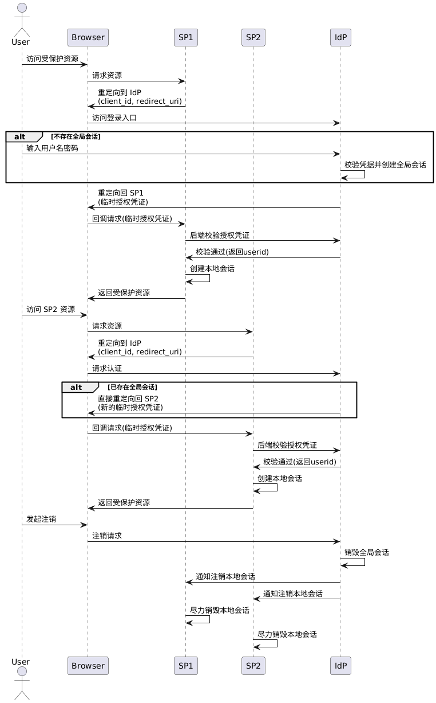

### 单机登录

在开发过程中，单点登录常与单机登录混淆。单机登录指同一账号在同一时间只能在有限数量的客户端保持登录状态。例如，有些系统仅允许单个`PC`端以及单个`APP`端登录，也有一些系统会限制最多同时登录`5`个客户端。

在单机登录场景中，通常需要使用有状态的`Token`进行认证。每次用户登录成功后，服务器都会为其生成新的`Token`，并将该`Token`与账号、设备类型、登录时间等信息统一存入`Redis`。可采用以下存储方式：

- 以`login:{user_id}`为`Key`，使用`ZSet`记录该用户当前所有有效`Token`与最近上线时间的时间戳。
- 以`token:{token}`为`Key`，使用`JSON`字符串保存该客户端的设备信息、登录时间，以及用户信息等数据。

在最多同时登录`5`个客户端的场景下，客户端完成登录后会生成对应的`Token`，设置`score`为当前时间戳并写入`ZSet`。后续请求在携带该`Token`时，后端会在确认其仍存在于`ZSet`的前提下同步更新对应的`score`值，否则重新登录。

当新的客户端登录成功后，会将新的`Token`写入`Redis`的`ZSet`，并检查该`ZSet`的元素数量是否已超出限制。如果超出，则根据`score`移除最近上线时间最早的`Token`，同时删除该`Token`在`Redis`中对应的`Key`保存的数据。

若需要在不同终端上分别限制登录数量，例如`PC`端与`APP`端各允许一个客户端登录，可以通过为不同终端使用独立的`Key`进行分桶处理，如`login:pc:{user_id}`与`login:app:{user_id}`。后端识别登录来源的终端类型后，会选择对应的`Key`进行操作。

在这种情况下，如果要控制客户端的登录态过期时间，需要为每个`token:{token}`设置`TTL`，例如`30`天，这样一旦`Token`超过有效期，对应的`Key`会自动过期并被`Redis`删除。

由于`ZSet`本身没有针对内部元素的`TTL`，无法自动清理过期元素，因此在新用户登录时，在判断`ZSet`元素是否超限之前，应先检查`ZSet`中的每个`Token`对应的`Key`是否存在于`Redis`，若不存在，则将该`Token`从`ZSet`中移除。同时，当客户端使用`Token`访问接口时，如果该`Token`仍在`ZSet`中，但对应的`Key`已经不存在，也应将其从`ZSet`中移除。

### 单点登录（`SSO`）

`SSO`的全称为`Single Sign-On`，即单点登录。从本质上看，`SSO`是跨系统的统一认证中心，通过集中化的身份认证与分布式的登录态传递协同运作。在`SSO`中，有`IdP`（`Identity Provider`）与`SP`（`Service Provider`）两大概念：

- `IdP`负责统一身份认证、凭证签发与会话管理，所有用户相关数据存储在这里。
- `SP`专注业务功能，仅依赖`IdP`进行用户身份校验，不自行处理登录认证。
- 用户只需在`IdP`完成一次认证，即可访问所有受信任的`SP`，无需重复登录。

在`SSO`模型中，用户与`IdP`之间建立的是全局会话，用户与各个`SP`之间分别建立局部会话。局部会话的创建依赖于全局会话的存在，但其生命周期通常由`SP`自行管理。全局会话存在时，用户不一定在所有`SP`中都拥有局部会话。

当全局会话终止时，系统可以通过`SLO`（`Single Logout`）机制尝试联动注销各`SP`的局部会话。但在实际工程实现中，该过程通常只能做到尽力而为，或在语义上保证最终一致性，而难以实现严格的强一致注销。

在一个包含`IdP`与多个`SP`（如`SP1`、`SP2`、`SP3`）的系统中，用户单点登录的整体流程如下所示：

1. 用户在客户端访问`SP1`上的受保护资源时，`SP1`发现用户尚未建立本地会话，于是重定向用户至`IdP`的登录入口。在重定向请求中，`SP1`会携带自身标识`client_id`以及回调地址`redirect_uri`，以便`IdP`在认证成功后将用户返回。
2. 用户到达`IdP`登录页面后，若当前不存在全局会话，则需要输入用户名和密码完成身份认证。`IdP`校验用户凭据成功后，创建并维护全局会话，通常以全局`Token`的形式存在。同时，`IdP`会为目标`SP`生成一个临时授权凭证，用于后续身份校验。
3. `IdP`通过浏览器重定向的方式将用户返回至最初请求的`SP`（即`SP1`），并在回调中携带该临时授权凭证。`SP1`接收凭证后，会通过后端`API`调用向`IdP`校验其有效性。校验通过后，`SP1`为用户创建本地会话，用户随即可访问`SP1`的受保护资源。
4. 当用户随后访问`SP2`时，`SP2`同样会检测本地是否存在有效会话。若不存在，则将用户重定向至`IdP`。由于用户在`IdP`侧已建立全局会话，`IdP`无需再次要求用户输入账号密码，而是直接为`SP2`生成新的临时授权凭证并返回。`SP2`通过后端`API`调用完成凭证校验并创建本地会话后，用户即可无感知地访问`SP2`资源。
5. 在用户发起注销操作时，`IdP`可触发`SLO`（`Single Logout`）机制，尝试通知所有已参与的`SP`销毁对应的本地会话。由于网络和实现差异，跨`SP`的注销通常只能保证最终一致性，部分`SP`的会话失效可能存在延迟或失败的情况。

用户单点登录的时序图如下所示：



用户单点登录的时序图，其`PlantUML`代码如下所示：

```scss
@startuml
actor User
participant Browser
participant SP1
participant SP2
participant IdP

User -> Browser: 访问受保护资源
Browser -> SP1: 请求资源
SP1 -> Browser: 重定向到 IdP\n(client_id, redirect_uri)
Browser -> IdP: 访问登录入口

alt 不存在全局会话
    User -> IdP: 输入用户名密码
    IdP -> IdP: 校验凭据并创建全局会话
end

IdP -> Browser: 重定向回 SP1\n(临时授权凭证)
Browser -> SP1: 回调请求(临时授权凭证)
SP1 -> IdP: 后端校验授权凭证
IdP -> SP1: 校验通过(返回userid)
SP1 -> SP1: 创建本地会话
SP1 -> Browser: 返回受保护资源

User -> Browser: 访问 SP2 资源
Browser -> SP2: 请求资源
SP2 -> Browser: 重定向到 IdP\n(client_id, redirect_uri)
Browser -> IdP: 请求认证

alt 已存在全局会话
    IdP -> Browser: 直接重定向回 SP2\n(新的临时授权凭证)
end

Browser -> SP2: 回调请求(临时授权凭证)
SP2 -> IdP: 后端校验授权凭证
IdP -> SP2: 校验通过(返回userid)
SP2 -> SP2: 创建本地会话
SP2 -> Browser: 返回受保护资源

User -> Browser: 发起注销
Browser -> IdP: 注销请求
IdP -> IdP: 销毁全局会话
IdP -> SP1: 通知注销本地会话
IdP -> SP2: 通知注销本地会话
SP1 -> SP1: 尽力销毁本地会话
SP2 -> SP2: 尽力销毁本地会话
@enduml
```

