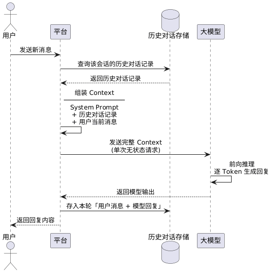

我们之前提到，大模型是通过逐个`Token`接龙的方式生成回复的，这会带来一个问题：当用户输入新的消息时，上一轮对话的输入与模型输出就会被模型忘记掉。因此，需要依赖上下文（`Context`）机制来让模型记住先前的对话内容。

这里有一个关键前提需要理解：大模型本身是完全无状态的，它没有任何持久化记忆，每次调用都是一次独立的前向推理，模型只能根据当次输入的全部内容来计算输出。「记住历史对话」这件事并不是模型自己做到的，而是由平台（即调用大模型的外部系统或应用程序）负责维护和管理的。平台在每次用户发送新消息时，会将历史对话内容从存储中取出，与当前输入拼接组装成一个完整的请求，再统一发送给模型。模型每次「看到」历史内容，实际上是平台在当次请求中重新喂给它的，而非模型自身记住的。

具体来说，用户每次向大模型发送消息时，平台实际提交的不仅是当前内容，还会将历史对话一并发送，其中既包含用户输入，也包含模型输出。因此，模型在每一轮看到的都是完整的对话上下文，从而能够理解此前讨论的内容，并给出更贴切的回答。

例如，用户先输入「我叫蒙多，我想去哪就去哪」，模型回复「是的」；随后用户再发送「我是谁？我有什么能力？」，平台会把此前的全部对话连同本次问题拼接后一起发送给模型，模型便能据此回答「你是蒙多，你的能力是想去哪就去哪」。

`Context`指的就是模型在每次处理任务时所接收到的全部信息。在大模型生成回复的过程中，每输出一个`Token`，都会将该`Token`追加到`TokenID`序列中，并再次输入模型以预测下一个`Token`，这一循环过程本质上就是不断扩展`Context`。

平台收集上下文信息，并发送给大模型的时序图如下所示：



除用户对话与模型回复之外，`Context`还包含`System Prompt`、`RAG`检索片段、可用工具列表、工具执行结果以及长期记忆等信息，这些内容同样由平台负责在每次请求时动态组装注入。从某种程度上，我们也可以把`Context`看作大模型的一个临时记忆体。

我们之前提到过`Token`消耗的概念：单次请求中处理的`Token`越多，消耗也越高。由于`Context`会包含历史全部对话内容，因此对话越长、轮次越多，后续请求所需处理的`Token`数量就会持续增长。

上节提到，大模型会通过`KV Cache`技术缓存已计算过的`Token`特征。如今许多大模型服务商也在此基础上提供了`Prompt Caching`（提示词缓存）能力：当用户多次针对同一长文档提问时，系统可以直接复用已有的`KV Cache`，从而显著降低响应延迟。

在计费层面，命中缓存的输入`token`通常可享受平台提供的专项折扣，例如`Anthropic`会对缓存命中的输入`token`提供`90%`的折扣，`OpenAI`则提供约`50%`的折扣。在`Claude Code`等重度依赖长上下文的`AI`智能体场景中，`Prompt Caching`的命中率极高，因此实际的输入费用往往远低于标准定价。

那么这个`Context`能有多大，最多能放下多少`Token`呢？这就引出了`Context Window`（上下文窗口）的概念，它表示`Context`能够容纳的最大`Token`数量。目前主流大模型的`Context Window`大约在`10-100`万`Token`量级。

需要注意的是，窗口越大并不一定越好。随着上下文长度持续增加，模型的注意力会被逐步分散，推理能力可能随之下降，这一现象被称为`Context Decay`（上下文衰减）。许多模型在处理长文本时，对中间段落的记忆能力会显著减弱，即出现中间迷失（`Lost in the Middle`）。通常情况下，模型会对对话开头与结尾部分的记忆最为牢固。

当`Context`规模非常大时，即使模型具备处理能力，首字响应时间（`TTFT`, `Time To First Token`）也会明显增加，因为模型需要先完成对这些`Token`的预读（`Prefill`）。这种由计算与读取带来的物理延迟，已成为当前长上下文应用的重要瓶颈之一。

主流大模型基于`Transformer`架构，其核心的`Self-Attention`在处理长度为`n`的`Token`序列时，计算复杂度通常为`O(n^2)`。这意味着当上下文长度翻倍时，计算量与显存占用并不会线性翻倍，而是以平方级别的速度增长，因此在现阶段实现接近「无限」的上下文窗口在工程与成本上仍然十分困难。`FlashAttention`等技术正不断压榨硬件性能，缓解`O(n^2)`带来的显存焦虑。

当对话轮次不断增加并最终超过`Context Window`限制时，平台通常会结合多种工程策略进行处理。

例如可以采用`Sliding Window`机制直接丢弃最早的历史内容，仅保留最近若干轮对话以控制`Token`规模，也可通过`Summarization`在上下文过长时对早期内容进行压缩总结，用更短的摘要替换冗长历史；同时也可以结合`RAG`方案，将长期记忆存入向量数据库，在需要时再进行检索并注入`Context`，从而避免将全部历史信息一次性加载进模型。

讲到这里，我们会自然地引出一个更深层的问题：既然`Context`直接决定了模型「看到什么、记住什么」，那么平台应当如何更好地组织和管理`Context`的内容，就成了影响模型表现的关键所在。这一领域被称为`Context Engineering`（上下文工程）。

以一个客服场景为例：如果将用户的全部历史工单都塞进`Context`，模型可能因为信息过载而抓不住重点；但如果只保留最近一次对话，模型又可能丢失关键背景。`Context Engineering`要做的，就是在这两个极端之间找到最优解。

当`Context`中积累的内容越来越多时，一种有效的处理方式是对其进行主动压缩，而不是简单地丢弃。具体做法是让模型对已有的对话或文档进行总结，提炼关键信息后，以更短的摘要替换原始内容，从而在不损失核心语义的前提下大幅缩减`Token`占用。

压缩不等于截断。截断是粗暴地切掉超出窗口的部分，信息一旦丢失便无从找回；而压缩是对内容进行语义层面的浓缩，核心信息以更紧凑的形式得以保留。打个比方，截断像是把一本书的后半部分直接撕掉，压缩则像是请人写了一份详尽的读书笔记。

在实际系统中，压缩策略可以做得相当精细。例如，可以对整段历史对话进行滚动摘要——每隔若干轮将早期对话浓缩成一段摘要，再与近期对话拼接后一并送入模型；也可以对`RAG`检索回来的片段进行二次压缩，只保留与当前问题直接相关的句子，去掉冗余背景，让有限的窗口空间发挥更大的价值。在某些场景下，系统甚至会专门训练或调用一个轻量级的压缩模型，负责对`Context`进行实时蒸馏，使主模型始终拿到经过精炼的高密度信息。

可以把`Context Window`想象成一张大小有限的工作台，而`Context Engineering`就是在管理这张工作台的摆放方式：把最重要的工具放在手边，把暂时用不到的收进抽屉，把已经没用的及时清走，把一叠厚厚的参考资料提炼成一页要点贴在眼前。工作台的面积是固定的，但如何利用它，决定了你能完成多复杂的任务。

平台收集上下文信息，并发送给大模型的时序图，其`PlantUML`代码如下所示：

```scss
@startuml
skinparam sequenceMessageAlign center

actor 用户
participant "平台" as Platform
database "历史对话存储" as Storage
participant "大模型" as LLM

用户 -> Platform : 发送新消息

Platform -> Storage : 查询该会话的历史对话记录
Storage --> Platform : 返回历史对话记录

Platform -> Platform : 组装 Context\n────────────────\nSystem Prompt\n+ 历史对话记录\n+ 用户当前消息

Platform -> LLM : 发送完整 Context\n(单次无状态请求)
LLM -> LLM : 前向推理\n逐 Token 生成回复
LLM --> Platform : 返回模型输出

Platform -> Storage : 存入本轮「用户消息 + 模型回复」

Platform --> 用户 : 返回回复内容
@enduml
```

