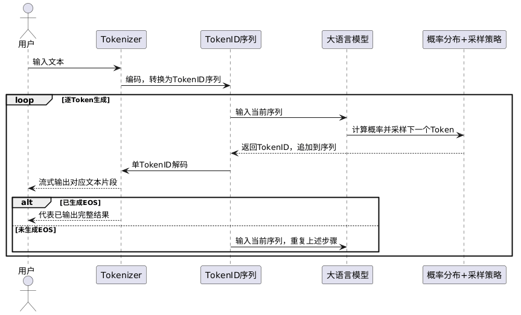

在「`Token`概念」一节中提到，大模型并不会直接处理用户输入的自然语言文本，而是先通过`Tokenizer`将文本切分为多个`Token`，再根据预训练分词词表将其映射为`TokenID`序列。随后，每个`TokenID`会经过`Embedding`层映射为高维向量，并结合位置信息（如`RoPE`旋转位置编码），从而形成同时包含语义信息与顺序信息的数值矩阵，作为模型计算的输入。

从计算机制来看，大模型本质上是基于`Token`的自回归序列预测模型，通过逐词生成完成文本接续，其在复杂任务中可以呈现出类似推理的行为表现，但其实现机制与人类认知过程并不相同。模型在多层`Transformer`结构中利用自注意力机制对输入的高维向量序列进行计算，最终得到一个高维隐层向量，该向量仅表示语义趋势和上下文逻辑，并非某个现成`Token`对应的向量。

随后，该隐层向量会经过输出层（`LM Head`）映射到整个词表空间，得到词表中每个`Token`对应的预测得分（`Logits`）。在采用权重共享（`Weight Tying`）的模型中，这一计算可以理解为与词表中所有`Token`对应向量进行一次点积运算，因此语义更接近的`Token`通常会获得更高得分。模型不会直接选择分数最高的`Token`，而是结合温度系数、`Top-P`、`Top-K`等采样策略，在概率较高的候选集合中进行筛选采样，得到更合理且多样化的`TokenID`，最终通过分词器查表解码为具体`Token`文本。

我们可以用三维向量作为示例来说明。假设词表中有三个词：苹果、桃子、手机，它们对应的向量为：

```scss
Token      三维向量
苹果       [0.9, 0.1, 0.2]
桃子       [0.8, 0.2, 0.3]
手机       [-1.0, 0.5, 0.0]
```

当模型输入序列「我想吃」后，经过`Embedding`层和`Transformer`计算，得到输出的隐层向量为`[0.85, 0.15, 0.25]`。

随后，模型会通过点积算法，计算该隐层向量与词表中每个`Token`向量的相似度：

```scss
隐层向量·苹果 = 0.85×0.9 + 0.15×0.1 + 0.25×0.2 = 0.765 + 0.015 + 0.05 = 0.83
隐层向量·桃子 = 0.85×0.8 + 0.15×0.2 + 0.25×0.3 = 0.68 + 0.03 + 0.075 = 0.785
隐层向量·手机 = 0.85×(-1.0) + 0.15×0.5 + 0.25×0.0 = -0.85 + 0.075 + 0 = -0.775
```

得到这些分值后，通常会接入`Softmax`函数，将原始得分（`Logits`）转换为概率分布。其过程是先以`e`为底对各分值取指数，再计算指数和，最后完成归一化得到概率。计算结果显示：苹果的概率为`46.36%`，桃子的概率为`44.32%`，手机的概率为`9.31%`。因此模型会判断苹果与当前语义最接近并优先输出对应的`Token`，但在一定采样策略下，也可能选择桃子。

值得注意的是，模型权重决定了各个`Token`的预测得分，而温度系数、`Top-P`、`Top-K`等采样策略既不会修改模型权重，也不会改变模型本身的推理能力。其中，温度系数会在`Softmax`计算前对`Logits`进行缩放，以调节输出概率分布的平滑程度；`Top-P`与`Top-K`则会在采样阶段限制候选`Token`的范围。这些都属于推理阶段的参数调整，是推理阶段控制模型输出行为的重要手段。

以温度系数为例，温度越低，概率分布越集中，模型越倾向于选择概率最高的`Token`；温度越高，概率分布越平缓，低概率`Token`也更容易被采样，因此生成结果更加多样。可以将这一过程类比为高校招生：假设三名学生的综合评分分别为`98`分、`96`分、`90`分，招生委员会已经完成了评分，并据此计算出了每名学生的录取概率，而温度仅决定最终采用怎样的录取规则。例如规则如下：

- `Temperature = 0`：始终录取综合评分最高的学生。

- `Temperature = 0.2`：极大概率录取综合评分最高的学生，少数情况下录取其他学生。

- `Temperature = 1`：按照招生委员会根据综合评分计算出的默认录取概率进行录取。

- `Temperature = 2`：降低高分学生的绝对优势，提高其他学生被录取的概率。

在整个过程中，学生的综合评分始终保持不变，变化的只是最终的录取概率；对应到大模型，模型参数（权重）和输出的`Logits`同样不会发生变化，温度仅通过调整采样时的概率分布来影响最终选择哪个`Token`。因此，无需修改模型权重，仅通过调整温度这一推理阶段的生成参数，就能够改变模型最终生成内容的随机性与多样性。

我们可以先不考虑隐层向量与`TokenID`之间的计算与映射过程，只聚焦单个`Token`逐步生成的本质。

例如输入「蒙多想去哪就去哪」，`Tokenizer`会将其转换为`TokenID`序列`[75, 61, 18, 22, 12, 22]`。该序列输入模型后，模型基于已有上下文预测下一个`Token`为「是」，对应的`TokenID`为`32`。此时序列更新为`[75, 61, 18, 22, 12, 22, 32]`。

接着，这个新序列会再次输入模型，继续预测下一个`Token`，如此循环。既然是「接龙」，就必须有一个停止条件。在整个词表中，通常会包含一个特殊的「隐形`Token`」，称为`[EOS]`（`End Of Sequence`，终止符）。当模型在某一步计算中，发现概率最高，或者通过采样选中的`TokenID`正好对应这个`[EOS]`时，就表示当前序列已经完整，生成过程应当结束。

在`Decoding`（解码）阶段，为提升用户体验，当前主流`LLM`通常采用`Stream`（流式传输）机制，即模型每生成一个`Token`，就会立即完成解码并返回给用户，因此在实际使用大模型平台时，会观察到逐步流式输出的效果。

这种`Token`接龙的过程在技术上称为自回归生成（`Autoregressive Generation`）。从工程角度看，从接收指令到完成接龙的整个运行过程，被统称为「推理」（`Inference`）。

用户输入到大模型并得到输出的整体流程，可简要表示为如下时序结构：



大模型会通过`KV Cache`技术，将历史已计算的`Key`与`Value`向量缓存起来；在每一轮自回归生成时，仅对最新的`Token`执行前向计算，生成对应的`Query`，并与缓存中的`Key`、`Value`进行注意力计算，从而避免对历史`Token`的重复计算，显著降低推理开销。在`API`计费层面，费用是基于输入总量与生成总量进行统计的，并不会因为循环调用次数而重复计费。

各大模型服务商普遍采用`Token`消耗量作为计费标准，其根本原因在于，`Token`是大模型推理过程中的天然计量单位。对于输入内容，模型需要先完成所有输入`Token`的`Prefill`阶段，即进行一次全量注意力计算；对于输出内容，则采用自回归方式逐`Token`生成，每生成一个`Token`都需要执行一次完整的前向传播。因此，在相同模型和推理配置下，整体推理成本通常与输入、输出`Token`数量近似呈线性关系，因而`Token`成为衡量推理资源消耗和计费成本最直接、最合理的计量单位。

此外，输入`Token`与输出`Token`在计费时通常单独定价，且输出价格约为输入的`3`至`5`倍，原因在于二者的资源占用模式不同。具体而言，输入`Prefill`阶段可并行计算，`GPU`利用率高；而输出`Decode`阶段是串行的逐`Token`生成，`GPU`利用率较低，且随着序列增长，`KV Cache`的显存占用持续累积，单位算力成本更高，因此定价也更贵。

以模型`Qwen3-8B`为例，其在`Hugging Face`上的目录结构如下所示：

```sh
Qwen3-8B/
├── .gitattributes                    # Git属性配置，用于指定LFS追踪的大文件类型
├── LICENSE                           # 开源协议文件（11.3 kB）
├── README.md                         # 模型介绍文档，包含使用说明、性能指标等（16.7 kB）
├── config.json                       # 模型结构配置，定义层数、隐层维度、注意力头数等超参数
├── generation_config.json            # 生成参数配置，定义推理时的默认参数（temperature、top_p等）
├── merges.txt                        # BPE分词器的合并规则表，记录子词合并的优先级顺序（1.67 MB）
├── model.safetensors.index.json      # 分片模型的索引文件，记录每个权重张量所在的分片编号
├── model-00001-of-00005.safetensors  # 模型权重分片1/5（4 GB）
├── model-00002-of-00005.safetensors  # 模型权重分片2/5（3.99 GB）
├── model-00003-of-00005.safetensors  # 模型权重分片3/5（3.96 GB）
├── model-00004-of-00005.safetensors  # 模型权重分片4/5（3.19 GB）
├── model-00005-of-00005.safetensors  # 模型权重分片5/5（1.24 GB）
├── tokenizer.json                    # 完整分词器定义，包含词表、合并规则及特殊token的完整描述（11.4 MB）
├── tokenizer_config.json             # 分词器行为配置，指定分词器类型、chat_template、特殊token映射等
└── vocab.json                        # 词表文件，存储token到ID的映射字典（2.78 MB）
```

该模型的`Hugging Face`地址：`https://huggingface.co/Qwen/Qwen3-8B/tree/main`。

模型权重总计约`16.42 GB`，因单文件体积过大，被拆分为`5`个`.safetensors`分片进行存储。`.safetensors`格式相比传统的`.bin`格式，加载更安全、速度更快，且完全不依赖`pickle`序列化机制，从根本上规避了反序列化漏洞风险。

`model.safetensors.index.json`作为整个权重体系的索引入口，推理引擎（`vLLM`等）在启动时会根据该文件定位并加载各个权重分片，将模型参数加载至`GPU`显存（若显存不足，则可能采用`CPU`卸载、分层加载或模型并行等策略）。随后，在整个推理过程中，模型前向传播所需的参数均直接从显存读取，而不会在每次请求时反复从磁盘加载权重文件。

`merges.txt`、`tokenizer.json`、`tokenizer_config.json`、`vocab.json`这`4`个文件共同构成一套完整的`BPE`分词体系。其中`tokenizer.json`是`Hugging Face`格式的完整快速分词器描述，包含词表、合并规则及后处理配置，单独使用即可完成全流程分词；其余`3`个文件则是面向旧版`tokenizers`库的拆分兼容形式，在新版环境中通常无需单独使用。

有了权重文件、模型结构定义与自回归生成推理流程，接下来需要将这些拼装成一个能够持续对外提供请求响应的推理服务。这一层通常分为四部分，分别为推理引擎、工程优化手段、模型部署形态、服务化部署。

一、推理引擎

推理引擎是推理服务的核心执行层，负责加载模型权重、管理显存资源，并执行模型前向传播计算。

常见的推理引擎包括`vLLM`、`TensorRT-LLM`与`llama.cpp`等。

其中，`vLLM`与`TensorRT-LLM`更适用于生产环境下的高并发推理场景，但二者的工程取向并不相同：`vLLM`主打易用性与灵活的运行时调度，模型加载即可运行，无需预编译；`TensorRT-LLM`是`NVIDIA`官方针对自家`GPU`做的深度编译优化方案，需先将模型编译为专属的执行引擎（`Engine Build`），`70B`级别模型编译耗时可达`20`分钟至`45`分钟，对硬件绑定更紧，但吞吐上限通常更高。

`llama.cpp`更适合本地单机部署与开发调试，部署门槛较低、使用更加便捷；面向本地大模型运行的工具`Ollama`就是基于`llama.cpp`封装的一层模型管理与服务化壳，负责模型拉取、`REST`接口暴露与生命周期管理。

推理服务启动时，推理引擎首先读取模型配置文件与权重文件，将模型参数一次性加载至`GPU`显存（或`CPU`内存）；完成初始化后进入请求监听状态。后续每次推理请求均直接复用已加载的模型参数，仅执行前向传播计算，不会重复从磁盘读取权重文件。

二、工程优化手段

为了在有限的硬件资源下获得更高的推理性能，现代推理引擎通常围绕请求调度与显存管理进行优化，其中`Continuous Batching`与`PagedAttention`是`vLLM`最具代表性的两项核心技术，也是其实现高吞吐、高并发推理能力的重要基础。

`Continuous Batching`（连续批处理）是一种面向大语言模型推理的动态批处理技术，最早由`Orca`论文系统性提出，称为`Iteration-level Scheduling`，`vLLM`并非该技术的发明者，而是较早将其工程化落地并推广开的实现者之一。由于不同用户请求的到达时间与生成长度各不相同，若采用传统静态批处理方式，需等待整个批次全部生成完成后才能统一返回结果，不仅会增加请求等待时间，还会导致大量`GPU`计算资源处于空闲状态。`Continuous Batching`允许在批次执行过程中动态加入新请求，并及时移除已完成的请求，使批次始终保持较高的计算负载，从而显著提升`GPU`利用率与整体吞吐能力。

`PagedAttention`（分页注意力）是`vLLM`提出的一种显存管理机制，其核心思想借鉴了操作系统的分页内存管理，是`vLLM`的原创核心贡献。传统实现中，每个请求的`KV Cache`通常需要预先分配一块连续显存，随着请求不断创建与释放，容易产生显存碎片并造成资源浪费；`PagedAttention`则将`KV Cache`划分为固定大小的内存块，采用按需分配、非连续存储的方式进行管理，从而有效降低显存碎片率，提高显存利用率，进而支撑更高的并发请求规模。

三、模型部署形态

单机单卡部署适用于中小规模模型，例如`7B`、`13B`级别的模型通常可以在单张消费级或专业级显卡上完成推理部署，部署成本较低，适用于开发测试以及中低并发业务场景。

当模型参数规模增大，单个模型的显存占用超过单张显卡容量时，便需要引入模型并行策略，常见有以下两种：

1. 张量并行（`Tensor Parallelism`）：将模型单层内部的矩阵运算切分到多张显卡上协同计算，各显卡在每一层计算后需要执行`All-Reduce`通信，对`Attention`与`MLP`层的输出做规约求和，通信频率高、对带宽和时延要求极高，因此通常只部署在同一台机器内，并依赖`NVLink`等高速互联技术降低通信开销，跨机部署基本不可行。
2. 流水线并行（`Pipeline Parallelism`）：将模型的不同网络层划分到不同显卡或不同机器上，各阶段按照模型层次依次执行，仅在相邻阶段之间传递中间结果，通信频率相对较低，因此更适合跨机器部署。

对于千亿级（`100B`参数）及以上的超大规模模型，通常需要将张量并行与流水线并行结合使用，即单机内部利用多张显卡进行张量并行，多台机器之间采用流水线并行。通过这种混合并行方案，既能够充分利用单机高速互联带来的通信优势，又能够突破单机显存容量限制，实现超大规模模型的高效推理部署。

四、服务化部署

推理引擎本身仅负责模型执行，不直接对外提供网络服务，因此通常需要在其上封装一层`HTTP`或`gRPC`接口，用于接收外部请求并返回推理结果。目前，多数主流推理框架均兼容`OpenAI`的`API`规范，例如提供`/v1/chat/completions`等标准接口，使外部应用能够以统一的请求格式接入不同的模型服务，避免因底层推理引擎或模型提供方不同而重复适配接口。

为了便于部署与运维，推理服务通常会封装为`Docker`镜像进行部署。每个容器内部运行一个推理引擎进程（如`vLLM`），启动时一次性加载模型权重到`GPU`显存，并持续监听`HTTP`或`gRPC`接口。生产环境一般使用`Kubernetes`统一管理容器生命周期，通过`Deployment`完成滚动发布、故障恢复与弹性伸缩，并借助`Service`、`Ingress`或`Gateway`向外部应用提供统一访问入口。

当业务流量较大时，可部署多个推理实例，由负载均衡组件将请求分发至各实例，实现高可用与水平扩展。对于需要多机多卡协同推理的大模型，推理引擎会结合张量并行、流水线并行等技术，在多个`Pod`或多个节点之间共同完成一次推理计算。

用户输入到大模型并得到输出的整体流程，其`PlantUML`代码如下所示：

```scss
@startuml
actor 用户
participant "Tokenizer" as Tokenizer
participant "TokenID序列" as Tokens
participant "大语言模型" as LLM
participant "概率分布+采样策略" as Sampling

用户 -> Tokenizer : 输入文本
Tokenizer -> Tokens : 编码，转换为TokenID序列

loop 逐Token生成
    Tokens -> LLM : 输入当前序列
    LLM -> Sampling : 计算概率并采样下一个Token
    Sampling --> Tokens : 返回TokenID，追加到序列

    Tokens -> Tokenizer : 单TokenID解码
    Tokenizer --> 用户 : 流式输出对应文本片段

    alt 已生成EOS
        Tokenizer --> 用户 : 代表已输出完整结果
    else 未生成EOS
        Tokens -> LLM : 输入当前序列，重复上述步骤
    end
end
@enduml
```

