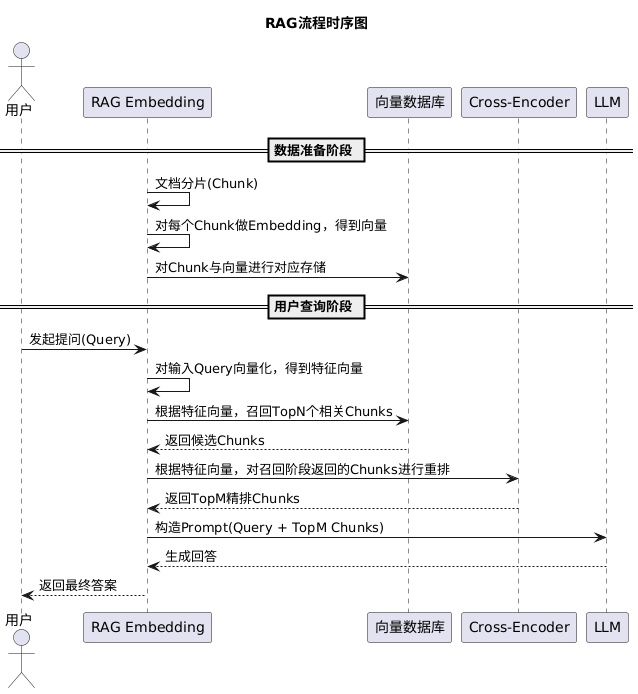

在讲解`Context`这一概念时我们提到，主流大模型的`Context Window`大约在`10-100`万`Token`量级。因此，如果公司内部存在一份手册，并希望模型在回答问题时参考其中内容，最直观的做法是：在每次提问时，将整本手册一并作为`Prompt`输入模型。

这种方式在理论上可行，但在工程实践中存在几个关键瓶颈：

首先是`Token`消耗问题。手册的全部内容都会参与`Token`计数，这在规模稍大的文档场景下往往是不可接受的，成本呈线性上升，甚至达到数量级失控。对于一些小模型，手册的内容甚至会超出`Context Window`的容量上限。

其次是长上下文的注意力衰减问题。模型在处理超长文本时，对中间区域的信息感知能力显著下降，更容易依赖首尾内容。这会导致即使正确答案存在于上下文中，模型也可能受到其他相似但无关表述的干扰，从而产生幻觉或输出偏差。本质上，这种「大锅饭」式的信息注入会稀释关键指令的权重，降低回答的确定性与精度。

最后是响应延迟问题。当`Prompt`长度达到`10`万甚至百万级别时，`Attention`计算的时间复杂度会急剧上升，导致推理延迟显著增加。用户在首次请求后，往往需要等待数十秒甚至数分钟才能获得响应，严重影响交互体验与系统吞吐能力。

因此，`RAG`技术应运而生。`RAG`的全称为`Retrieval-Augmented Generation`，即「检索增强生成」。

其核心思想是：不再将全部外部知识一次性注入模型，而是在每次提问时，先通过检索系统从知识库中筛选出与问题最相关的一小部分内容，再将这些高相关片段与用户问题一起作为`Prompt`输入模型进行生成。

这种机制在保证答案准确性的同时，大幅降低了`Token`消耗与推理成本。即使模型的训练数据停留在一年前，只要检索库保持实时更新，它依然能够基于最新内容回答当前发生的事件。同时，企业也可以将内部文档接入检索系统，使模型在推理过程中动态访问这些私有数据，从而在不暴露原始数据、也无需重新训练模型的前提下，安全地处理涉及商业机密的业务问题。

`RAG`的基本运行流程是：首先将原始文档切分为多个语义片段（`Chunk`），并对每个片段进行向量化并存入向量数据库；当用户发起提问时，通过向量检索从这些片段中拿到与问题最相关的一小部分内容。例如，一份文档被切分为`100`个片段，但在一次查询中，可能只有`3`个片段与问题高度相关，那么系统只会将这`3`个片段提取出来，与用户问题一起拼接为`Prompt`发送给大模型进行生成。

向量数据库是`RAG`系统中负责持久化存储向量与原始文本、并支持高效相似度检索的核心基础设施。向量数据库中的`Collection`对应`MySQL`中的`Table`，`Document`或`Record`对应`MySQL`中的`Row`，`Field`对应`MySQL`中的`Column`。

`id`和`vector`是向量数据库的核心结构字段，由数据库本身定义，名称与类型均固定，创建记录时必须提供。其余可选字段统一放在`Payload`里，字段名与字段类型完全自定义，数据库不做任何约束。一般来说，`content`字段也是必需的：

1. `id`：一个语义片段（`Chunk`）对应一条记录，该字段作为唯一标识，用于索引定位与删除操作。
2. `vector`：向量数据，即`Chunk`经`Embedding`模型处理后生成的高维浮点数组，维度取决于所使用的模型。
3. `content`：语义片段的原始文本内容，检索命中后直接返回给`LLM`作为上下文使用。

通常来说，`RAG`的整体实现流程可分为两个阶段：

- 第一是数据准备阶段，发生在用户提问之前。该阶段需要对所有相关文档进行收集与预处理，主要包括两个环节：一是分片，将长文档拆分为更适合检索的片段；二是索引，通过向量化等方式构建高效的检索结构。

- 第二是回答阶段，发生在用户提问之后。该阶段主要包含三个步骤：首先是召回，根据用户问题从索引中检索相关内容；其次是重排，对召回结果进行排序优化以提升相关性；最后是生成，将筛选后的内容输入模型，生成最终回答。

分片阶段，顾名思义是将文档拆分为多个片段。该过程通常由`Document Splitters`（文档切分器）完成，可根据不同策略进行划分，例如按字数、段落、章节或页码等方式。完成分割后，该阶段即告结束。

`RAG`引入了块重叠（`Chunk Overlap`）机制。固定长度切分可能将完整的语义单元强行截断，导致上下文丢失。实际工程中，通常会让相邻`Chunk`之间保留一定的重叠区域（如`100`个`Token`），以避免跨块语义断裂。

索引阶段是通过`RAG Embedding`将每个片段映射为高维浮点向量（维度通常在`768`～`4096`之间），并将片段文本与对应向量一并存储至向量数据库中。该过程与此前在`LLM`概念一节的内容中介绍的`Token`向量化原理基本一致。

`RAG Embedding`的核心目标，是将语义相近的文本映射为在向量空间中距离相近的表示。如下示例中，假设使用三维向量表示不同文本，则在经过`Embedding`处理后，其结果可能如下：

```scss
文本片段内容               三维向量
片段1:蒙多喜欢吃苹果        [0.9, 0.1, 0.2]
片段2:蒙多喜欢吃柠檬        [0.8, 0.2, 0.3]
片段3:蒙多觉得吃亏是福       [0.6, 0.6, 0.1]
片段4:蒙多觉得你是大娘们     [0.4, 0.2, 0.4]
片段5:蒙多想去哪就去哪       [0.1, 0.1, 0.7]
```

可以看到，前两个文本在语义上更为接近，因此对应向量之间的距离也更小；而第三个文本语义差异较大，其向量表示与前两者的距离相对更远。这种特性使得后续基于向量的相似度检索成为可能。

从技术原理上看，`RAG Embedding`通常由`Token Embedding`发展而来。`Token Embedding`用于表征「词」或「字」的语义及其在向量空间中的基础位置，当输入`N`个`Token`时，会生成`N`个对应的向量。而`RAG Embedding`的目标是表征「整段文本」的核心语义，用于相似度检索任务，无论输入包含多少`Token`，最终都会被聚合为一个向量表示。

`Embedding`模型首先将输入文本拆分为多个`Token`，随后基于`Transformer`结构对各个`Token`进行编码，生成融合上下文信息的深层向量表示。接着进入聚合阶段（`Pooling`），通过特定策略将多个`Token`向量压缩为单一向量。常见方法包括对所有向量执行平均计算（`Mean Pooling`），或直接选取序列起始位置的`[CLS]`向量作为整段文本的语义表示。

`Token Embedding`的结果会固化在模型的权重参数中（`Model Weights`），在推理时加载到显存（`VRAM`）或内存（`RAM`）中。这些向量是静态且只读的，除非重新训练模型，否则不会发生变化。而`RAG Embedding`的结果通常存储在向量数据库中，即持久化于硬盘。

这是因为`Token Embedding`的规模由词表大小决定，一般在`3`万到`12`万之间；而`RAG Embedding`的规模由文档数量决定，可能达到百万甚至千万级。前者基于直接索引访问，检索延迟可达纳秒级；后者依赖相似度计算，检索延迟通常为毫秒级。

我们可以将`Token Embedding`理解为模型内部的字典，而向量数据库更类似外部的图书馆。

完成上述步骤后，数据准备阶段即结束。用户发起提问时，输入内容会先经过`Embedding`模型编码为一个特征向量，随后在向量数据库中计算向量之间的相似度并执行检索，返回`N`条与问题最相关的结果。

向量之间的相似度可用于衡量语义接近程度，常见计算方法包括点积和余弦相似度。例如用户输入「蒙多喜欢吃什么？」，其特征向量为`[0.85, 0.15, 0.25]`，通过点积与不同片段向量计算相似度如下：

```scss
特征向量·片段1 = 0.85×0.9 + 0.15×0.1 + 0.25×0.2 = 0.765 + 0.015 + 0.05 = 0.83
特征向量·片段2 = 0.85×0.8 + 0.15×0.2 + 0.25×0.3 = 0.68 + 0.03 + 0.075 = 0.785
特征向量·片段3 = 0.85×0.6 + 0.15×0.6 + 0.25×0.1 = 0.51 + 0.09 + 0.025 = 0.625
特征向量·片段4 = 0.85×0.4 + 0.15×0.2 + 0.25×0.4 = 0.34 + 0.03 + 0.1 = 0.47
特征向量·片段5 = 0.85×0.1 + 0.15×0.1 + 0.25×0.7 = 0.085 + 0.015 + 0.175 = 0.275
```

得到这些分值后，通常会通过`Softmax`函数将原始得分（`Logits`）转换为概率分布。具体过程为：先以自然常数`e`为底对各分值取指数，再求和，最后归一化得到概率。计算结果表明：片段`1`的概率为`24.74%`，片段`2`为`23.65%`，片段`3`为`20.15%`，片段`4`为`17.26%`，片段`5`为`14.20%`。若选择返回与问题最相关的`3`条结果，则片段`1`、片段`2`和片段`3`将被召回。

一般情况下，召回阶段返回的片段数量应大于等于`10`条，这是因为后续还需要进行重排处理，即在已召回的候选集合中再次排序，并选取`M`条与用户问题最相关的结果作为最终输出。在重排阶段会引入更精细的语义匹配模型，例如`Cross-Encoder`，通过对「问题-片段」进行联合编码来直接建模相关性。该方法计算成本更高、延迟更大，但能够显著提升排序精度，从而弥补召回阶段的误差。

例如在上述召回结果中，虽然片段`1`、`2`和`3`均被选出，但片段`3`的内容是「蒙多觉得吃亏是福」，仅在字面上包含「吃」，语义上却与问题「蒙多喜欢吃什么？」无关。这类由向量相似度带来的「表面相关」问题，正是召回阶段常见的误差来源。

除此之外，向量数据库中存储的向量数量可能达到百万到千万级，若对所有向量进行暴力遍历，计算量将难以接受。工程上通常采用`ANN`（`Approximate Nearest Neighbor`，近似最近邻）算法，典型实现包括`HNSW`、`IVF`等，以牺牲少量精度换取大幅度的检索性能提升。这也是召回阶段存在误差的根本原因之一。

经过重排后，仅片段`1`和片段`2`被保留，并与用户问题一同输入大模型进行后续生成。由于召回并重排得到的片段需要与用户问题一同输入到模型中，因此这些文本内容同样会参与`Token`计算，直接影响上下文长度以及推理成本。

`RAG`的数据准备阶段与回答阶段整体流程，可简要表示为如下时序结构：



上述流程属于最基础的`RAG`实现方式，每次用户提问都会无条件触发完整的检索链路。在工程实践中，更推荐将检索能力封装为一个标准`Tool`，交由大模型自主判断是否需要调用。这样对于与知识库无关的问题，模型可以直接回答而不触发检索，避免引入无关内容干扰生成质量。关于`Tool`的详细机制，将在下一节展开介绍。

`RAG`整个流程中`4`个组件之间相互解耦，在工程实践中可以由不同厂商分别提供服务。例如`Embedding`模型使用`OpenAI`的`text-embedding-3-small`，`Reranker`使用`Cohere`的`rerank-v3.5`，`LLM`使用`DeepSeek`的`deepseek-chat`，向量数据库使用自托管的`Qdrant`或云服务商提供的`Pinecone`。只要各组件遵循标准接口规范，即可按需替换，不影响整体链路的运行。

`RAG`的数据准备阶段与回答阶段整体流程，其`PlantUML`代码如下所示：

```scss
@startuml
title RAG流程时序图

actor 用户
participant "RAG Embedding" as RE
participant "向量数据库" as VDB
participant "Cross-Encoder" as CE
participant "LLM" as LLM

== 数据准备阶段 ==

RE -> RE : 文档分片(Chunk)
RE -> RE : 对每个Chunk做Embedding，得到向量
RE -> VDB : 对Chunk与向量进行对应存储

== 用户查询阶段 ==

用户 -> RE : 发起提问(Query)

RE -> RE : 对输入Query向量化，得到特征向量
RE -> VDB : 根据特征向量，召回TopN个相关Chunks
VDB --> RE : 返回候选Chunks

RE -> CE : 根据特征向量，对召回阶段返回的Chunks进行重排
CE --> RE : 返回TopM精排Chunks

RE -> LLM : 构造Prompt(Query + TopM Chunks)
LLM --> RE : 生成回答

RE --> 用户 : 返回最终答案
@enduml
```


