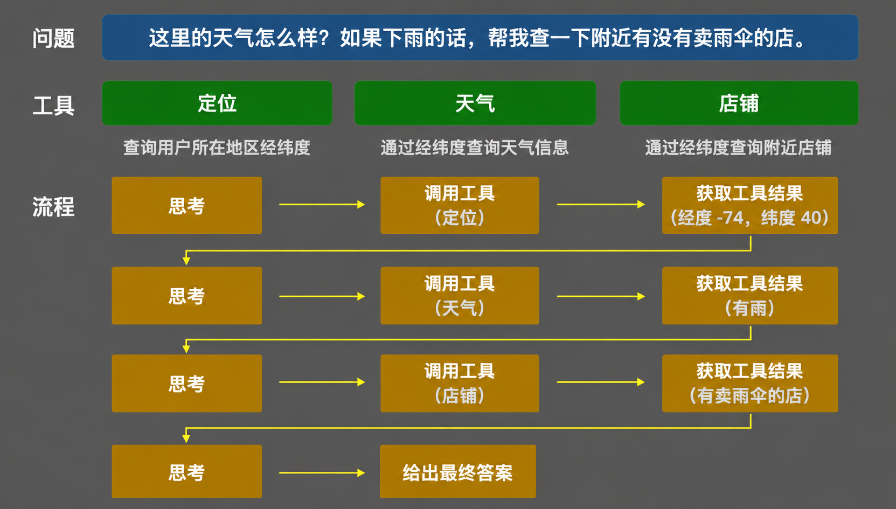

在「`Tool`技术基础」一节我们了解到，大模型可以通过工具感知外部世界，例如查询实时天气、搜索网页等。「`MCP`技术」一节则进一步讲到，工具可以通过`MCP`协议的方式实现统一接入。此外，主流大模型不仅支持在单次响应中同时输出多个工具调用指令，还支持多轮工具调用，即前一轮工具的返回结果将决定是否发起后续的工具调用。

这种支持多轮工具调用、由前序结果驱动后续决策、持续推进直至完成用户任务的大模型系统，具备了一定的自主规划能力，我们将其称为「智能体」，即`Agent`。目前市面上主流的`Agent`产品包括`Claude Code`、`Codex`、`Gemini CLI`等。

从多轮工具调用到`Agent`，本质上是大模型从「被动响应」走向「主动规划」的演进。单次对话中，大模型只负责生成一次回复；而在`Agent`模式下，大模型需要自主分解目标、制定步骤、调用工具获取反馈，再根据反馈调整计划，循环往复直至完成任务。这个「感知—推理—行动」的闭环，就是`Agent`区别于普通对话模型的核心。

要实现这种自主规划能力，`Agent`需要具备三类核心组件，分别是记忆、工具与规划能力。

记忆分为短期与长期两类。短期记忆即当前对话的上下文窗口，用于维持单次任务执行过程中的状态；长期记忆则通过向量数据库或结构化存储来实现，用于跨会话保留用户偏好、历史任务摘要等信息。工具则是`Agent`感知和操作外部世界的唯一手段，这也是`Agent`能力边界的核心所在。规划能力由大模型本身提供，负责将用户的目标拆解为可执行的子步骤，并根据中间结果动态调整后续计划。

以下面这张图为例，说明一下`Agent`的「感知—推理—行动」的闭环工作过程：



用户向`Agent`提问：「今天我这里的天气怎么样？如果下雨的话，帮我查一下附近有没有卖雨伞的店。」这个问题涉及条件判断与多个信息来源，`Agent`无法一次性给出回答，需要自主规划执行路径。整个过程如下所示：

- 第一轮，`Agent`意识到「我这里」是一个模糊的位置表述，必须先明确经纬度坐标，才能进行后续查询，于是调用定位工具，获取到用户所在位置的经度`-74`、纬度`40`。

- 第二轮，拿到坐标后，`Agent`以此为入参调用天气工具，获取到当前天气状态，结果显示有雨。

- 第三轮，`Agent`根据「有雨」这一结果，判断需要执行「查找附近卖雨伞的店」这一后续步骤，于是再次以经纬度坐标为入参调用店铺查询工具，获取到附近有售卖雨伞的店铺信息。

- 至此，`Agent`已掌握足够的信息，进行最后一轮推理，综合三次工具返回的结果，向用户给出最终回答。

整个流程中，`Agent`始终处于感知、推理、行动的循环之中，每次工具调用的返回结果都会作为新的输入触发下一轮推理，推理结果再决定是否继续调用工具、调用哪个工具，如此往复直至任务完成。这与前文介绍的多轮工具调用在机制上完全一致，区别仅在于每一步的决策逻辑更具目标导向性，`Agent`不只是在「响应」，而是在持续「推进」。

在这一过程中，`Agent`最初制定的执行计划共`3`步：

- 第`1`步：调用定位工具，获取当前位置坐标；
- 第`2`步：以坐标作为入参调用天气工具，查询当前天气状况
- 第`3`步：若天气为雨，则调用店铺查询工具，查找附近售卖雨伞的店铺。

第一个执行计划的第`1`步执行完成后，历史记录显示返回结果为经度`-74`、纬度`40`。`Agent`获取坐标后，意识到定位步骤已完成，于是重新规划，将第二个执行计划制定为`2`步：

- 第`1`步：以经纬度（`-74`，`40`）为入参调用天气工具，查询当前天气状况；
- 第`2`步：若天气为雨，则调用店铺查询工具，查找附近售卖雨伞的店铺。

第二个执行计划的第`1`步执行完成后，历史记录显示返回结果为雨。`Agent`据此判断条件成立，于是再次重新规划，将第三个执行计划制定为`1`步：以经纬度（`-74`，`40`）为入参调用店铺查询工具，获取附近售卖雨伞的店铺信息。

第三个执行计划仅有`1`步，执行并获取结果后，进行最后一次推理，便可向用户给出最终回答。

整个过程体现了`Agent`的核心特征，即前一步的返回结果会触发新一轮推理，`Agent`据此动态调整后续计划，而非在任务开始前就将所有步骤固定下来，这正是`Agent`区别于普通多轮工具调用的关键所在。

上文找雨伞店铺的场景之所以运转顺畅，是因为每一步都只需要调用一个职责清晰的接口，定位、查天气、查店铺，`Agent`只需要决定「调哪个、传什么参数」就行了，决策压力很小。

但现实中的任务往往更复杂。比如用户说：「帮我把这个月的销售数据整理成一份周报，发给团队的钉钉群。」这个任务横跨两个领域，一是生成`Excel`报表，二是发送钉钉消息。`Agent`手里有两个工具，一个是钉钉的发消息接口，传入群`ID`和消息内容即可发送，另一个是`Excel`写入接口，传入数据即可生成文件。

看起来这个任务和找雨伞的任务本质上是一样的，制定执行计划，调用工具，返回结果，而且这个任务还少一个工具，步骤更少。但问题恰恰不在这里，在于`Agent`不知道怎么把这些工具用好。

生成`Excel`这件事，数据要按哪个字段分组，表头怎么命名，金额列要不要加千分符，日期格式用`2025/6/16`还是`2025-06-16`，这些都是生成一份好看、易读的周报所需要的判断，而工具接口里没有这些信息。发钉钉消息也一样。钉钉支持`Markdown`格式，但哪些语法能正常渲染、哪些不行，消息超长时要不要截断，`@`全体成员的参数怎么写，这些细节同样藏不进接口定义里。

在往常，我们会把这些信息写进提示词，使用频率高的就写进全局提示词。但规范一多，就会造成输入`Token`的大量浪费，占用上下文窗口，并导致模型注意力的衰减。`Agent Skill`正是为了解决这个问题而诞生的，它是一种将特定领域的操作规范、经验约束与调用技巧封装起来、按需注入的机制，让`Agent`在需要时才加载相关知识，而不是把所有规范一股脑塞进每一次请求。

`Agent Skill`通常以`Markdown`格式编写，开头会使用`---`包裹元数据层，即`Agent`会预加载的内容，如下所示：

```markdown
---
name: sales-report
description: 当用户需要将销售数据生成为Excel周报时，使用此Skill
---
```

其中，`name`用于标识和引用，`description`用于触发匹配。

元数据层下面是指令层，是直接注入给`Agent`的规范内容，该部分没有格式要求，如下所示：

```markdown
使用openpyxl库生成.xlsx文件，遵循以下规范：

- 数据按销售日期升序排列
- 表头使用中文命名
- 金额字段单位为元，保留2位小数
- 日期格式统一为YYYY-MM-DD
- 数据区域末行添加合计行
- 列宽自适应内容长度
```

一个完整的钉钉发送群消息`Skill`如下所示：

```markdown
---
name: dingtalk-notify
description: 当用户需要向钉钉群发送消息时，使用此Skill
---

调用钉钉群机器人Webhook接口发送消息，遵循以下规范：

- 消息格式使用Markdown，仅使用钉钉支持的语法：#标题、加粗、链接、换行，不使用表格语法
- 正文超过2000字时截断，并在末尾附上完整文件的下载链接
- 需要@全体成员时，消息体中插入@all，同时在请求参数中设置isAtAll为true
- 发送前校验群ID不为空，若为空则终止执行并返回错误提示
```

上文两个`Skill`的内容都比较简洁，单个`SKILL.md`文件即可承载全部规范。但在实际项目中，`Skill`往往需要附带参考文档或辅助脚本，即资源层。为此，`Claude Code`以目录而非单文件的方式组织`Skill`，目录名即为`Skill`的标识，`SKILL.md`作为固定的入口文件，其他资源按需放入子目录。以上两个`Skill`在`Claude Code`中对应的目录结构如下所示：

```scss
.claude/skills/
├── sales-report/
│   └── SKILL.md
└── dingtalk-notify/
    └── SKILL.md
```

`Claude Code`对`Skill`的调用分为`3`层，官方将其称为「渐进式披露」，每层的触发时机与`Token`开销各不相同。

第一层，启动时加载元数据层。`Claude Code`启动后，会扫描`~/.claude/skills/`和项目根目录下的`.claude/skills/`两个目录，把每个`SKILL.md`的`YAML`元数据，也就是`name`和`description`部分，注入进系统提示词。这一层非常轻量，每个`Skill`的描述大约只占`100`个`Token`，所以装`50`个`Skill`也不会对上下文造成压力。

以文档里的两个`Skill`为例，启动后系统提示词里大概会多出这样两条信息：

```
sales-report: 当用户需要将销售数据生成为Excel周报时，使用此Skill
dingtalk-notify: 当用户需要向钉钉群发送消息时，使用此Skill
```

第二层，任务触发时读取指令层。用户输入「帮我把这个月的销售数据整理成一份周报，发给团队的钉钉群」之后，`Claude Code`根据系统提示词里已有的`description`做意图匹配，判断两个`Skill`都命中，然后通过`bash`命令直接读取对应`SKILL.md`文件的完整内容，将正文部分载入上下文窗口，也就是那些操作规范，比如「金额保留`2`位小数」「钉钉消息不能用表格语法」等。这一层按需触发，未命中的`Skill`正文永远不会进入上下文。

第三层，执行过程中按需加载资源层。如果`SKILL.md`的正文里引用了其他文件，`Claude Code`会继续用`bash`读取这些文件；如果正文里提到了可执行脚本，则直接运行脚本，并只将输出结果放入上下文，脚本源码本身不会进入上下文。对于上面这两个`Skill`而言，它们只有单个`SKILL.md`，没有附属资源，所以第三层不会触发，加载到第二层就结束了。

结合上文钉钉发消息的场景，扩展一个带附属资源的`Skill`示例会更直观。假设钉钉的消息模板随业务演进不断调整，与其把模板内容写死在`SKILL.md`正文里，不如单独维护一份模板文件，由`SKILL.md`引用它。文件结构如下：

```scss
.claude/skills/
├── sales-report/
│   └── SKILL.md
└── dingtalk-notify/
    ├── SKILL.md
    └── weekly-report.md
```

这样，`dingtalk-notify`目录下的`SKILL.md`中资源层部分即可添加以下内容：

```markdown
发送周报时，使用以下模板填充消息正文：

@weekly-report.md
```

`weekly-report.md`的文件内容如下所示：

```markdown
## {{month}}月销售周报

本周销售额：**{{total_amount}}** 元
环比上周：{{week_on_week}}

### 分产品明细

{{product_table}}

> 详细数据请查看附件：[完整Excel报表]({{excel_url}})
```

这样，当用户说「帮我把这个月的销售数据整理成一份周报，发给团队的钉钉群」时，`Claude Code`针对`dingtalk-notify`这个带附属资源的`Skill`，三层加载过程如下：

第一层，启动时仅将`SKILL.md`的元数据层注入系统提示词，`weekly-report.md`完全不在上下文中。

第二层，意图匹配命中`dingtalk-notify`后，`Claude Code`通过`bash`读取对应`SKILL.md`的完整正文，包含指令层与资源层，操作规范与末尾的`@weekly-report.md`引用会一并载入上下文。

第三层，`Claude Code`识别到资源层的`@weekly-report.md`引用，继续以`bash`读取该文件，将模板内容载入上下文。

整个过程中，`weekly-report.md`只在真正需要它的那一刻才进入上下文。若用户的任务不涉及钉钉发消息，`dingtalk-notify`的正文与模板文件便永远不会产生任何`Token`开销，这正是「渐进式披露」机制的价值所在。

`SKILL.md`资源层中除了通过`@`引用其他`Markdown`文件，也可以引用`.sh`等可执行脚本。引用`Markdown`文件时，`Claude Code`会将文件的完整内容读入上下文；而引用可执行脚本时，`Claude Code`会直接运行该脚本，只将输出结果放入上下文，脚本源码本身不会进入上下文。对于那些输出简洁但逻辑复杂的脚本，这种方式能显著节省`Token`开销。

`MCP`与`Agent Skill`都是增强`Agent`能力的手段，但解决的是不同层面的问题。

`MCP`解决的是「工具接入的标准化」，它以统一协议规范了工具的描述、调用与返回格式，让`Agent`能以一致的方式调用任意外部服务，关注点在于「能调什么」，扩展的是`Agent`的能力边界。`Agent Skill`解决的是「领域知识的按需注入」，工具接好之后，`Agent`仍然不知道「怎么用才对」，钉钉不支持表格语法、金额列要保留`2`位小数这类约束无法写进接口定义，`Skill`正是为此而生，关注点在于「怎么用才好」，提升的是`Agent`在特定场景下的执行质量。

简而言之，`MCP`决定`Agent`能做什么，`Skill`决定`Agent`把事情做得多对。在实际项目中，两者通常配合使用，以钉钉发消息为例，`MCP`提供调用`Webhook`的工具，`Skill`则告诉`Agent`调用时该遵守哪些规范，职责清晰，互不重叠。
