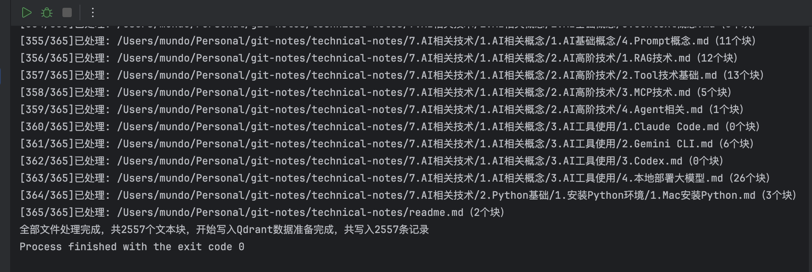
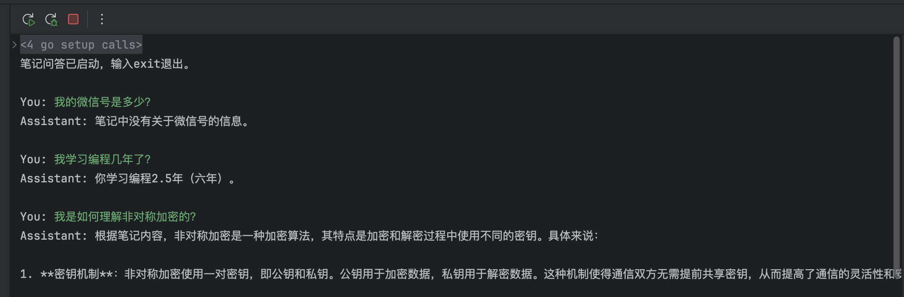

本节我们为大模型接入`RAG`能力，使大模型能够读取并检索本地的`Markdown`笔记内容。

推荐使用`Ollama`本地拉取`nomic-embed-text`作为`Embedding`模型，命令如下：

```sh
ollama pull nomic-embed-text
```

该模型专为文本向量化设计，基于`BERT`架构，输出`768`维归一化向量，本地运行开销极小。

对于向量数据库，我们选用`Qdrant`，它提供`Docker`一键启动、有官方`Go SDK`、支持按`metadata`过滤：

```sh
docker pull qdrant/qdrant
```

我们使用下面命令，启动`Qdrant`容器：

```sh
docker run -d \
  --restart=always \
  -p 6333:6333 \
  -p 6334:6334 \
  -v $(pwd)/qdrant_storage:/qdrant/storage \
  --name qdrant qdrant/qdrant
```

这里的`$(pwd)`表示执行命令时所在目录，在哪个目录下执行这条命令，`qdrant_storage`目录就会创建在哪里。

在`RAG`的数据准备阶段，首先递归遍历`Markdown`笔记目录，读取所有`.md`文件的原始内容，代码如下：

```go
// 递归遍历目录，收集所有.md文件路径，后续Embedding和入库流程依赖此列表作为数据源
func walkMarkdownFiles(root string) ([]string, error) {
	var files []string
	err := filepath.WalkDir(root, func(path string, d fs.DirEntry, err error) error {
		if err != nil {
			return err // 这里的err会返回给filepath.WalkDir函数
		}
		if !d.IsDir() && strings.HasSuffix(path, ".md") {
			files = append(files, path)
		}
		return nil
	})
	if err != nil {
		return nil, err
	}
	return files, nil
}
```

接下来定义两个结构体，一个描述文本块的字段，另一个用于建立文本块与向量之间的映射关系：

```go
type Chunk struct {
	FilePath string // 所属.md文件的路径
	Text     string // 分块后的原始文本内容
	Index    int    // 该块在当前文件中的分块序号，从0开始
}

type ChunkVector struct {
	Chunk  Chunk
	Vector []float32 // Chunk.Text经Embedding模型编码后的高维浮点向量
}
```

随后对每个文件按固定字符数进行分块，将长文档拆解为若干语义完整的片段，代码如下：

```go
// 按固定字符数对每个文件进行切分，相邻块之间保留overlap长度的重叠区域，避免语义在块边界处断裂
func splitBySize(content, filePath string, chunkSize, overlap int) []Chunk {
	var chunks []Chunk
	runes := []rune(content)
	total := len(runes)
	start := 0
	for idx := 0; start < total; idx++ {
		end := start + chunkSize
		if end > total {
			end = total
		}
		chunks = append(chunks, Chunk{
			FilePath: filePath,
			Text:     string(runes[start:end]),
			Index:    idx,
		})
		if end == total {
			break
		}
		start += chunkSize - overlap
	}
	return chunks
}
```

需要注意，这里的分块文本长度单位是字符，不是`Token`。

接着我们使用`OpenAI`兼容接口的方式，调用`Embedding`模型对每个片段进行向量化，将文本转换为高维浮点向量：

```go
// 调用兼容OpenAI的Embedding接口，使用nomic-embed-text模型，将文本块转为768维float32向量
func embed(ctx context.Context, client *openai.Client, text string) ([]float32, error) {
	resp, err := client.Embeddings.New(ctx, openai.EmbeddingNewParams{
		Model: "nomic-embed-text",
		Input: openai.EmbeddingNewParamsInputUnion{
			OfString: openai.String(text),
		},
	})
	if err != nil {
		return nil, err
	}
	raw := resp.Data[0].Embedding
	result := make([]float32, len(raw))
	for i, v := range raw {
		result[i] = float32(v)
	}
	return result, nil
}
```

我们引入操作`Qdrant`向量数据库的`Go`第三方库：

```sh
go get github.com/qdrant/go-client
```

接下来我们在向量数据库中创建集合，并执行批量写入操作：

```go
// 在Qdrant中创建集合，并指定向量维度与计算向量相似度的方式
func ensureCollection(ctx context.Context, client *qdrant.Client, name string) error {
	return client.CreateCollection(ctx, &qdrant.CreateCollection{
		CollectionName: name,
		VectorsConfig: qdrant.NewVectorsConfig(&qdrant.VectorParams{
			Size:     768,                    // 向量维度数
			Distance: qdrant.Distance_Cosine, // 用余弦相似度计算向量相似度
		}),
	})
}

// 将文本块连同向量和元数据批量写入Qdrant，id用自增序号，payload中存储原始文本、文件路径以及块序号
func upsertChunks(ctx context.Context, client *qdrant.Client,
	collection string, items []ChunkVector) error {
	var points []*qdrant.PointStruct
	for i, item := range items {
		points = append(points, &qdrant.PointStruct{
			Id:      qdrant.NewIDNum(uint64(i)),
			Vectors: qdrant.NewVectors(item.Vector...),
			Payload: qdrant.NewValueMap(map[string]any{
				"text":      item.Chunk.Text,
				"file_path": item.Chunk.FilePath,
				"index":     item.Chunk.Index, // 块在文件中的序号，用于后续定位与脏数据清理
			}),
		})
	}
	_, err := client.Upsert(ctx, &qdrant.UpsertPoints{
		CollectionName: collection,
		Points:         points,
	})
	if err != nil {
		return err
	}
	return nil
}
```

当前代码以自增序号（`0`、`1`、`2`...）作为每条向量记录的`id`，导致`id`与「某个具体文本块」之间不存在任何稳定的绑定关系，它仅表示「第几条记录」。每次重新处理笔记时，都会重新遍历所有文件、重新分块、重新从`0`开始编号，再执行`Upsert`。`Upsert`的语义是：命中`id`则覆盖，否则插入。若本轮生成的块数少于数据库中已有的块数，多出的那部分记录便会成为脏数据。

解决方案是采用哈希`id`，将「文件路径 + 块在文件中的偏移量」拼接后取`MD5`或`SHA256`，由于`Qdrant`的`id`支持`UUID`字符串格式，直接使用哈希的十六进制字符串做主键即可。在此方案下，有三种情况需要分别处理：

1. 若本轮计算出的`id`在数据库中已存在，`Upsert`时直接覆盖该条记录。
2. 若本轮计算出的`id`在数据库中不存在，说明这是一个新块，例如新增了`.md`文件、文件内容增加或分块参数变化导致分块数量变多，`Upsert`会将其作为新记录插入。
3. 若数据库中存在某`id`但本轮未计算出该`id`，则说明对应的块已经消失，例如文件被删除、内容减少或分块参数变化，这部分即为脏数据。将本轮所有`id`收集为集合，与数据库现存`id`取差集，再将差集中的`id`显式删除。

这部分代码本节暂不展示，后续优化时可自行编写相关实现。

数据准备的函数能力编写完毕，这里我们编写一个主函数来串起整个流程，完成数据准备：

```go
func main() {
	ctx := context.Background()
	notesRoot := "/Users/mundo/Personal/git-notes/technical-notes"
	collectionName := "notes"
	chunkSize := 500 // 文本分块大小，单位：字符
	overlap := 50    // 分块重叠字符数，单位：字符
	// 初始化OpenAI兼容客户端，用于调用本地Ollama的Embedding接口
	embedClient := openai.NewClient(
		option.WithBaseURL("http://localhost:11434/v1"),
		option.WithAPIKey("ollama"),
	)
	// 初始化Qdrant客户端，连接本地向量数据库
	qdrantClient, _ := qdrant.NewClient(&qdrant.Config{
		Host: "localhost",
		Port: 6334,
	})
	defer qdrantClient.Close()
	// 在向量数据库中创建集合，若已存在则跳过
	err := ensureCollection(ctx, qdrantClient, collectionName)
	if err != nil {
		// 处理创建集合过程遇到的错误
	}
	// 递归收集所有Markdown文件路径，作为后续Embedding流程的数据源
	files, err := walkMarkdownFiles(notesRoot)
	if err != nil {
		// 处理文件遍历过程中遇到的错误
	}
	fmt.Printf("共发现%d个Markdown文件\n", len(files))
	var allItems []ChunkVector
	for i, filePath := range files {
		raw, _ := os.ReadFile(filePath)
		// 按固定字符数对文件内容进行分块，保留overlap避免块边界处语义断裂
		chunks := splitBySize(string(raw), filePath, chunkSize, overlap)
		for j, chunk := range chunks {
			// 调用Embedding模型将当前文本块转为768维向量
			vec, err := embed(ctx, &embedClient, chunk.Text)
			if err != nil {
				fmt.Printf("Embedding失败，跳过[%s]第%d块: %v\n", filePath, j, err)
				continue
			}
			allItems = append(allItems, ChunkVector{Chunk: chunk, Vector: vec})
		}
		fmt.Printf("[%d/%d]已处理: %s（%d个块）\n", i+1, len(files), filePath, len(chunks))
	}
	fmt.Printf("全部文件处理完成，共%d个文本块，开始写入Qdrant", len(allItems))
	// 将所有文本块及其向量批量写入向量数据库
	err = upsertChunks(ctx, qdrantClient, collectionName, allItems)
	if err != nil {
		// 处理写入向量数据库过程遇到的错误
	}
	fmt.Printf("数据准备完成，共写入%d条记录", len(allItems))
}
```

执行成功的效果如下所示：



`Qdrant`自带`Web UI`，浏览器访问`http://localhost:6333/dashboard`，即可查看集合信息等：


数据准备流程结束后，问答阶段的函数能力如下所示：

```go
// 将用户问题向量化后在Qdrant中检索最相关的Top-K块，这里TopK取10，表示召回10条文本块
func retrieve(ctx context.Context, qdrantClient *qdrant.Client,
	embedClient *openai.Client, collection, question string) ([]string, error) {
	// 将用户问题调用embed方法，获取其768维向量
	vec, err := embed(ctx, embedClient, question)
	if err != nil {
		return nil, err
	}
	results, err := qdrantClient.Query(ctx, &qdrant.QueryPoints{
		CollectionName: collection,
		Query:          qdrant.NewQuery(vec...),
		Limit:          qdrant.PtrOf(uint64(10)),
		WithPayload:    qdrant.NewWithPayload(true),
	})
	if err != nil {
		return nil, err
	}
	var texts []string
	for _, r := range results {
		if v, ok := r.Payload["text"]; ok {
			texts = append(texts, v.GetStringValue())
		}
	}
	return texts, nil
}

// 将检索到的文本块构造为System消息注入Prompt，引导模型基于笔记内容作答
// System消息不计入history，避免每轮对话重复累积笔记内容撑爆Context Window
func buildMessages(contexts []string, question string,
	history []openai.ChatCompletionMessageParamUnion) []openai.ChatCompletionMessageParamUnion {
	var sb strings.Builder
	sb.WriteString("你是一个笔记助手，请根据以下笔记内容回答问题。如果笔记中没有相关信息，请直接说明。\n\n")
	sb.WriteString("【笔记内容】\n")
	for i, ctx := range contexts {
		fmt.Fprintf(&sb, "--- 片段%d ---\n%s\n", i+1, ctx)
	}
	messages := []openai.ChatCompletionMessageParamUnion{
		openai.SystemMessage(sb.String()),
	}
	messages = append(messages, history...)
	messages = append(messages, openai.UserMessage(question))
	return messages
}

// 使用注入了携带笔记内容的System消息后的messages列表发起流式对话请求，并将本轮问答写入history。
func chatWithMessages(client *openai.Client, history *[]openai.ChatCompletionMessageParamUnion,
	userInput string, messages []openai.ChatCompletionMessageParamUnion) error {
	stream := client.Chat.Completions.NewStreaming(
		context.Background(),
		openai.ChatCompletionNewParams{
			Model:    "qwen3:8b",
			Messages: messages,
		},
		option.WithJSONSet("reasoning_effort", "none"),
	)
	acc := openai.ChatCompletionAccumulator{}
	fmt.Print("Assistant: ")
	for stream.Next() {
		chunk := stream.Current()
		acc.AddChunk(chunk)
		if len(chunk.Choices) > 0 {
			fmt.Print(chunk.Choices[0].Delta.Content)
		}
	}
	fmt.Println()
	if err := stream.Err(); err != nil {
		return err
	}
	// 将本轮用户输入和模型完整回复写入history，供下一轮对话拼入上下文
	*history = append(*history, openai.UserMessage(userInput))
	if len(acc.Choices) > 0 {
		*history = append(*history, openai.AssistantMessage(acc.Choices[0].Message.Content))
	}
	return nil
}
```

接着，我们写一个主函数，用于使用`RAG`的能力获取文本片段，拼接`Prompt`后与大模型进行对话：

```go
func main() {
	ctx := context.Background()
	collectionName := "notes"
	// 初始化OpenAI兼容客户端，Embedding和对话共用同一个client
	client := openai.NewClient(
		option.WithBaseURL("http://localhost:11434/v1"),
		option.WithAPIKey("ollama"),
	)
	// 初始化Qdrant客户端，连接本地向量数据库
	qdrantClient, _ := qdrant.NewClient(&qdrant.Config{
		Host: "localhost",
		Port: 6334,
	})
	defer qdrantClient.Close()
	history := make([]openai.ChatCompletionMessageParamUnion, 0)
	scanner := bufio.NewScanner(os.Stdin)
	fmt.Println("笔记问答已启动，输入exit退出。")
	for {
		fmt.Print("\nYou: ")
		if !scanner.Scan() {
			break
		}
		input := strings.TrimSpace(scanner.Text())
		if input == "" {
			continue
		}
		if input == "exit" {
			fmt.Println("对话结束。")
			break
		}
		// 将用户问题向量化并从Qdrant检索相关笔记片段，这里只召回，不重排
		contexts, err := retrieve(ctx, qdrantClient, &client, collectionName, input)
		if err != nil {
			// 检索失败，跳过当前问题，处理相关错误，继续下一轮对话
			continue
		}
		// 将检索到的笔记片段与历史对话拼装为完整消息列表
		messages := buildMessages(contexts, input, history)
		err = chatWithMessages(&client, &history, input, messages)
		if err != nil {
			// 处理对话过程中遇到的错误
		}
	}
}
```

运行代码进行对话后，可以发现大模型已经可以参照笔记文本片段内容来进行问题回答：



但由于本地部署的`LLM`与`Embedding`模型能力均较弱，加之检索环节只有召回而没有重排，实际效果并不特别理想。

在用户输入问题后，可以在日志中记录每次召回的文本片段信息，包括来源文件名及该片段在文件中的序号。这样便于后续验证检索效果是否准确，召回的内容是否真正与问题相关。后续可自行代码实现。

