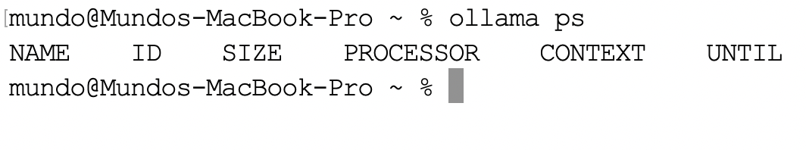

学习完本地部署大模型后，可按以下步骤依次关停所有服务。首先停止当前运行的`qwen3:8b`模型：

```sh
ollama stop qwen3:8b
```

再停止`Ollama`主进程，在`macOS`菜单栏点击`Ollama`图标，选择`Quit Ollama`即可。也可以直接执行：

```sh
pkill ollama
```

接着停止`Qdrant`容器：

```sh
docker stop qdrant
```

后续若需再次使用，执行`docker start qdrant`重新启动即可。如果确定不再需要，可将容器一并删除：

```sh
docker rm qdrant
```

执行下面命令将`nomic-embed-text`服务停止：

```sh
ollama stop nomic-embed-text
```

如果想确认`qwen3:8b`和`nomic-embed-text`服务是否还驻留在内存中，可执行下面命令：

```sh
ollama ps
```

清理成功的结果如下所示：



`Ollama`中的模型默认采用按需加载机制。模型首次收到推理请求时加载到内存，默认在请求结束后继续保持加载`5`分钟；如果期间没有新的请求，则自动从内存中卸载。该机制同时适用于`qwen3:8b`等生成模型和`nomic-embed-text`等`Embedding`模型。
