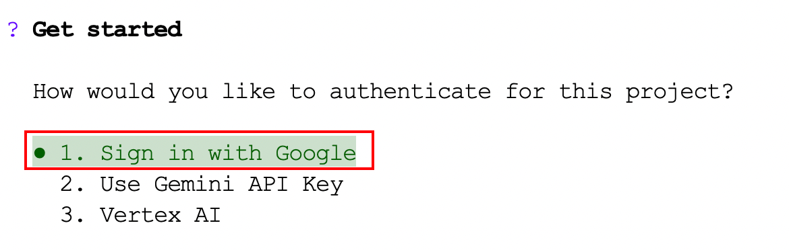
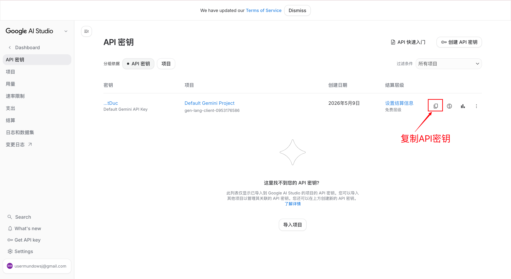
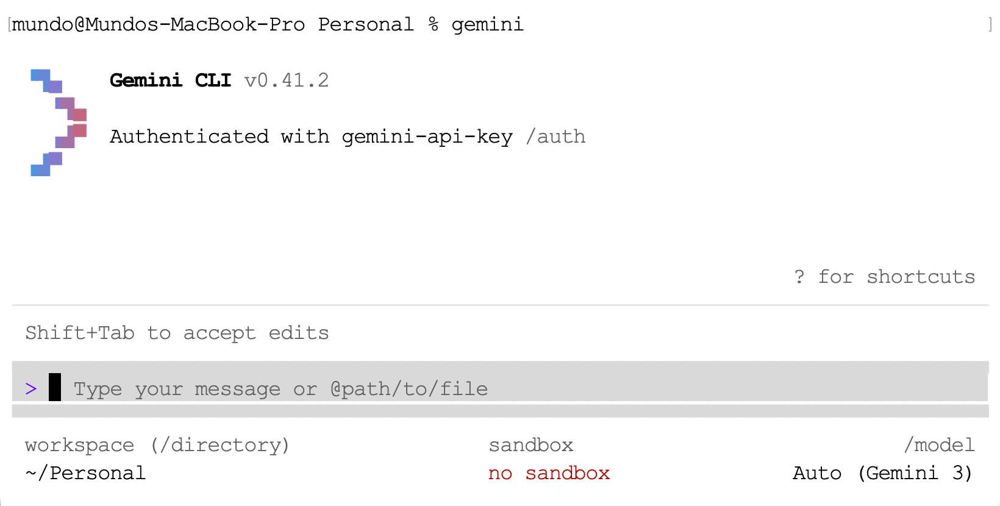

首先，确保本机已安装`Node.js`，且版本`>=18`：

```sh
node -v
```

如果未安装，执行以下命令进行安装：

```sh
brew install node
```

执行下面命令，安装`Gemini CLI`：

```sh
npm install -g @google/gemini-cli
```

在安装过程中可能会遇见下面的报错信息：

```sh
npm error code UNABLE_TO_GET_ISSUER_CERT_LOCALLY
npm error errno UNABLE_TO_GET_ISSUER_CERT_LOCALLY
npm error request to https://registry.npmjs.org/@google%2fgemini-cli failed, reason: unable to get local issuer certificate
```

这个报错的原因是`Node.js`内置了一份独立的根证书列表，不读取`macOS`系统钥匙串。若本机曾安装过代理软件（如`Clash`），代理会向系统钥匙串写入自定义根证书，`macOS`与`curl`均信任该证书，但`Node.js`无法识别，从而导致证书验证失败。

首先验证`MacOS`系统证书库是否正常，能返回`JSON`说明系统层面无问题：

```sh
curl https://registry.npmjs.org
```

接着，导出系统证书库到一个临时文件：

```sh
security find-certificate -a -p /Library/Keychains/System.keychain > /tmp/system-certs.pem
security find-certificate -a -p /System/Library/Keychains/SystemRootCertificates.keychain >> /tmp/system-certs.pem
```

设置`Node.js`使用系统证书：

```sh
export NODE_EXTRA_CA_CERTS=/tmp/system-certs.pem
```

重新执行下面命令进行安装：

```sh
npm install -g @google/gemini-cli
```

如果安装成功，将该配置写入`~/.zshrc`使其永久生效：

```sh
echo 'export NODE_EXTRA_CA_CERTS=/tmp/system-certs.pem' >> ~/.zshrc
source ~/.zshrc
```

安装完成后，在终端执行`gemini`命令，选择谷歌账号登录即可：



如果登录谷歌账号时出现超时情况，先退出`Gemini CLI`，然后执行下面两条命令后，再执行`gemini`命令：

```sh
export https_proxy=socks5://127.0.0.1:7897
export http_proxy=socks5://127.0.0.1:7897
```

如果将上面的代理写入`~/.zshrc`，每个新终端会话都会默认走代理，不只是`gemini`命令。`curl`、`wget`、`go get`、`npm`等所有走`http/https`的命令都会受影响。若代理未启动或故障，这些命令可能会连接失败或超时。

所以我们可以给`gemini`命令设置别名，只有`gemini`命令走代理，其他命令完全不受影响：

```sh
echo "alias gemini='https_proxy=socks5://127.0.0.1:7897 http_proxy=socks5://127.0.0.1:7897 gemini'" >> ~/.zshrc && source ~/.zshrc
```

目前登录谷歌账号会有如下这样的问题：


这表示你当前使用的`Google`账号所在地区暂不支持`Gemini Code Assist`个人版服务。即使通过了这一关，后续还需要手机扫描二维码进行身份验证，而这一环节在中国大陆同样无法完成。

我们可以登录这个网址：https://aistudio.google.com/api-keys，获取`API Key`：



接着在使用`gemini`命令的登录验证时，选择第二项：`Use Gemini API Key`，输入上面复制的密钥即可。

这样就可以完成登录，进入`Gemini CLI`的命令终端界面了：



我们的`API Key`是在`Google AI Studio`免费创建的，且没有绑定任何信用卡，在物理上不可能扣费，如果超过限制只会报错。
