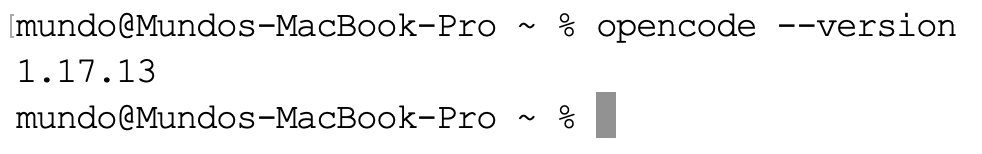
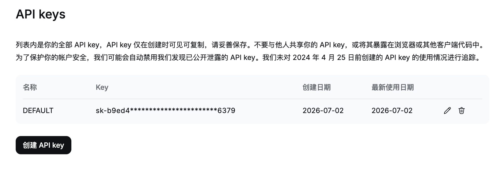

对于`Mac`用户，推荐直接用`Homebrew`安装，这是官方推荐的方式，升级也最方便：

```sh
brew install anomalyco/tap/opencode
```

安装完成后，验证是否成功：

```sh
opencode --version
```

命令执行结果如下所示：



后续若想更新`opencode`版本，使用以下命令：

```sh
brew update
brew upgrade opencode
```

如果更喜欢桌面应用（目前还是`Beta`），也可以安装：

```sh
brew install --cask opencode-desktop
```

或者直接从官方下载页面下载对应版本的`.dmg`安装包：https://dev.opencode.ai/download。

接着我们登录`DeepSeek`开放平台：https://platform.deepseek.com/usage，充值后创建`API Key`并将其保存：



> 需要注意，创建`API Key`后平台仅会展示一次，因此必须妥善保存；若后续遗失，则只能删除后重新创建。