### 一、`Claude Code`安装

对于`Mac`用户，推荐直接用`Homebrew`安装，直接执行以下命令：

```sh
brew install --cask claude-code
```

安装完成后，验证是否成功：

```sh
claude --version
```

首次使用时，在终端进入我们的项目目录，然后运行`claude`命令，按照提示登录`Anthropic`账号即可开始使用。

由于`Homebrew`安装方式默认不会自动更新，因此后续需要手动升级：

```sh
brew upgrade claude-code
```

### 二、`OpenCode`安装

对于`Mac`用户，推荐直接用`Homebrew`安装，这是官方推荐的方式，升级也最方便：

```sh
brew install anomalyco/tap/opencode
```

安装完成后，验证是否成功：

```sh
opencode --version
```

命令执行结果如下所示：

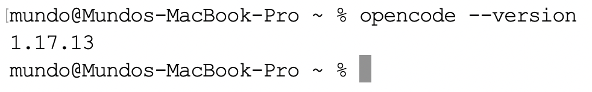

后续若想更新`opencode`版本，使用以下命令：

```sh
brew update
brew upgrade opencode
```

如果更喜欢桌面应用（目前还是`Beta`），也可以安装：

```sh
brew install --cask opencode-desktop
```

或者直接从官方下载页面下载对应版本的`.dmg`安装包：https://dev.opencode.ai/download。

接着我们登录`DeepSeek`开放平台：https://platform.deepseek.com/usage，充值后创建`API Key`并将其保存：

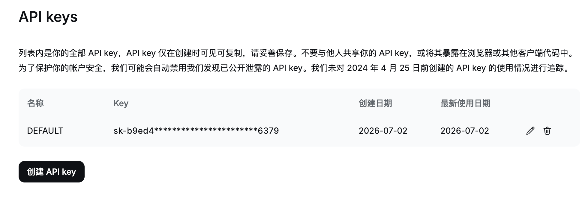

> 需要注意，创建`API Key`后平台仅会展示一次，因此必须妥善保存；若后续遗失，则只能删除后重新创建。

在任意目录执行`opencode`命令后，会进入其专属终端。接着输入`/connect`，然后选择下方对应的选项：

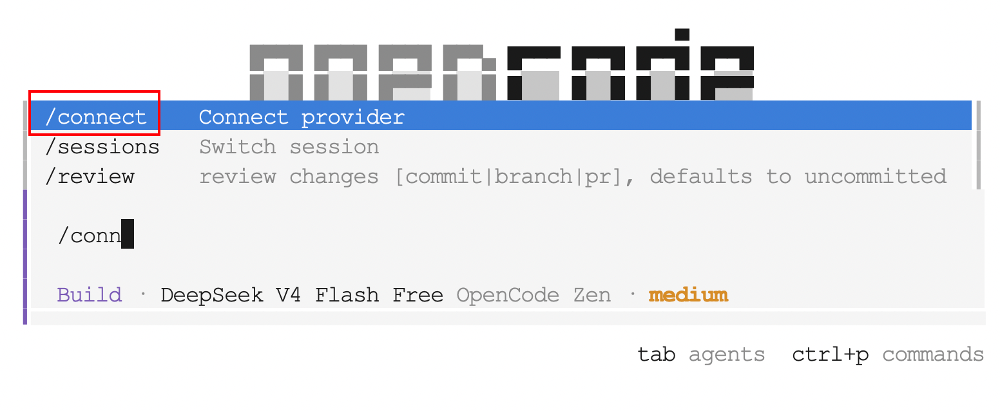

在展示出的搜索框中输入`DeepSeek`，然后从搜索结果中选择对应的选项：

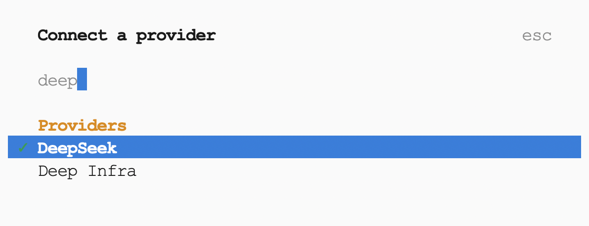

将刚才在`DeepSeek`开放平台创建的`API Key`粘贴到输入框中，然后按回车键提交：

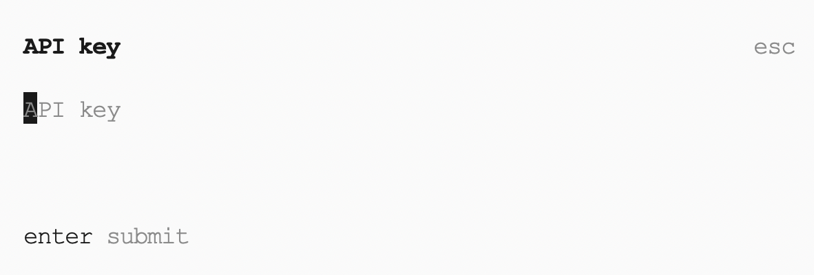

回到终端后，输入`/models`，点击下方对应的选项，然后选择需要使用的模型：

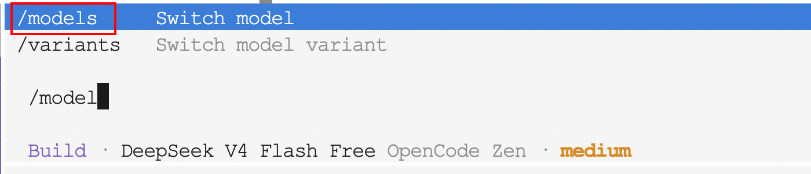

在这里即可选择前面导入的`DeepSeek V4 Flash`和`DeepSeek V4 Pro`两个模型：

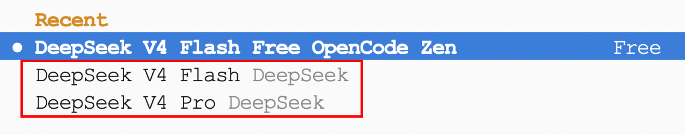

选择好模型后，即可在终端输入`prompt`，开始访问并操作当前项目：

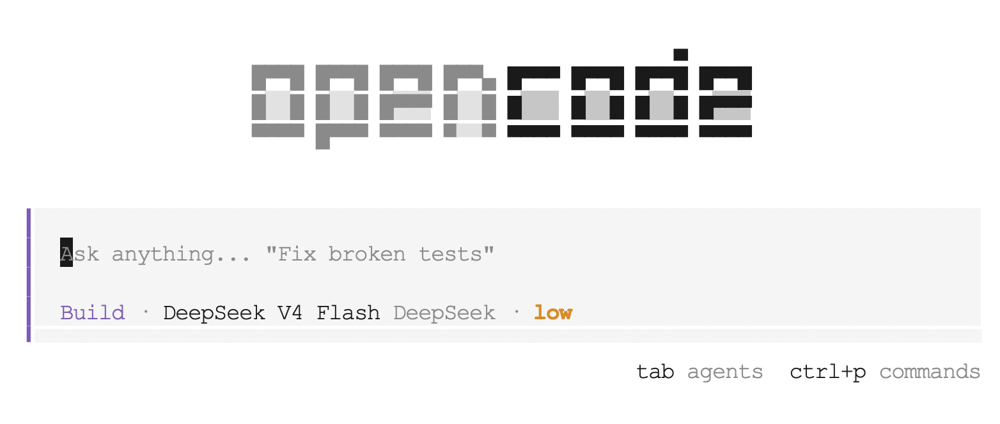

### 三、`Codex`与`CC Switch`安装

`Codex`推荐使用客户端工具方式使用，可前往：https://developers.openai.com/codex/app，进行下载。

随后，我们下载`CC Switch`工具，在`Mac`终端执行下方命令：

```sh
brew tap farion1231/ccswitch
brew install --cask cc-switch
```

安装成功的截图如下所示：

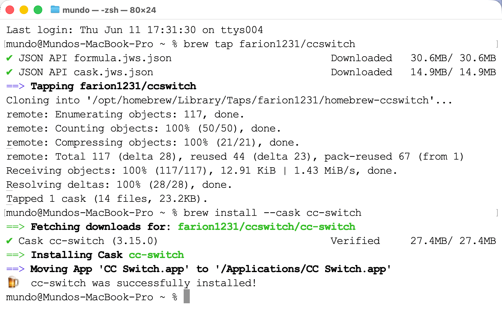

后续更新命令如下所示：

```sh
brew upgrade --cask cc-switch
```

如果没有`Homebrew`，可以去官方`GitHub Releases`页面下载：

```sh
https://github.com/farion1231/cc-switch/releases
```

下载`CC-Switch-vX.X.X-macOS.dmg`，挂载后将`CC Switch.app`拖入「应用程序」文件夹即可。

安装完成后，可以在「应用程序」中找到该`APP`，双击使用它。

### 四、`Gemini CLI`安装

首先，确保本机已安装`Node.js`，且版本`>=18`：

```sh
node -v
```

如果未安装，执行以下命令进行安装：

```sh
brew install node
```

执行下面命令，安装`Gemini CLI`：

```sh
npm install -g @google/gemini-cli
```

在安装过程中可能会遇见下面的报错信息：

```sh
npm error code UNABLE_TO_GET_ISSUER_CERT_LOCALLY
npm error errno UNABLE_TO_GET_ISSUER_CERT_LOCALLY
npm error request to https://registry.npmjs.org/@google%2fgemini-cli failed, reason: unable to get local issuer certificate
```

这个报错的原因是`Node.js`内置了一份独立的根证书列表，不读取`macOS`系统钥匙串。若本机曾安装过代理软件（如`Clash`），代理会向系统钥匙串写入自定义根证书，`macOS`与`curl`均信任该证书，但`Node.js`无法识别，从而导致证书验证失败。

首先验证`MacOS`系统证书库是否正常，能返回`JSON`说明系统层面无问题：

```sh
curl https://registry.npmjs.org
```

接着，导出系统证书库到一个临时文件：

```sh
security find-certificate -a -p /Library/Keychains/System.keychain > /tmp/system-certs.pem
security find-certificate -a -p /System/Library/Keychains/SystemRootCertificates.keychain >> /tmp/system-certs.pem
```

设置`Node.js`使用系统证书：

```sh
export NODE_EXTRA_CA_CERTS=/tmp/system-certs.pem
```

重新执行下面命令进行安装：

```sh
npm install -g @google/gemini-cli
```

如果安装成功，将该配置写入`~/.zshrc`使其永久生效：

```sh
echo 'export NODE_EXTRA_CA_CERTS=/tmp/system-certs.pem' >> ~/.zshrc
source ~/.zshrc
```

安装完成后，在终端执行`gemini`命令，选择谷歌账号登录即可：

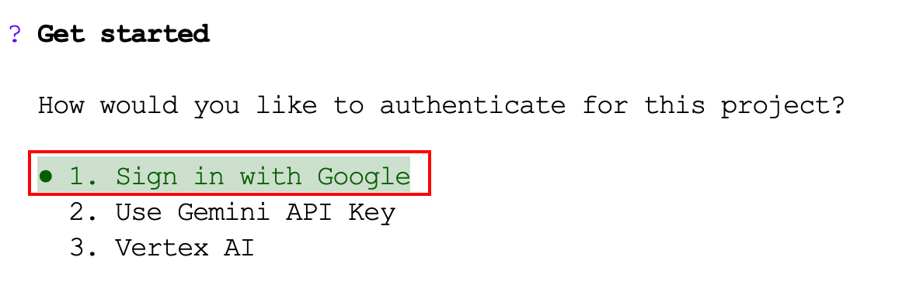

如果登录谷歌账号时出现超时情况，先退出`Gemini CLI`，然后执行下面两条命令后，再执行`gemini`命令：

```sh
export https_proxy=socks5://127.0.0.1:7897
export http_proxy=socks5://127.0.0.1:7897
```

如果将上面的代理写入`~/.zshrc`，每个新终端会话都会默认走代理，不只是`gemini`命令。`curl`、`wget`、`go get`、`npm`等所有走`http/https`的命令都会受影响。若代理未启动或故障，这些命令可能会连接失败或超时。

所以我们可以给`gemini`命令设置别名，只有`gemini`命令走代理，其他命令完全不受影响：

```sh
echo "alias gemini='https_proxy=socks5://127.0.0.1:7897 http_proxy=socks5://127.0.0.1:7897 gemini'" >> ~/.zshrc && source ~/.zshrc
```

目前登录谷歌账号会有如下这样的问题：


这表示你当前使用的`Google`账号所在地区暂不支持`Gemini Code Assist`个人版服务。即使通过了这一关，后续还需要手机扫描二维码进行身份验证，而这一环节在中国大陆同样无法完成。

我们可以登录这个网址：https://aistudio.google.com/api-keys，获取`API Key`：

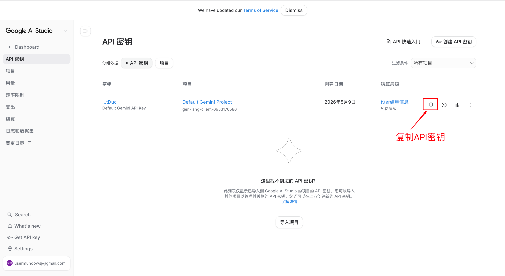

接着在使用`gemini`命令的登录验证时，选择第二项：`Use Gemini API Key`，输入上面复制的密钥即可。

`API Key`本质上是一串字符串，充当访问接口的身份凭证。每次调用`Gemini`接口时，请求里都会携带这个`Key`，服务器拿到后识别其归属的`Google`账户、校验调用权限，并将本次请求计入该账户的配额消耗，用于限流或计费。

`API Key`专为机器间调用设计，可以直接嵌入命令行工具、脚本或服务端程序，无需经过浏览器跳转和人工交互。由于它本身不含加密机制，拿到这串字符就等同于拥有对应账户的调用权限，因此不能提交到公开代码仓库或以任何方式泄露。

这样就可以完成登录，进入`Gemini CLI`的命令终端界面了：

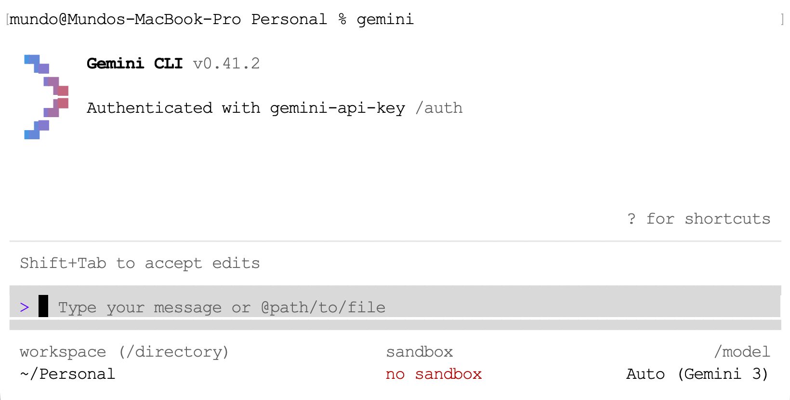

我们的`API Key`是在`Google AI Studio`免费创建的，且没有绑定任何信用卡，在物理上不可能扣费，如果超过限制只会报错。
