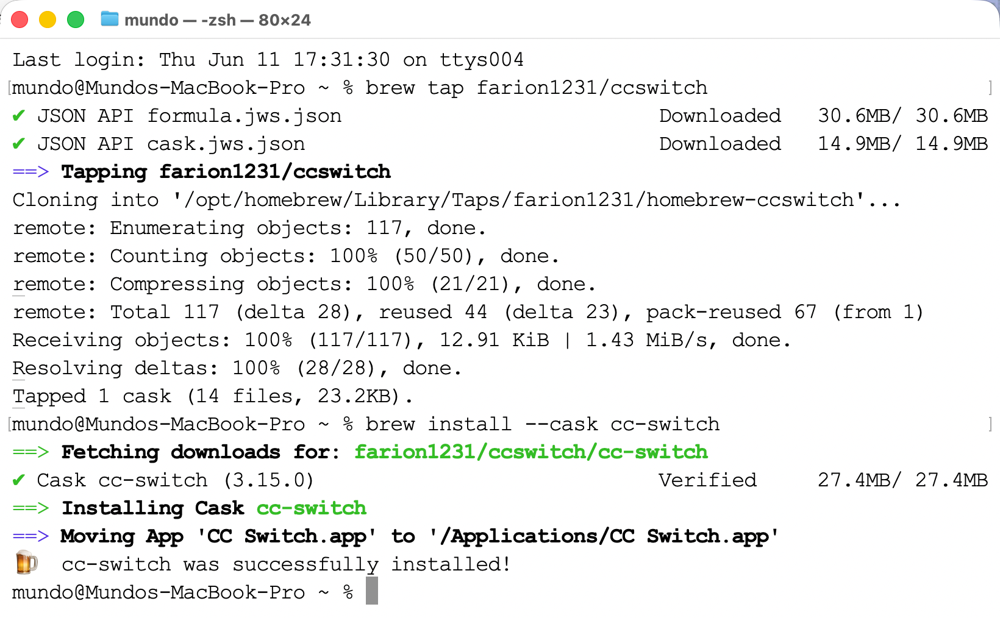

`Codex`推荐使用客户端工具方式使用，可前往：https://developers.openai.com/codex/app，进行下载。

随后，我们下载`CC Switch`工具，在`Mac`终端执行下方命令：

```sh
brew tap farion1231/ccswitch
brew install --cask cc-switch
```

安装成功的截图如下所示：



后续更新命令如下所示：

```sh
brew upgrade --cask cc-switch
```

如果没有`Homebrew`，可以去官方`GitHub Releases`页面下载：

```sh
https://github.com/farion1231/cc-switch/releases
```

下载`CC-Switch-vX.X.X-macOS.dmg`，挂载后将`CC Switch.app`拖入「应用程序」文件夹即可。

安装完成后，可以在「应用程序」中找到该`APP`，双击使用它。
