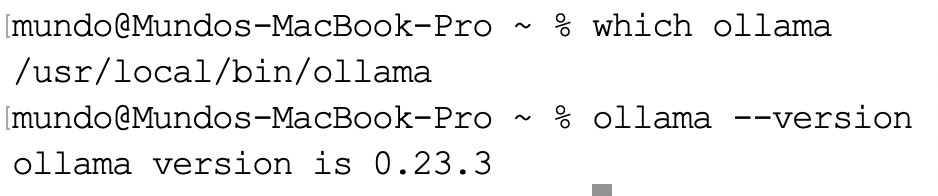
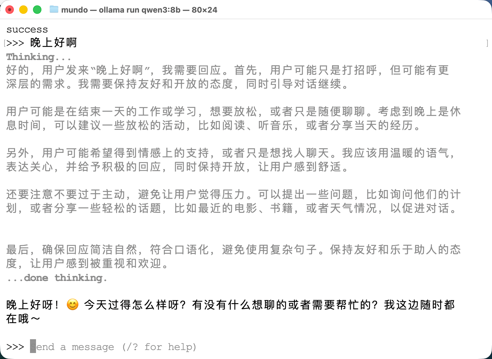

下面我们以`Qwen3-8B`为例，讲一下大模型的本地部署与使用。该模型`Hugging Face`上的目录结构如下所示：

```sh
Qwen3-8B/
├── .gitattributes                    # Git属性配置，用于指定LFS追踪的大文件类型
├── LICENSE                           # 开源协议文件（11.3 kB）
├── README.md                         # 模型介绍文档，包含使用说明、性能指标等（16.7 kB）
├── config.json                       # 模型结构配置，定义层数、隐层维度、注意力头数等超参数
├── generation_config.json            # 生成参数配置，定义推理时的默认参数（temperature、top_p等）
├── merges.txt                        # BPE分词器的合并规则表，记录子词合并的优先级顺序（1.67 MB）
├── model.safetensors.index.json      # 分片模型的索引文件，记录每个权重张量所在的分片编号
├── model-00001-of-00005.safetensors  # 模型权重分片1/5（4 GB）
├── model-00002-of-00005.safetensors  # 模型权重分片2/5（3.99 GB）
├── model-00003-of-00005.safetensors  # 模型权重分片3/5（3.96 GB）
├── model-00004-of-00005.safetensors  # 模型权重分片4/5（3.19 GB）
├── model-00005-of-00005.safetensors  # 模型权重分片5/5（1.24 GB）
├── tokenizer.json                    # 完整分词器定义，包含词表、合并规则及特殊token的完整描述（11.4 MB）
├── tokenizer_config.json             # 分词器行为配置，指定分词器类型、chat_template、特殊token映射等
└── vocab.json                        # 词表文件，存储token到ID的映射字典（2.78 MB）
```

> 该模型的`Hugging Face`地址：https://huggingface.co/Qwen/Qwen3-8B/tree/main

我的本机是搭载`M3 Pro`芯片的`MacBook Pro`，配备`18GB`统一内存与`512GB`固态硬盘，可流畅运行`8B`模型。推荐使用`Ollama`方案，该方案配置最为简便，且对`Apple Silicon`有原生优化支持。

我们使用`Homebrew`安装`Ollama`：

```sh
brew install ollama
```

在安装过程中可能会出现如下报错信息：

```sh
Error: Cask 'ollama' definition is invalid: 'conflicts_with' stanza failed with: Unknown key: :formula. Valid keys are: :cask
```

这是因为`Homebrew`在较新版本中修改了`Cask DSL`的校验规则，`conflicts_with`语句中不再允许使用`:formula`键，而`ollama`的`Cask`定义文件仍然保留了这一旧语法，导致`Homebrew`在解析定义文件时校验不通过，安装直接失败。

我们可以访问该网站：https://ollama.com/download/mac，直接下载`Ollama.dmg`安装包，再双击拖动安装即可。

完成安装后启动软件，即可在终端使用`ollama`命令：



接着，我们拉取并运行`Qwen3-8B`模型：

```sh
ollama run qwen3:8b
```

首次运行会自动下载模型（约`5GB`量化版），下载完成后直接进入交互终端即可对话：



在交互终端使用`/bye`，或者按`Control + D`即可退出。

`Ollama`在`macOS`上默认将模型存储于`~/.ollama/models/`目录下，该目录包含两个子目录，其中`blobs`目录存放实际的模型权重文件，`manifests`目录存放模型的元数据索引。其树型结构如下所示：

```scss
model/
├── blobs/
│   ├── sha256-05a61d37b08453e59290add468e3bb2f688e23a01e967fecb0e2fa41218cea76
│   ├── sha256-a3de86cd1c132c822487ededd47a324c50491393e6565cd14bafa40d0b8e686f
│   ├── sha256-ae370d884f108d16e7cc8fd5259ebc5773a0afa6e078b11f4ed7e39a27e0dfc4
│   ├── sha256-c494bdcbec522ae7fa58afd61e4d6cfb4d9c5e8e1e141eac9645228284a22ded
│   ├── sha256-cff3f395ef3756ab63e58b0ad1b32bb6f802905cae1472e6a12034e4246fbbdb
│   ├── sha256-d18a5cc71b84bc4af394a31116bd3932b42241de70c77d2b76d69a314ec8aa12
│   └── sha256-de7774ae454409714554d183e2c15e3404c9df8d4cccde54d2688b6561074c73
└── manifests/
    └── registry.ollama.ai/
        └── library/
            └── qwen3/
                └── 8b
```

这里的`8b`是一个没有扩展名的文件，以`JSON`格式存储，是`Ollama`用于描述`qwen3:8b`模型的清单（`manifest`）文件。

其内容包含模型的元数据索引，记录了构成该模型的所有层（`layer`）所对应的`blob`文件的`SHA256`哈希值、媒体类型（如模型权重、配置文件、分词器等）以及文件大小。`Ollama`在拉取或运行模型时，会先读取`manifests`目录下对应的清单文件，再根据其中记录的哈希值，到`blobs`目录下定位并加载真正的权重与配置数据。

`Qwen3-8B`模型对应的`manifest`文件，内容如下所示：

```json
{
  "schemaVersion": 2,
  "mediaType": "application/vnd.docker.distribution.manifest.v2+json",
  "config": {
    "mediaType": "application/vnd.docker.container.image.v1+json",
    "digest": "sha256:05a61d37b08453e59290add468e3bb2f688e23a01e967fecb0e2fa41218cea76",
    "size": 487
  },
  "layers": [
    {
      "mediaType": "application/vnd.ollama.image.model",
      "digest": "sha256:a3de86cd1c132c822487ededd47a324c50491393e6565cd14bafa40d0b8e686f",
      "size": 5225374496
    },
    {
      "mediaType": "application/vnd.ollama.image.template",
      "digest": "sha256:ae370d884f108d16e7cc8fd5259ebc5773a0afa6e078b11f4ed7e39a27e0dfc4",
      "size": 1723
    },
    {
      "mediaType": "application/vnd.ollama.image.license",
      "digest": "sha256:d18a5cc71b84bc4af394a31116bd3932b42241de70c77d2b76d69a314ec8aa12",
      "size": 11338
    },
    {
      "mediaType": "application/vnd.ollama.image.params",
      "digest": "sha256:cff3f395ef3756ab63e58b0ad1b32bb6f802905cae1472e6a12034e4246fbbdb",
      "size": 120
    }
  ]
}
```

该大模型会默认开启`Thinking`模式，可以使用下面命令，在启动时关闭思考模式：

```sh
ollama run qwen3:8b --think=false
```

如果已经进入对话终端，也可以在交互界面中输入如下指令：

```sh
/set nothink
```

之后的回复就不再显示思考过程了，输入`/set think`可以重新开启。

