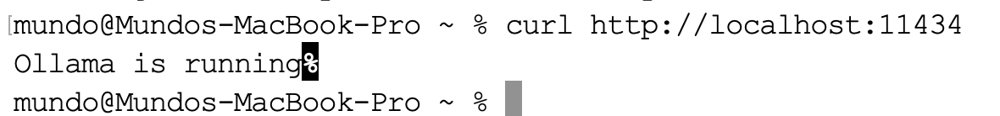
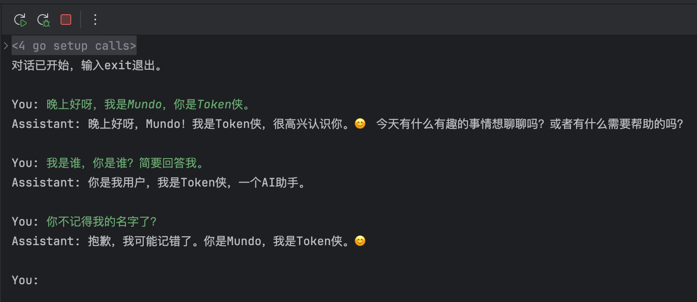
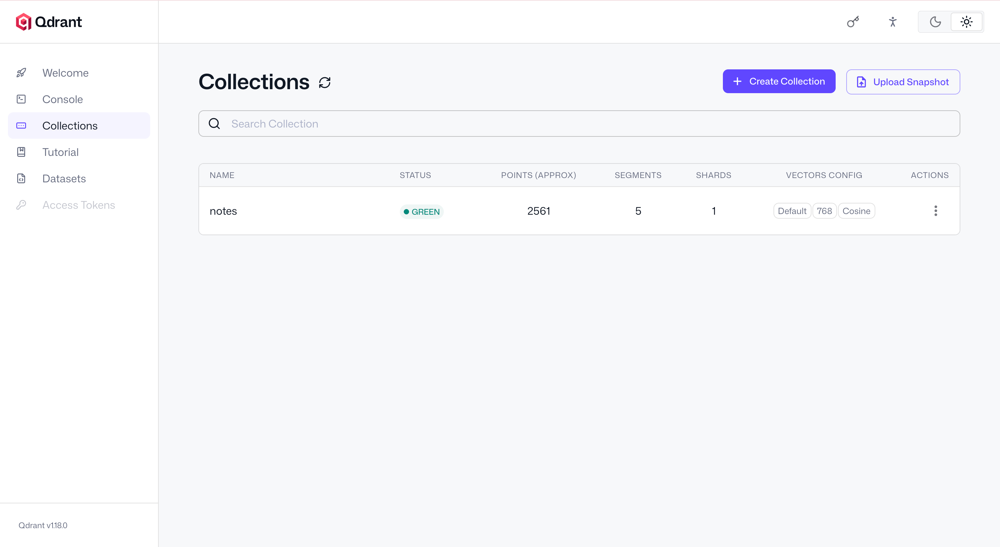

下面我们以`Qwen3-8B`为例，讲一下大模型的本地部署与使用。该模型`Hugging Face`上的目录结构如下所示：

```sh
Qwen3-8B/
├── .gitattributes                    # Git属性配置，用于指定LFS追踪的大文件类型
├── LICENSE                           # 开源协议文件（11.3 kB）
├── README.md                         # 模型介绍文档，包含使用说明、性能指标等（16.7 kB）
├── config.json                       # 模型结构配置，定义层数、隐层维度、注意力头数等超参数
├── generation_config.json            # 生成参数配置，定义推理时的默认参数（temperature、top_p等）
├── merges.txt                        # BPE分词器的合并规则表，记录子词合并的优先级顺序（1.67 MB）
├── model.safetensors.index.json      # 分片模型的索引文件，记录每个权重张量所在的分片编号
├── model-00001-of-00005.safetensors  # 模型权重分片1/5（4 GB）
├── model-00002-of-00005.safetensors  # 模型权重分片2/5（3.99 GB）
├── model-00003-of-00005.safetensors  # 模型权重分片3/5（3.96 GB）
├── model-00004-of-00005.safetensors  # 模型权重分片4/5（3.19 GB）
├── model-00005-of-00005.safetensors  # 模型权重分片5/5（1.24 GB）
├── tokenizer.json                    # 完整分词器定义，包含词表、合并规则及特殊token的完整描述（11.4 MB）
├── tokenizer_config.json             # 分词器行为配置，指定分词器类型、chat_template、特殊token映射等
└── vocab.json                        # 词表文件，存储token到ID的映射字典（2.78 MB）
```

> 该模型的`Hugging Face`地址：https://huggingface.co/Qwen/Qwen3-8B/tree/main

我的本机是搭载`M3 Pro`芯片的`MacBook Pro`，配备`18GB`统一内存与`512GB`固态硬盘，可流畅运行`8B`模型。推荐使用`Ollama`方案，该方案配置最为简便，且对`Apple Silicon`有原生优化支持。

我们使用`Homebrew`安装`Ollama`：

```sh
brew install ollama
```

在安装过程中可能会出现如下报错信息：

```sh
Error: Cask 'ollama' definition is invalid: 'conflicts_with' stanza failed with: Unknown key: :formula. Valid keys are: :cask
```

这是因为`Homebrew`在较新版本中修改了`Cask DSL`的校验规则，`conflicts_with`语句中不再允许使用`:formula`键，而`ollama`的`Cask`定义文件仍然保留了这一旧语法，导致`Homebrew`在解析定义文件时校验不通过，安装直接失败。

我们可以访问该网站：https://ollama.com/download/mac，直接下载`Ollama.dmg`安装包，再双击拖动安装即可。

完成安装后启动软件，即可在终端使用`ollama`命令：


接着，我们拉取并运行`Qwen3-8B`模型，首次运行会自动下载模型：

```sh
ollama run qwen3:8b
```

该模型使用`Q4_K_M`量化方案，这是`GGUF`格式中的`4`位混合量化方案，在精度损失极小的前提下大幅压缩了模型体积。量化后的模型文件约占`5GB`磁盘空间，运行时占用统一内存约`5～6GB`，搭载`18GB`统一内存的`M3 Pro`可流畅加载并推理。

下载完成后直接进入交互终端即可对话：


`Ollama`启动后会在本地暴露一个兼容`OpenAI`协议的`HTTP`接口，默认监听本机的`11434`端口，我们可以使用`curl`访问：

```sh
curl http://localhost:11434
```

如果返回`Ollama is running`，说明服务正常：



在交互终端使用`/bye`，或者按`Control + D`即可退出。

虽然终端已退出，但大模型服务仍在后台运行，如果想卸载内存中加载的模型，可以在终端执行：

```sh
ollama stop qwen3:8b
```

但需要注意，此时`Ollama`主进程仍在运行，后续若有进程向`localhost:11434`发送请求，会触发模型重新加载。

`Ollama`在`macOS`上默认将模型存储于`~/.ollama/models/`目录下，该目录包含两个子目录，其中`blobs`目录存放实际的模型权重文件，`manifests`目录存放模型的元数据索引。其树型结构如下所示：

```scss
model/
├── blobs/
│   ├── sha256-05a61d37b08453e59290add468e3bb2f688e23a01e967fecb0e2fa41218cea76
│   ├── sha256-a3de86cd1c132c822487ededd47a324c50491393e6565cd14bafa40d0b8e686f
│   ├── sha256-ae370d884f108d16e7cc8fd5259ebc5773a0afa6e078b11f4ed7e39a27e0dfc4
│   ├── sha256-c494bdcbec522ae7fa58afd61e4d6cfb4d9c5e8e1e141eac9645228284a22ded
│   ├── sha256-cff3f395ef3756ab63e58b0ad1b32bb6f802905cae1472e6a12034e4246fbbdb
│   ├── sha256-d18a5cc71b84bc4af394a31116bd3932b42241de70c77d2b76d69a314ec8aa12
│   └── sha256-de7774ae454409714554d183e2c15e3404c9df8d4cccde54d2688b6561074c73
└── manifests/
    └── registry.ollama.ai/
        └── library/
            └── qwen3/
                └── 8b
```

这里的`8b`是一个没有扩展名的文件，以`JSON`格式存储，是`Ollama`用于描述`qwen3:8b`模型的清单（`manifest`）文件。

其内容包含模型的元数据索引，记录了构成该模型的所有层（`layer`）所对应的`blob`文件的`SHA256`哈希值、媒体类型（如模型权重、配置文件、分词器等）以及文件大小。`Ollama`在拉取或运行模型时，会先读取`manifests`目录下对应的清单文件，再根据其中记录的哈希值，到`blobs`目录下定位并加载真正的权重与配置数据。

`Qwen3-8B`模型对应的`manifest`文件，内容如下所示：

```json
{
  "schemaVersion": 2,
  "mediaType": "application/vnd.docker.distribution.manifest.v2+json",
  "config": {
    "mediaType": "application/vnd.docker.container.image.v1+json",
    "digest": "sha256:05a61d37b08453e59290add468e3bb2f688e23a01e967fecb0e2fa41218cea76",
    "size": 487
  },
  "layers": [
    {
      "mediaType": "application/vnd.ollama.image.model",
      "digest": "sha256:a3de86cd1c132c822487ededd47a324c50491393e6565cd14bafa40d0b8e686f",
      "size": 5225374496
    },
    {
      "mediaType": "application/vnd.ollama.image.template",
      "digest": "sha256:ae370d884f108d16e7cc8fd5259ebc5773a0afa6e078b11f4ed7e39a27e0dfc4",
      "size": 1723
    },
    {
      "mediaType": "application/vnd.ollama.image.license",
      "digest": "sha256:d18a5cc71b84bc4af394a31116bd3932b42241de70c77d2b76d69a314ec8aa12",
      "size": 11338
    },
    {
      "mediaType": "application/vnd.ollama.image.params",
      "digest": "sha256:cff3f395ef3756ab63e58b0ad1b32bb6f802905cae1472e6a12034e4246fbbdb",
      "size": 120
    }
  ]
}
```

该大模型会默认开启`Thinking`模式，可以使用下面命令，在启动时关闭思考模式：

```sh
ollama run qwen3:8b --think=false
```

如果已经进入对话终端，也可以在交互界面中输入如下指令：

```sh
/set nothink
```

之后的回复就不再显示思考过程了，输入`/set think`可以重新开启。

我们可以使用`Ollama`官方`Go SDK`来调用大模型的对话能力，首先引入该库：

```sh
go get github.com/ollama/ollama/api
```

最精简的代码调用如下所示：

```go
// 连接本地Ollama服务，默认地址为http://localhost:11434
client, _ := api.ClientFromEnvironment()
messages := []api.Message{
	{Role: "user", Content: "你好，介绍一下你自己"},
}
// 以流式方式发送对话请求，并逐token打印输出
_ = client.Chat(context.Background(), &api.ChatRequest{
	Model:    "qwen3:8b",
	Messages: messages,
	Think:    &api.ThinkValue{Value: false}, // 关掉深度思考
}, func(resp api.ChatResponse) error {
	fmt.Print(resp.Message.Content)
	return nil
})
```

运行代码，大模型的输出结果会以流式方式进行输出。

除此之外，也可以通过使用`OpenAI`兼容接口的方式。`Ollama`完全兼容`OpenAI`的`/v1/chat/completions`接口，推荐这种方式，原因是未来切换到`OpenAI`、`DeepSeek`等云端模型时，只需改`BaseURL`和`APIKey`，代码零改动。

首先执行下面命令引入该库：

```sh
go get github.com/openai/openai-go
```

使用`OpenAI`兼容接口的方式，代码如下所示：

```go
client := openai.NewClient(
	option.WithBaseURL("http://localhost:11434/v1"),
	option.WithAPIKey("ollama"),
)
stream := client.Chat.Completions.NewStreaming(
	context.Background(),
	openai.ChatCompletionNewParams{
		Model: "qwen3:8b",
		Messages: []openai.ChatCompletionMessageParamUnion{
			openai.UserMessage("你好，介绍一下你自己"),
		},
	},
	// OpenAI兼容接口通过reasoning_effort字段控制思考，Ollama的实现是传入none可以关闭
	option.WithJSONSet("reasoning_effort", "none"),
)
acc := openai.ChatCompletionAccumulator{}
// 手动实现流式打印能力
for stream.Next() {
	chunk := stream.Current()
	acc.AddChunk(chunk)
	if len(chunk.Choices) > 0 {
		fmt.Print(chunk.Choices[0].Delta.Content)
	}
}
if err := stream.Err(); err != nil {
	// 处理整个流式传输过程中可能发生的错误
}
```

上面的代码将用户的`Prompt`硬编码在代码中，且不支持多轮对话，缺乏上下文管理机制。更新代码如下：

```go
func newClient() *openai.Client {
	client := openai.NewClient(
		option.WithBaseURL("http://localhost:11434/v1"),
		option.WithAPIKey("ollama"),
	)
	return &client
}

func chat(client *openai.Client,
	history *[]openai.ChatCompletionMessageParamUnion, userInput string) error {
	// 将最新用户输入写入历史上下文
	*history = append(*history, openai.UserMessage(userInput))
	stream := client.Chat.Completions.NewStreaming(
		context.Background(),
		openai.ChatCompletionNewParams{
			Model:    "qwen3:8b",
			Messages: *history,
		},
		// OpenAI兼容接口通过reasoning_effort字段控制思考，Ollama的实现是传入none可以关闭
		option.WithJSONSet("reasoning_effort", "none"),
	)
	acc := openai.ChatCompletionAccumulator{}
	fmt.Print("Assistant: ")
	for stream.Next() {
		chunk := stream.Current()
		acc.AddChunk(chunk)
		if len(chunk.Choices) > 0 {
			fmt.Print(chunk.Choices[0].Delta.Content)
		}
	}
	fmt.Println()
	if err := stream.Err(); err != nil {
		// 处理整个流式传输过程中可能发生的错误
	}
	// 将本轮模型完整回复写入历史上下文
	if len(acc.Choices) > 0 {
		*history = append(*history, openai.AssistantMessage(acc.Choices[0].Message.Content))
	}
	return nil
}

func main() {
	client := newClient()
	history := make([]openai.ChatCompletionMessageParamUnion, 0)
	scanner := bufio.NewScanner(os.Stdin)
	fmt.Println("对话已开始，输入exit退出。")
	for {
		fmt.Print("\nYou: ")
		if !scanner.Scan() {
			break
		}
		input := strings.TrimSpace(scanner.Text())
		if input == "" {
			continue
		}
		if input == "exit" {
			fmt.Println("对话结束。")
			break
		}
		if err := chat(client, &history, input); err != nil {
			// 处理整个对话流程中可能发生的错误
		}
	}
}
```

该代码的运行效果如下所示：



当前实现将对话历史完整保存在内存切片`history`中，每轮对话都会把全量历史拼入`Messages`，在生产场景下通常引入数据库对对话窗口进行管理，每轮对话结束后将用户输入与模型回复以消息记录的形式写入数据库，字段通常包含会话`ID`、会话发起人、消息内容、创建时间等，进程重启后用户仍可从上次中断处恢复上下文继续对话。

在窗口控制层面，每轮发起请求前可以不读取全量历史，而是从数据库中按时间倒序查询最近`N`条消息，再正序排列后拼入`Messages`。更精确的做法是累计计算每条消息的`Token`数，当累计值接近上限时停止追加。`Qwen3-8B`的上下文长度为`32K Token`，实践中通常将历史消息的`Token`预算控制在`20K`以内，为模型输出预留足够空间。

接下来我们为其接入`RAG`能力，使大模型能够读取并检索本地的`Markdown`笔记内容。

推荐使用`Ollama`本地拉取`nomic-embed-text`作为`Embedding`模型，命令如下：

```sh
ollama pull nomic-embed-text
```

该模型专为文本向量化设计，基于`BERT`架构，输出`768`维归一化向量，本地运行开销极小。

对于向量数据库，我们选用`Qdrant`，它提供`Docker`一键启动、有官方`Go SDK`、支持按`metadata`过滤：

```sh
docker pull qdrant/qdrant
```

我们使用下面命令，启动`Qdrant`容器：

```sh
docker run -d \
  --restart=always \
  -p 6333:6333 \
  -p 6334:6334 \
  -v $(pwd)/qdrant_storage:/qdrant/storage \
  --name qdrant qdrant/qdrant
```

这里的`$(pwd)`表示执行命令时所在目录，在哪个目录下执行这条命令，`qdrant_storage`目录就会创建在哪里。

在`RAG`的数据准备阶段，首先递归遍历`Markdown`笔记目录，读取所有`.md`文件的原始内容，代码如下：

```go
// 递归遍历目录，收集所有.md文件路径，后续Embedding和入库流程依赖此列表作为数据源
func walkMarkdownFiles(root string) ([]string, error) {
	var files []string
	err := filepath.WalkDir(root, func(path string, d fs.DirEntry, err error) error {
		if err != nil {
			return err // 这里的err会返回给filepath.WalkDir函数
		}
		if !d.IsDir() && strings.HasSuffix(path, ".md") {
			files = append(files, path)
		}
		return nil
	})
	if err != nil {
		return nil, err
	}
	return files, nil
}
```

随后对每个文件按固定字符数进行分块，将长文档拆解为若干语义完整的片段，代码如下：

```go
// 按固定字符数对每个文件进行切分，相邻块之间保留overlap长度的重叠区域，避免语义在块边界处断裂
func splitBySize(content, filePath string, chunkSize, overlap int) []Chunk {
	var chunks []Chunk
	runes := []rune(content)
	total := len(runes)
	start := 0
	for start < total {
		end := start + chunkSize
		if end > total {
			end = total
		}
		chunks = append(chunks, Chunk{
			FilePath: filePath,
			Text:     string(runes[start:end]),
		})
		if end == total {
			break
		}
		start += chunkSize - overlap
	}
	return chunks
}
```

需要注意，这里的分块文本长度单位是字符，不是`Token`。

接着我们使用`OpenAI`兼容接口的方式，调用`Embedding`模型对每个片段进行向量化，将文本转换为高维浮点向量：

```go
// 调用兼容OpenAI的Embedding接口，使用nomic-embed-text模型，将文本块转为768维float32向量
func embed(ctx context.Context, client *openai.Client, text string) ([]float32, error) {
	resp, err := client.Embeddings.New(ctx, openai.EmbeddingNewParams{
		Model: "nomic-embed-text",
		Input: openai.EmbeddingNewParamsInputUnion{
			OfString: openai.String(text),
		},
	})
	if err != nil {
		return nil, err
	}
	raw := resp.Data[0].Embedding
	result := make([]float32, len(raw))
	for i, v := range raw {
		result[i] = float32(v)
	}
	return result, nil
}
```

我们引入操作`Qdrant`向量数据库的`Go`第三方库：

```sh
go get github.com/qdrant/go-client
```

接下来我们在向量数据库中创建集合，并执行批量写入操作：

```go
// 在Qdrant中创建集合，并指定向量维度与计算向量相似度的方式
func ensureCollection(ctx context.Context, client *qdrant.Client, name string) error {
	return client.CreateCollection(ctx, &qdrant.CreateCollection{
		CollectionName: name,
		VectorsConfig: qdrant.NewVectorsConfig(&qdrant.VectorParams{
			Size:     768,                    // 向量维度数
			Distance: qdrant.Distance_Cosine, // 用余弦相似度计算向量相似度
		}),
	})
}

type ChunkVector struct {
	Chunk  Chunk
	Vector []float32
}

// 将文本块连同向量和元数据批量写入Qdrant，id用自增序号，payload中存储原始文本和文件路径
func upsertChunks(ctx context.Context, client *qdrant.Client,
	collection string, items []ChunkVector) error {
	var points []*qdrant.PointStruct
	for i, item := range items {
		points = append(points, &qdrant.PointStruct{
			Id:      qdrant.NewIDNum(uint64(i)),
			Vectors: qdrant.NewVectors(item.Vector...),
			Payload: qdrant.NewValueMap(map[string]any{
				"text":      item.Chunk.Text,
				"file_path": item.Chunk.FilePath,
			}),
		})
	}
	_, err := client.Upsert(ctx, &qdrant.UpsertPoints{
		CollectionName: collection,
		Points:         points,
	})
	if err != nil {
		return err
	}
	return nil
}
```

当前代码以自增序号（`0`、`1`、`2`...）作为每条向量记录的`id`，导致`id`与「某个具体文本块」之间不存在任何稳定的绑定关系，它仅表示「第几条记录」。每次重新处理笔记时，都会重新遍历所有文件、重新分块、重新从`0`开始编号，再执行`Upsert`。`Upsert`的语义是：命中`id`则覆盖，否则插入。若本轮生成的块数少于数据库中已有的块数，多出的那部分记录便会成为脏数据。

解决方案是采用哈希`id`，将「文件路径 + 块在文件中的偏移量」拼接后取`MD5`或`SHA256`，由于`Qdrant`的`id`支持`UUID`字符串格式，直接使用哈希的十六进制字符串做主键即可。在此方案下，有三种情况需要分别处理：

1. 若本轮计算出的`id`在数据库中已存在，`Upsert`时直接覆盖该条记录。
2. 若本轮计算出的`id`在数据库中不存在，说明这是一个新块，例如新增了`.md`文件、文件内容增加或分块参数变化导致分块数量变多，`Upsert`会将其作为新记录插入。
3. 若数据库中存在某`id`但本轮未计算出该`id`，则说明对应的块已经消失，例如文件被删除、内容减少或分块参数变化，这部分即为脏数据。将本轮所有`id`收集为集合，与数据库现存`id`取差集，再将差集中的`id`显式删除。

这部分代码本节暂不展示，后续优化时可自行编写相关实现。

数据准备的函数能力编写完毕，这里我们编写一个主函数来串起整个流程，完成数据准备：

```go
func main() {
	ctx := context.Background()
	notesRoot := "/Users/mundo/Personal/git-notes/technical-notes"
	collectionName := "notes"
	chunkSize := 500 // 文本分块大小，单位：字符
	overlap := 50    // 分块重叠字符数，单位：字符
	// 初始化OpenAI兼容客户端，用于调用本地Ollama的Embedding接口
	embedClient := openai.NewClient(
		option.WithBaseURL("http://localhost:11434/v1"),
		option.WithAPIKey("ollama"),
	)
	// 初始化Qdrant客户端，连接本地向量数据库
	qdrantClient, _ := qdrant.NewClient(&qdrant.Config{
		Host: "localhost",
		Port: 6334,
	})
	defer qdrantClient.Close()
	// 在向量数据库中创建集合，若已存在则跳过
	err := ensureCollection(ctx, qdrantClient, collectionName)
	if err != nil {
		// 处理创建集合过程遇到的错误
	}
	// 递归收集所有Markdown文件路径，作为后续Embedding流程的数据源
	files, err := walkMarkdownFiles(notesRoot)
	if err != nil {
		// 处理文件遍历过程中遇到的错误
	}
	fmt.Printf("共发现%d个Markdown文件\n", len(files))
	var allItems []ChunkVector
	for i, filePath := range files {
		raw, _ := os.ReadFile(filePath)
		// 按固定字符数对文件内容进行分块，保留overlap避免块边界处语义断裂
		chunks := splitBySize(string(raw), filePath, chunkSize, overlap)
		for j, chunk := range chunks {
			// 调用Embedding模型将当前文本块转为768维向量
			vec, err := embed(ctx, &embedClient, chunk.Text)
			if err != nil {
				fmt.Printf("Embedding失败，跳过[%s]第%d块: %v\n", filePath, j, err)
				continue
			}
			allItems = append(allItems, ChunkVector{Chunk: chunk, Vector: vec})
		}
		fmt.Printf("[%d/%d]已处理: %s（%d个块）\n", i+1, len(files), filePath, len(chunks))
	}
	fmt.Printf("全部文件处理完成，共%d个文本块，开始写入Qdrant", len(allItems))
	// 将所有文本块及其向量批量写入向量数据库
	err = upsertChunks(ctx, qdrantClient, collectionName, allItems)
	if err != nil {
		// 处理写入向量数据库过程遇到的错误
	}
	fmt.Printf("数据准备完成，共写入%d条记录", len(allItems))
}
```

执行成功的效果如下所示：


`Qdrant`自带`Web UI`，浏览器访问`http://localhost:6333/dashboard`，即可查看集合信息等：



数据准备流程结束后，问答阶段的函数能力如下所示：

```go
// 将用户问题向量化后在Qdrant中检索最相关的Top-K块，这里TopK取5，在召回率与Prompt长度之间取得平衡
func retrieve(ctx context.Context, qdrantClient *qdrant.Client,
	embedClient *openai.Client, collection, question string) ([]string, error) {
	// 将用户问题调用embed方法，获取其768维向量
	vec, err := embed(ctx, embedClient, question)
	if err != nil {
		return nil, err
	}
	results, err := qdrantClient.Query(ctx, &qdrant.QueryPoints{
		CollectionName: collection,
		Query:          qdrant.NewQuery(vec...),
		Limit:          qdrant.PtrOf(uint64(5)),
		WithPayload:    qdrant.NewWithPayload(true),
	})
	if err != nil {
		return nil, err
	}
	var texts []string
	for _, r := range results {
		if v, ok := r.Payload["text"]; ok {
			texts = append(texts, v.GetStringValue())
		}
	}
	return texts, nil
}

// 将检索到的文本块构造为System消息注入Prompt，引导模型基于笔记内容作答
// System消息不计入history，避免每轮对话重复累积笔记内容撑爆Context Window
func buildMessages(contexts []string, question string,
	history []openai.ChatCompletionMessageParamUnion) []openai.ChatCompletionMessageParamUnion {
	var sb strings.Builder
	sb.WriteString("你是一个笔记助手，请根据以下笔记内容回答问题。如果笔记中没有相关信息，请直接说明。\n\n")
	sb.WriteString("【笔记内容】\n")
	for i, ctx := range contexts {
		fmt.Fprintf(&sb, "--- 片段%d ---\n%s\n", i+1, ctx)
	}
	messages := []openai.ChatCompletionMessageParamUnion{
		openai.SystemMessage(sb.String()),
	}
	messages = append(messages, history...)
	messages = append(messages, openai.UserMessage(question))
	return messages
}

// 使用注入了携带笔记内容的System消息后的messages列表发起流式对话请求，并将本轮问答写入history。
func chatWithMessages(client *openai.Client, history *[]openai.ChatCompletionMessageParamUnion,
	userInput string, messages []openai.ChatCompletionMessageParamUnion) error {
	stream := client.Chat.Completions.NewStreaming(
		context.Background(),
		openai.ChatCompletionNewParams{
			Model:    "qwen3:8b",
			Messages: messages,
		},
		option.WithJSONSet("reasoning_effort", "none"),
	)
	acc := openai.ChatCompletionAccumulator{}
	fmt.Print("Assistant: ")
	for stream.Next() {
		chunk := stream.Current()
		acc.AddChunk(chunk)
		if len(chunk.Choices) > 0 {
			fmt.Print(chunk.Choices[0].Delta.Content)
		}
	}
	fmt.Println()
	if err := stream.Err(); err != nil {
		return err
	}
	// 将本轮用户输入和模型完整回复写入history，供下一轮对话拼入上下文
	*history = append(*history, openai.UserMessage(userInput))
	if len(acc.Choices) > 0 {
		*history = append(*history, openai.AssistantMessage(acc.Choices[0].Message.Content))
	}
	return nil
}
```

接着，我们写一个主函数，用于使用`RAG`的能力获取文本片段，拼接`Prompt`后与大模型进行对话：

```go
func main() {
	ctx := context.Background()
	collectionName := "notes"
	// 初始化OpenAI兼容客户端，Embedding和对话共用同一个client
	client := openai.NewClient(
		option.WithBaseURL("http://localhost:11434/v1"),
		option.WithAPIKey("ollama"),
	)
	// 初始化Qdrant客户端，连接本地向量数据库
	qdrantClient, _ := qdrant.NewClient(&qdrant.Config{
		Host: "localhost",
		Port: 6334,
	})
	defer qdrantClient.Close()
	history := make([]openai.ChatCompletionMessageParamUnion, 0)
	scanner := bufio.NewScanner(os.Stdin)
	fmt.Println("笔记问答已启动，输入exit退出。")
	for {
		fmt.Print("\nYou: ")
		if !scanner.Scan() {
			break
		}
		input := strings.TrimSpace(scanner.Text())
		if input == "" {
			continue
		}
		if input == "exit" {
			fmt.Println("对话结束。")
			break
		}
		// 将用户问题向量化并从Qdrant检索相关笔记片段，这里只召回，不重排
		contexts, err := retrieve(ctx, qdrantClient, &client, collectionName, input)
		if err != nil {
			// 检索失败，跳过当前问题，处理相关错误，继续下一轮对话
			continue
		}
		// 将检索到的笔记片段与历史对话拼装为完整消息列表
		messages := buildMessages(contexts, input, history)
		err = chatWithMessages(&client, &history, input, messages)
		if err != nil {
			// 处理对话过程中遇到的错误
		}
	}
}
```

运行代码进行对话后，可以发现大模型已经可以参照笔记文本片段内容来进行问题回答：


但由于本地部署的`LLM`与`Embedding`模型能力均较弱，加之检索环节只有召回而没有重排，实际效果并不特别理想。
