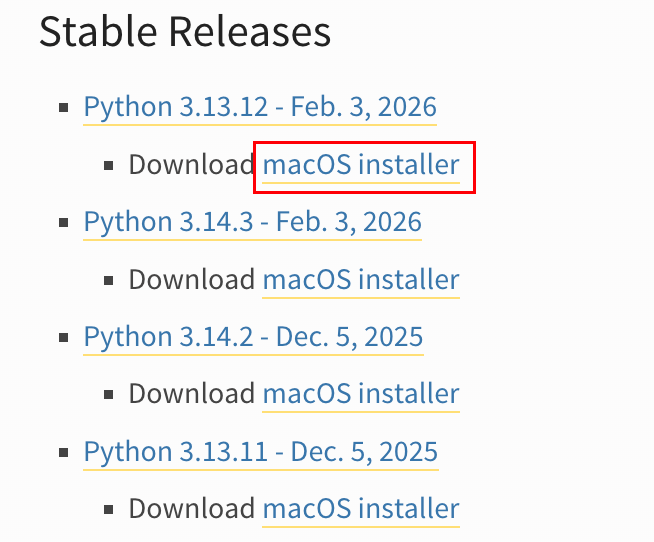

`Mac`支持使用`Homebrew`安装`Python3`与`pip3`环境：

```
brew install python
```

使用下面命令，验证是否安装成功：

```sh
python3 --version
pip3 --version
```

可以在`.zprofile`或`.zshrc`中添加下面两行内容，设置别名：

```sh
alias python='python3'
alias pip='pip3'
```

这样设置后，系统会把输入的`python`和`pip`命令，自动替换成`python3`和`pip3`执行，避免误用到`Python2`环境。

设置后，就可以直接使用下面命令查看`python`与`pip`的版本信息：

```sh
python --version
pip --version
```

如果想下载指定版本的`Python`环境，登录该网址：https://www.python.org/downloads/macos/。

在该网址中，可以选择合适的`Python`版本，点击`macOS installer`：



这样浏览器会自动下载对应的`.pkg`安装包。下载完成后，双击该安装包，即可进入图形化安装界面并完成安装。

可以通过以下命令查看`python3`与`pip3`这两个可执行文件的安装位置：

```sh
mundo@Mundos-MacBook-Pro ~ % which python3
/Library/Frameworks/Python.framework/Versions/3.13/bin/python3
mundo@Mundos-MacBook-Pro ~ % which pip3  
/Library/Frameworks/Python.framework/Versions/3.13/bin/pip3
```

