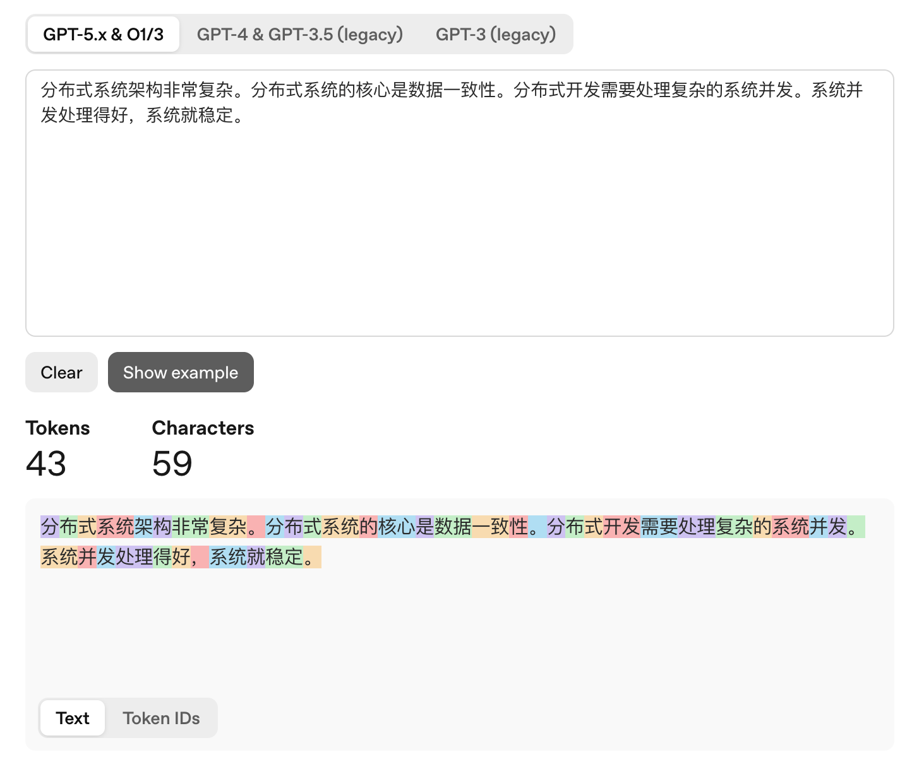
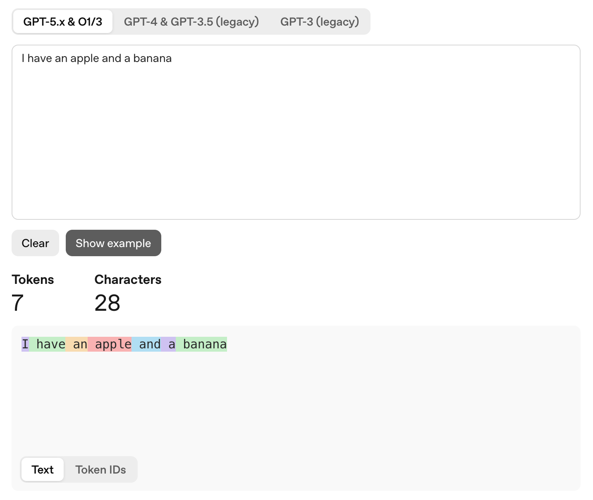

在`LLM`领域中，`Token`是模型能够理解和处理的最小文本单元。人类可以直接理解自然语言，而大模型本身并不具备这种能力，因此需要一个翻译官将自然语言转换为模型可处理的表示，这个翻译官称为`Tokenizer`，学名为分词器。

首先，`Tokenizer`需要构建词表，并为其中的每一个`Token`分配唯一的整数标识，即`TokenID`。该映射关系通常会被保存为一个配置文件，通常为`.json`或`.txt`文件。一旦训练开始，这一对应关系便保持不变。

这一过程称为预训练分词，由分词器`Tokenizer`内部的训练器`Trainer`模块负责完成。预训练语料（`Pre-training Corpus`）的来源极为广泛，本质上涵盖了人类在互联网上留下的几乎所有公开文本数据，包括通用网页抓取、代码数据、书籍与学术文献、社交媒体与对话，以及各类垂直领域和多语言数据等。

在数据进入`Tokenizer`之前，必须经过严格的数据清洗流程，包括去重（`De-duplication`），用于剔除大量重复内容，避免模型对重复数据过拟合而产生「复读」现象；过滤（`Filtering`），用于移除低质量内容（如垃圾广告、乱码）以及有害内容（如色情、暴力、极端偏见）；以及语言识别，用于确保输入数据符合预期语种。

对于中文而言，每个字都可以作为一个`Token`。但如果仅采用这种方式，一句话对应的`Token`数量会非常多，也就是转换为`TokenID`数组后长度过长。因此，`Tokenizer`通常会将高频共现的字组合在一起，生成新的`Token`，分配新的`TokenID`。

例如存在这样一段预训练语料：

```sh
分布式系统架构非常复杂。分布式系统的核心是数据一致性。分布式开发需要处理复杂的系统并发。系统并发处理得好，系统就稳定。
```

首先，语料中的每个字都会被映射为对应的`TokenID`进行记录，随后算法通过统计分析高频共现关系，发现「分、布、式」、「系、统」、「并、发」等字组合经常一起出现，因此会将这些连续且高频的字进行合并，形成更长的`Token`。

例如将`[分]`、`[布]`、`[式]`合并为`[分布式]`，将`[系]`、`[统]`合并为`[系统]`，以及将`[并]`、`[发]`合并为`[并发]`，从而在保证语义表达能力的同时，有效减少`Token`数量并提升编码效率。此时文本分词后的结果为：

```sh
[分布式] [系统] [架构] [非常] [复杂] [。] [分布式] [系统] [的] [核心] [是] [数据] [一致] [性] [。] [分布式] [开发] [需要] [处理] [复杂] [的] [系统] [并发] [。] [系统] [并发] [处理] [得] [好] [，] [系统] [就] [稳定] [。]
```

接下来可以进行更高阶的压缩，即在词组层面继续合并。当基础词已经足够稳定时，算法会尝试将它们连接起来，形成更长的专业`Token`。例如，将`[分布式]`与`[系统]`组合为`[分布式系统]`，将`[系统]`与`[并发]`组合为`[系统并发]`：

```sh
[分布式系统] [架构] [非常] [复杂] [。] [分布式系统] [的] [核心] [是] [数据] [一致] [性] [。] [分布式] [开发] [需要] [处理] [复杂] [的] [系统并发] [。] [系统并发] [处理] [得] [好] [，] [系统] [就] [稳定] [。]
```

这样一来，`Tokenizer`将原本每个字符都单独作为一个`Token`时所需的`59`个`Token`，压缩到了`30`个。需要说明的是，这里仅用于演示`Token`分词的基本原理；在实际应用中，由于语料规模极大，只有极高频的词才会被合并为一个`Token`。因此，上述这段话在真实环境中的`Token`数量通常不会低至`30`个，可以通过相关网站查看其实际的`Token`统计结果：



> `OpenAI`官方提供的文本转`Token`工具地址：https://platform.openai.com/tokenizer。

一个`Token`并不一定对应至少一个汉字。在实际分词过程中，如果遇到生僻字或不常用字，这些字符可能会被拆分为多个`Token`，通常为`2`到`3`个不等。这是因为分词算法更倾向于基于已有的高频子结构进行编码，而不是为低频字符单独分配完整的`Token`。

对于英文分词，通常只有高频词汇才会被划分为一个完整的`Token`，其余词汇一般会被拆分为子词。像`the`、`apple`、`run`这类在语料库中出现频率极高的词，算法会为其分配独立的`TokenID`，使其在模型中作为不可再分的语义单元存在。对于低频词或较长的词，模型则会将其拆解为更小的片段（类似词根、前缀、后缀）。例如`misunderstanding`会被拆分为`mis` + `under` + `standing`。

需要注意的是，在大多数现代大语言模型使用的分词技术中，空格通常会被视为紧随其后的单词的一部分。例如：



如果将空格单独作为一个`Token`处理，会显著增加文本的`Token`数量（在极端情况下甚至接近翻倍），从而占用更多的上下文窗口并提升计算成本。将空格附着在单词开头的做法，可以在减少`Token`数量的同时，更贴近人类语言的自然书写结构。

一般来说，`1000`个`Token`大致对应`3800-4200`个英文字符，或约`750`个英文单词；对于中文，则大约相当于`1600–1800`个汉字。

如果将所有词语或短句都直接作为一个独立的`Token`，词表规模会迅速膨胀；同时，一旦模型遇到未收录的新词，就难以进行有效处理。此外，这种方式也会削弱模型对拼写错误的鲁棒性，使其难以识别和纠正用户输入中的错误。

不同大模型的分词器与词表设计各自独立，没有统一的通用`TokenID`编码，同一句话在不同模型中对应的`TokenID`序列完全不同。

当前发展趋势正向多模态（`Multimodal`）扩展，`Token`的概念也在持续外延。

在多模态建模中，除文本外的其他数据类型（如图像、音频）同样会被转化为统一的离散表示形式，即由一系列`TokenID`构成的序列。本质上，这是将连续或结构化信号映射到离散符号空间，使其能够被基于`Transformer`架构的模型统一处理。

对于图像模态，以`Vision Transformer`为代表的方法，通常先将输入图像划分为固定大小的`patch`（如`16×16`像素块），再将每个`patch`展平并映射到向量空间，随后通过线性投影生成「图像`Token`」，最终对应为离散的`TokenID`或等价的嵌入索引。

在音频模态中，常见流程是将原始波形转换为时频表示（如梅尔频谱图），再沿时间轴划分为多个时间帧，每一帧作为基本单元。这些时间帧会被编码为「音频`Token`」，并通过量化或映射转化为对应的离散`TokenID`序列。

从大语言模型或更广义的序列模型视角来看，不同模态数据在进入模型前，通常都会经历「分块 → 向量化 → 离散化（可选）」这一统一流程，最终被表示为一维的`TokenID`序列。模型本身并不直接感知「文本」、「图像」或「音频」的物理语义，而是对这些离散符号序列进行建模，通过学习其上下文依赖关系完成理解与生成任务。
