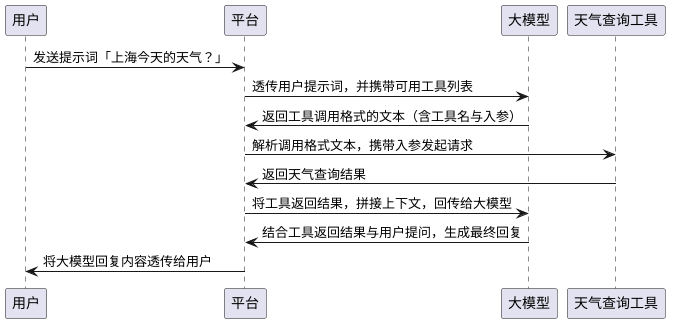

在「`AI`基础概念」这部分，我们讲解了大模型的预训练、微调与推理的全流程，以及`RAG`技术。经过这套流程训练出的大模型已经具备了相当不错的对话能力，但仍然存在一个核心局限——它无法感知外部世界的实时状态。在早期大模型平台中，如果我们询问近期发生的事件或当天的天气，它只会回答：「抱歉，我的知识库截止于`xxxx`年，无法提供当前的天气信息。」

这是因为大模型在训练完成后其参数便已固定，它只能依据训练时学习到的规则预测下一个`Token`，而无法主动访问天气预报网站去获取实时数据。要解决这一问题，就需要引入`Tool`了。`Tool`的中文直译为「工具」，但我更倾向于将其理解为「接口」，我们给它一个输入，它经过一系列处理后，返回给我们一个输出。

整个过程涉及四个角色，分别是用户、大模型、天气查询工具与平台。前三个很好理解，那这个平台究竟是什么呢？实际上，用户与大模型之间的对话，本质上都是通过平台来传递完成的——就像我们日常访问`ChatGPT`、`Claude`时所使用的前后端页面，这便是平台。与此同时，大模型并不具备直接调用天气查询工具的能力，这一调用过程同样需要由平台来负责实现。

在整个流程开始之前，平台会预先在`System Prompt`中向大模型注入可用工具的列表及其描述信息，通常包括工具名称、功能说明与入参格式。大模型正是基于这些描述，在接收到用户提问时，才能判断是否需要调用工具。整体时序图如下所示：



在上面的时序图的决策部分，大模型会结合用户的提问内容与工具列表，自主判断以下两种情况：

1. 当前问题无需借助工具，直接生成自然语言回复，流程就此结束。
2. 当前问题需要借助某个工具，则输出工具调用格式的文本，由平台接管后续的调用流程。

所以工具列表本质上是给大模型的一份「能力菜单」，每次请求都会随上下文一起发送，由大模型按需选用。平台通过检测大模型返回内容是否符合工具调用的`JSON`结构，来判断当前应触发工具调用流程，而非将内容直接回复给用户。该`JSON`结构如下所示：

```json
{
  "tool_name": "get-weather",
  "parameters": {
    "city": "北京",
    "date": "2026-04-18"
  }
}
```

平台解析出具体需要调用的工具名称及入参信息，随后平台在工具注册表中，根据工具名称查找对应的调用地址，以`HTTP`请求的方式向天气查询工具发起调用。工具注册表本质上是平台维护的一份映射表，记录了工具名称、调用地址、认证方式等信息。

请求方式通常为`POST`，`Content-Type`为`application/json`，入参作为请求体携带，如下所示：

```json
POST https://tools.example.com/get-weather
Content-Type: application/json

{
  "city": "北京",
  "date": "2026-04-18"
}
```

工具处理完成后，向平台返回的出参如下所示：

```json
{
  "city": "北京",
  "date": "2026-04-18",
  "condition": "晴",
  "temperature": 22,
  "unit": "°C",
  "humidity": "35%",
  "wind_direction": "西北风",
  "wind_speed": "3级"
}
```

平台收到工具返回的出参后，会将其拼入对话上下文，连同用户最初的提问一并作为新一轮输入发送给大模型。大模型基于这份完整的上下文，将结构化数据转化为自然语言，最终向用户回复：「今天北京天气晴，当前气温`22`摄氏度，湿度`35%`，西北风`3`级」。

上文描述的是单次调用单个工具的流程。实际上，现代主流大模型支持在一次响应中同时输出多个工具调用指令，平台可以并行发起请求，全部完成后再将结果统一拼入上下文。此外，有些复杂任务需要多轮工具调用才能完成，即第一次工具的返回结果决定了是否要发起第二次工具调用。例如：先调用「城市代码查询工具」拿到城市编码，再用编码调用「天气查询工具」。

若工具调用超时或返回错误，平台通常会将错误信息同样拼入上下文，再次发送给大模型，由大模型自行判断后续处理方式：选择重试、降级回答，还是直接告知用户当前无法获取相关信息。

调用工具的时序图，其`PlantUML`代码如下所示：

```scss
@startuml
participant "用户" as User
participant "平台" as Platform
participant "大模型" as LLM
participant "天气查询工具" as Weather

User -> Platform: 发送提示词「上海今天的天气？」
Platform -> LLM: 透传用户提示词，并携带可用工具列表
LLM -> Platform: 返回工具调用格式的文本（含工具名与入参）
Platform -> Weather: 解析调用格式文本，携带入参发起请求
Weather -> Platform: 返回天气查询结果
Platform -> LLM: 将工具返回结果，拼接上下文，回传给大模型
LLM -> Platform: 结合工具返回结果与用户提问，生成最终回复
Platform -> User: 将大模型回复内容透传给用户
@enduml
```

