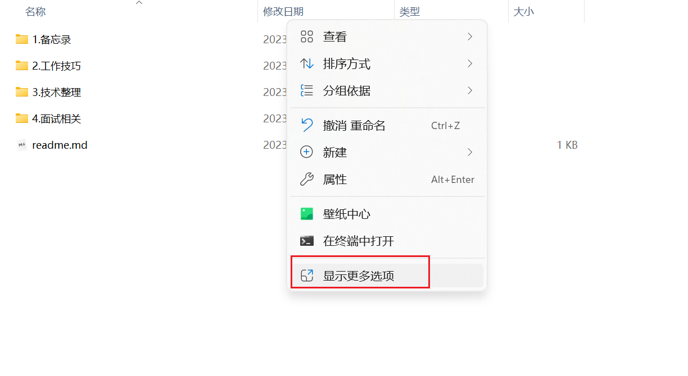
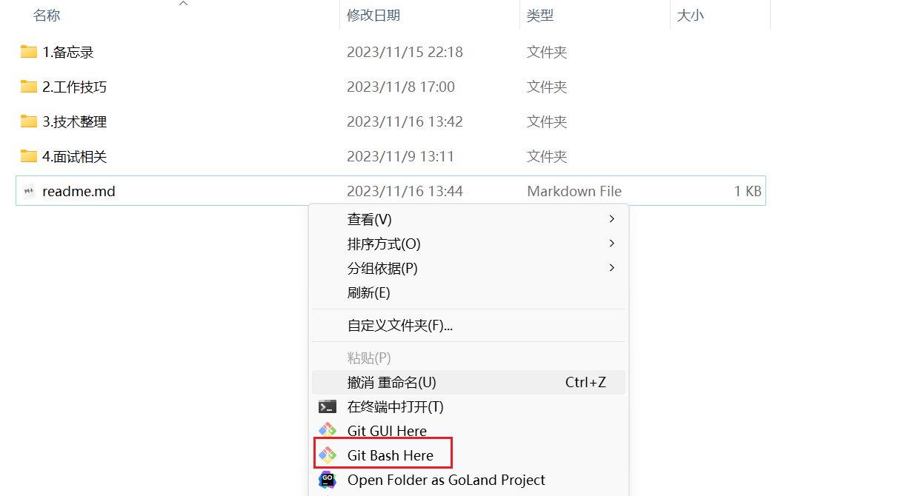
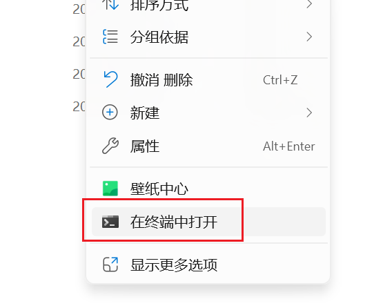
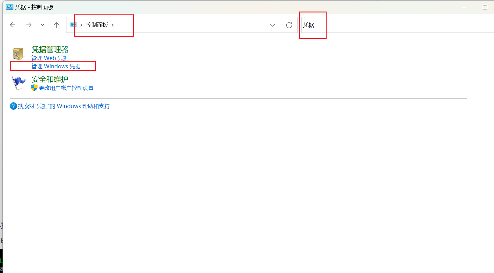
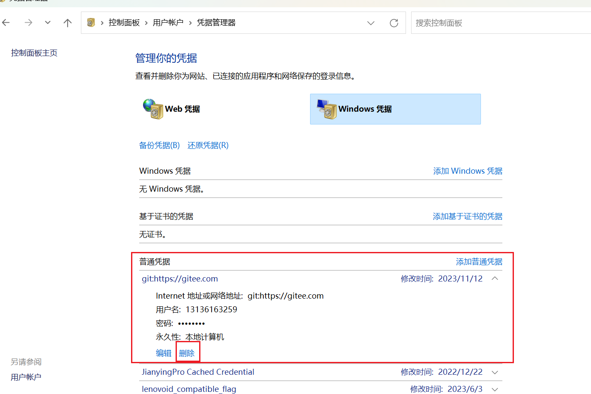
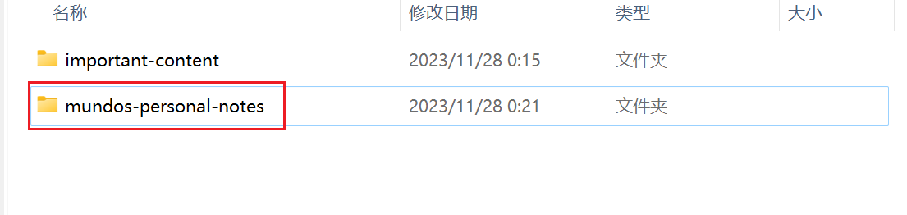
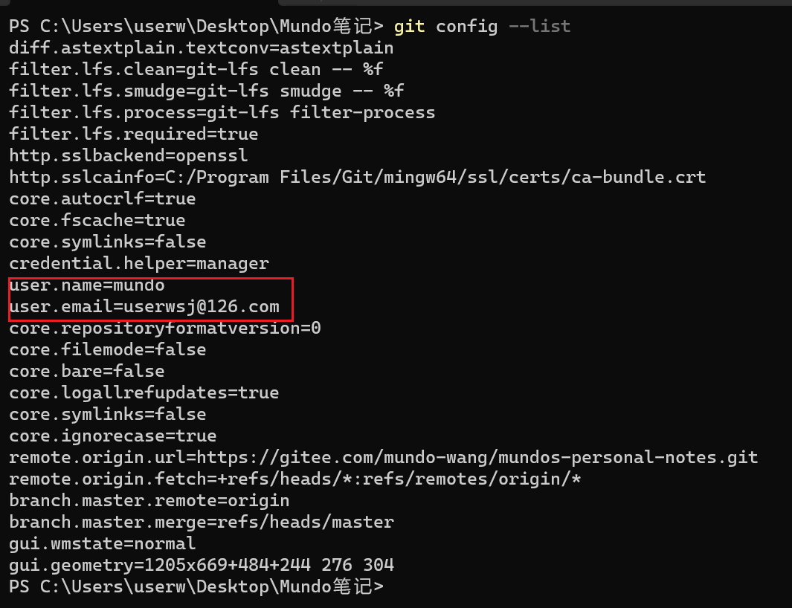
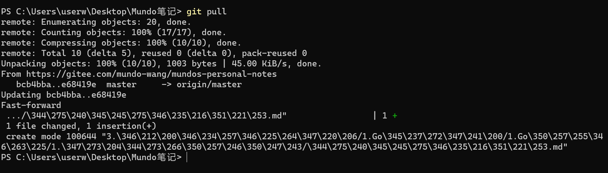

这是一个自学编程一坤年的小菜鸡做的技术笔记，已经绑定GitHub远程仓库。

怎么提交？





或者也可以直接打开powershell（不一定完全适用，还是Git Bash好）：



打开 git bash 窗口后，操作以下命令：

```shell
git add .
git commit -m "refresh save"
git push
```

这样就可以把本地修改推到远程了，然后可以去远程仓库看一下有没有更新成功。

远程仓库地址：https://gitee.com/mundo-wang/mundos-personal-notes

如果在git bash窗口不小心把密码输错了，或者是把远程分支的密码改了，在git push时会提示错误，怎么处理？

首先找到控制面板，搜索凭据，点击“管理windows凭据”。



然后看到这个gitee网址的凭据了吗？删掉它。



重新git push，会重新弹出一个框让你输入用户名和密码，输入正确的之后，就可以正常推了。

换了一个新的环境，如何从远程仓库拉取文件内容呢？

首先要新建一个文件夹，作为所有远程分支库的根目录。

然后打开git bash，执行下面的命令，拉取master分支内容。

这里的地址就是你要拉取的远程分支的地址，自行去gitee复制。

```shell
git clone https://gitee.com/mundo-wang/mundos-personal-notes
```

拉取后，会有这样的一个文件夹，默认它就是远程仓库的名字。



当在此环境进行修改，想提交修改的内容时，应该这么做：

先看看你有没有设置过邮箱和用户名，要让git知道你是谁。

```shell
git config --list
```



这里如果没有查看到邮箱和用户名，操作下面的步骤。

设置邮箱和用户名：

```shell
git config --global user.email "userwsj@163.com"
git config --global user.name "suye"
```

设置完再次使用命令查看，发现可以看到邮箱和用户名信息。

然后，就是和上面提交一样的步骤，推送到远端。因为是克隆过来的，所以就不用指定远程推送目标了。

```shell
git add .
git commit -m "refresh save"
git push
```

我这边想拿到那边推过来的差异内容，直接git pull即可。



这样就实现了多端同步操作。

不过这样多端同步操作时，最好是要各拉一条分支，而不是在同一条分支操作，这样可以最大程度避免冲突所带来的影响。

我们可以对每一端，都从master分支拉一个分支下来，然后每次修改完，都merge到master分支，其余分支直接从master分支合并即可。例如两条分支windows和mac：

在windows分支做完修改，并推到远程后，这样操作：

```sh
git checkout master
git merge windows
git push
git checkout windows
```

然后在mac分支上，这样操作：

```sh
git checkout master
git fetch
git pull
git checkout mac
git merge master
git push
```

如何把远程分支拉到我的本地？例如我要在Mac上把远程的windows分支拉到本地分支，使用以下命令：

```sh
git fetch origin windows:windows
```

第一个windows代表远程分支windows，第二个windows代表拉取下来的本地分支名。

但是这样，还是没有建立本地与远程的上下文关系，使用下面这个命令：

```sh
git branch --set-upstream-to=origin/windows
```

这样，就可以直接使用`git push`了。
